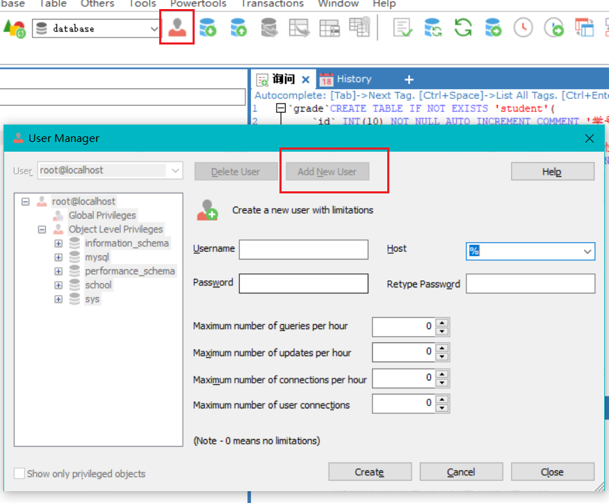
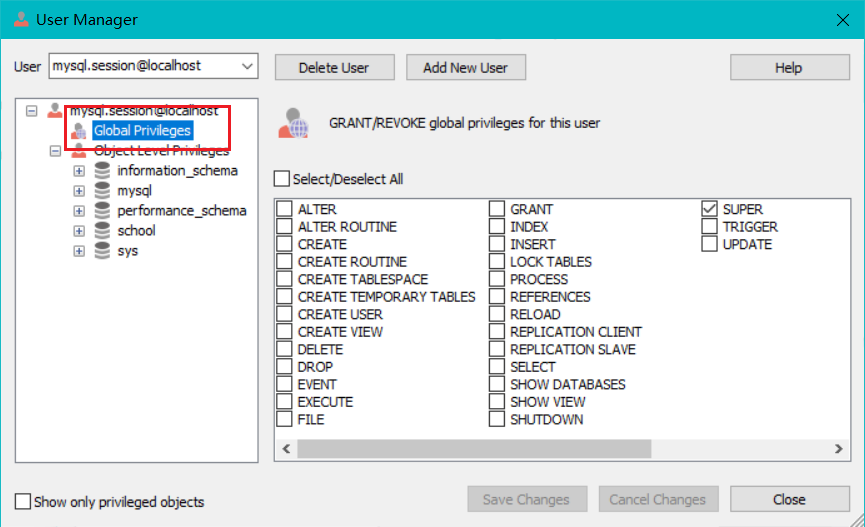

 <h1 style="font-size:60px;text-align:center;">权限管理</h1>

# 创建用户

**`SQLyog`软件：**

<p style="text-align:center;"></p>

<p style="text-align:center;"></p>

**`SQL`命令：**

> [!note|style:flat]
> **本质上，就是修改`mysql`数据下的`user`表。**

```sql
-- 创建用户
create user 用户名 indentified by '密码';

-- 修改当前密码
set password=password('');

-- 修改指定用户密码
set password for 用户名=password('密码');
```

# 用户重命名

```sql
rename user 用户名 to 新名字;
```

# 删除用户

```sql
drop user `用户名`;
```

# 权限

**给全部权限：**

```sql
-- 给指定表权限
grant all privileges on `数据库名`.`表名` to `用户`;

-- 全部数据库与表
grant all privileges on *.* to `用户`;

-- root 用户
GRANT ALL PRIVILEGES ON *.* TO 'root'@'localhost' WITH GRANT OPTION

```

> [!note|style:flat]
> **`all privileges`：没有授权`grant`的权限。**

**查看权限：**

```sql
-- 查看用户的
show grants for 用户;
-- 查看root的
show grants for root@ip地址;
```

**撤销权限：**

```sql
rework all privileges on `数据库`.`表` from `用户`;
```

