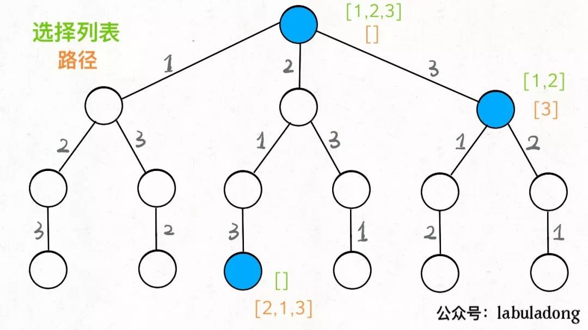

<h1 style="font-size:60px;text-align:center;">回溯算法</h1>

# 框架

- **路径**：记录做过具体的选择
- **标记**：标记记录过的选择
- **选择列表**：也就是你当前可以做的选择。
- **结束条件**：也就是到达决策树底层，无法再做选择的条件。

```python
result = []
def backtrack(路径, 选择列表):
    if 满足结束条件:
        result.add(路径)
        return

    for 选择 in 选择列表:
        做选择
        backtrack(路径, 选择列表)
        撤销选择
```

**其核心就是 for 循环里面的递归，在递归调用之前「做选择」，在递归调用之后「撤销选择」。**

# 全排列

<p style="text-align:center;"></p>

```cpp
void printAll(const vector<int> & nums,vector<int> &path,vector<int> &book){

    // 结束
    if(path.size() == nums.size()){
        string res = "";
        for(int item:path){
            res = to_string(item) + res;
        }
        cout << res << endl;
    }

    // 列举所有情况
    for (int i = 0; i < nums.size(); i++)
    {
        if (book[i] == false)
        {
            // 进入
            path.push_back(nums[i]);
            book[i] = true;

            printAll(nums,path,book);

            // 出来
            path.pop_back();
            book[i] = false;
        }
    }

    // 结束
}
```

# 全皇后

<!--sec data-title="实现代码" data-id="queue" data-show=true data-collapse=true ces-->

> [!note|style:flat]
> **都用回溯算法，时间肯定不达标，放心大胆循环列条件。**

```cpp
bool isOk(vector<string> & bord,int row ,int col){
    
    // 检查行
    for (int i = 0; i < bord.size(); i++)
    {
        if(bord[row][i] == 'Q'){
            return false;
        }
    }

    // 检查列
    for(int i = 0; i < bord.size(); i++){
        if(bord[i][col] == 'Q'){
            return false;
        }
    }

    int states[4];
    states[0] = row - 1 >= 0;
    states[1] = row + 1 < bord.size();
    states[2] = col - 1 >= 0;
    states[3] = col + 1 < bord.size();

    // 上角
    if (states[0])
    {
        if (states[2] && bord[row-1][col-1] == 'Q')
        {
            return false;
        }
        if (states[3] && bord[row-1][col+1] == 'Q')
        {
            return false;
        }
    }
    
    if (states[1])
    {
        if (states[2] && bord[row+1][col-1] == 'Q')
        {
            return false;
        }
        if (states[3] && bord[row+1][col+1] == 'Q')
        {
            return false;
        }
    }
    
    return true;
}

void solveNQueens(vector<string> & bord,int count){

    if(count == bord.size()){
        for(string str:bord){
            cout << str << endl;
        } 
        return;
    }

    for(int i = 0; i < bord.size(); i++){

        if(isOk(bord,count,i)){
            bord[count][i] = 'Q';

            solveNQueens(bord,count+1);

            bord[count][i] = '.';
        }
    }
}

```
<!--endsec-->