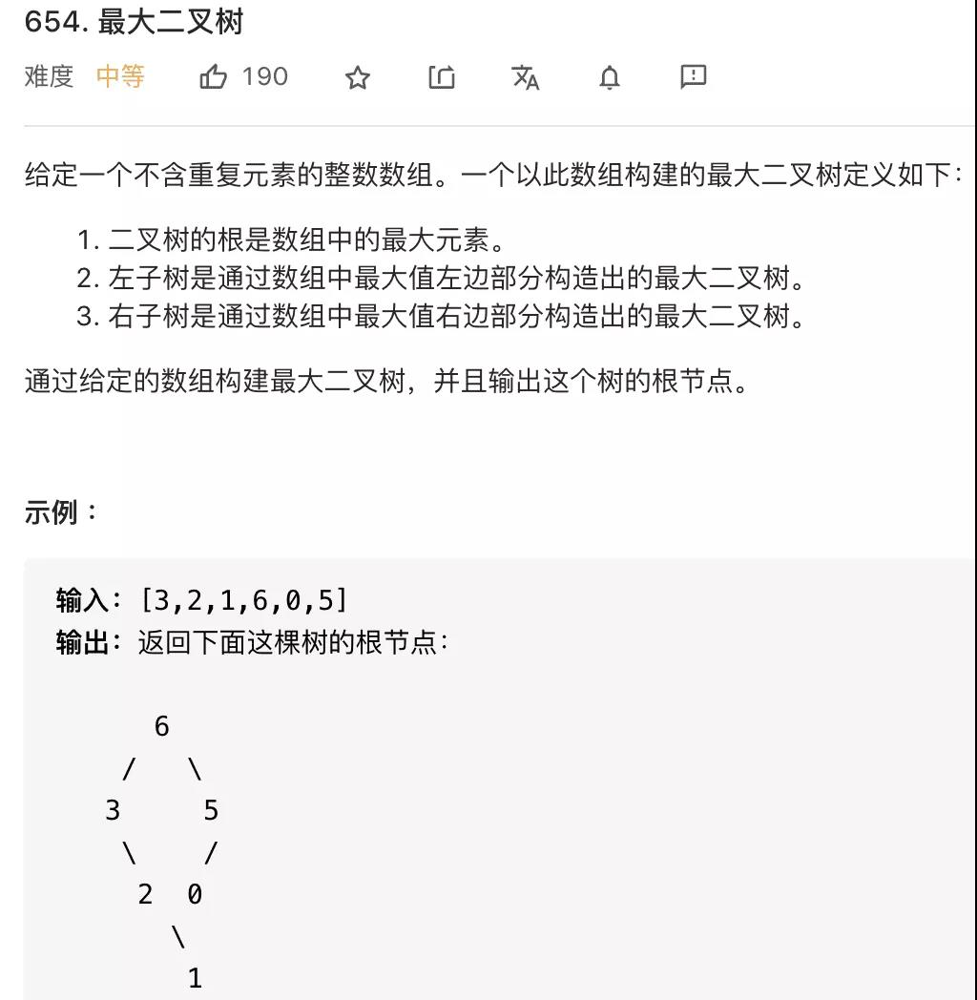
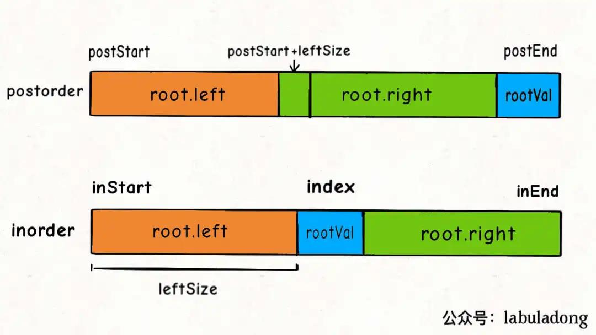

 <h1 style="font-size:60px;text-align:center;">二叉树</h1>

 # 递归的逻辑

- **明确函数的「定义」是什么，然后相信这个定义，利用这个定义推导最终结果，绝不要跳入递归的细节。**
- **以内部函数调用为分界，上部分是入栈，下部分是出栈**

```java
// 定义：count(root) 返回以 root 为根的树有多少节点
int count(TreeNode root) {
    // base case
    if (root == null) return 0;
    // 自己加上子树的节点数就是整棵树的节点数
    return 1 + count(root.left) + count(root.right);
}
```

 # 二叉树的操作逻辑

**先搞清楚当前 root 节点「该做什么」(重点)以及「什么时候做」(前，中，后)，然后根据函数定义递归调用子节点。**

```java
/* 二叉树遍历框架 */
void traverse(TreeNode root) {
    // 前序遍历
    traverse(root.left)
    // 中序遍历
    traverse(root.right)
    // 后序遍历
}

```

 # 二叉树前，中，后序列化与反序列化

- **序列化储存形式：`12#4 3 `,`#`表示空节点**
- **改变「解析」和「序列化」位置，可以分别实现前，中，后。**
- <span style="color:red;font-weight:bold"> 深度优先搜索 </span>

```cpp
struct Node{
    int value;
    Node* left;
    Node* right;

    Node(){
        left = nullptr;
        right = nullptr;
    }

    ~Node(){
        if (left != nullptr)
        {
            delete left;
        }

        if (right != nullptr)
        {
            delete right;
        }
    }
};

class BinaryTree{
private:
    const string nullStr = "#";
public:
    Node* deserialize(queue<string> &nodes){

        // 读取一个节点
        string str =  nodes.front();
        nodes.pop();

        // 到头了
        if (str == nullStr)
        {
            return nullptr;
        }

        // 解析
        Node* node = new Node();
        node->value = stoi(str);

        // 解析左右节点
        node->left = deserialize(nodes); 
        node->right = deserialize(nodes);

        return node;
    }

    string serialize(Node* root){

        // 节点到头了
        if (root == nullptr)
        {
            return nullStr;
        }

        // 序列化
        string str = to_string(root->value); 

        // 序列化左右
        str = str + serialize(root->left);
        str = str + serialize(root->right);

        return str;
    }
};
```
 # 二叉树层级遍历的序列化与反序列化

- **序列化**: <span style="color:red;font-weight:bold"> 递归的作用，1）将父节点输出；2)子节点入队；3）当父节点出队 </span> 

```cpp
    string serializeProcess(Node* root){

        if (nodeQueue.empty())
        {
            return "";
        }
        
        // 搜索到头
        string str = "";
        if (root == nullptr)
        {
            str = nullnode;
        }else{

            str = to_string(root->value);

            // 子节点入队
            nodeQueue.push(root->left);
            nodeQueue.push(root->right);
        }
        // 将当前节点弹出
        nodeQueue.pop();
        
        str = str + serializeProcess(nodeQueue.front());

        return str;
    }

    string serialize(Node* root){
        while (!nodeQueue.empty())
        {
            nodeQueue.pop();
        }

        // 初始化队列
        nodeQueue.push(root);

        return serializeProcess(nodeQueue.front());
    }

```

- **反序列化**：<span style="color:red;font-weight:bold"> 递归的作用，1）父节点出队；2）解析左右子节点；3）子节点入队 </span>

```cpp
    void deserializeProcess(queue<string>& nodes){

        if(nodes.empty()){
            return;
        }

        // 取出一个父类
        Node* parent = nodeQueue.front();
        nodeQueue.pop();

        string str = "";
        Node* node = nullptr;

        // 取出左子节点
        str = nodes.front();
        nodes.pop();

        if (str == nullnode)
        {
            node  = nullptr;
        }else{
            node = new Node();
            node->value = stoi(str);
            nodeQueue.push(node);
        }
        parent->left = node;

        // 取出右子节点
        str = nodes.front();
        nodes.pop();
        if (str == nullnode)
        {
            node  = nullptr;
        }else{
            node = new Node();
            node->value = stoi(str);
            nodeQueue.push(node);
        }
        parent->right = node;


        deserializeProcess(nodes);
    }

    Node* deserialize(queue<string>& nodes){
        while (!nodeQueue.empty())
        {
            nodeQueue.pop();
        }

        if (nodes.front() == nullnode)
        {
            return nullptr;
        }

        Node* root = new Node();
        root->value = stoi(nodes.front());    
        nodes.pop();

        nodeQueue.push(root);

        deserializeProcess(nodes);
        return root;
    }

```

 # 翻转二叉树

```cpp
    void invertTree(Node * root){

        if (root == nullptr)
        {
            return;
        }

        // 交换节点
        Node* temp = root->left;
        root->left = root->right; 
        root->right = temp;

        invertTree(root->left);
        invertTree(root->right);
    }
```

 # 连通完全二叉树一层的节点

```java
// 主函数
Node connect(Node root) {
    if (root == null) return null;
    connectTwoNode(root.left, root.right);
    return root;
}

// 辅助函数
void connectTwoNode(Node node1, Node node2) {
    if (node1 == null || node2 == null) {
        return;
    }
    /**** 前序遍历位置 ****/
    // 将传入的两个节点连接
    node1.next = node2;

    // 连接相同父节点的两个子节点
    connectTwoNode(node1.left, node1.right);
    connectTwoNode(node2.left, node2.right);
    // 连接跨越父节点的两个子节点
    connectTwoNode(node1.right, node2.left);
}
```
> [!tip|style:flat]
> **「将每两个相邻节点都连接起来」**

 # 将二叉树变链表


- 将 root 的左子树和右子树拉平
- 将 root 的右子树接到左子树下方
- 将整个左子树作为右子树。

```java
// 定义：将以 root 为根的树拉平为链表
void flatten(TreeNode root) {
    // base case
    if (root == null) return;

    flatten(root.left);
    flatten(root.right);

    /**** 后序遍历位置 ****/
    // 1、左右子树已经被拉平成一条链表
    TreeNode left = root.left;
    TreeNode right = root.right;

    // 2、将左子树作为右子树
    root.left = null;
    root.right = left;

    // 3、将原先的右子树接到当前右子树的末端
    TreeNode p = root;
    while (p.right != null) {
        p = p.right;
    }
    p.right = right;
}
```

 # 构造最大二叉树




- **左右拆分找节点**

```cpp
    Node* constructMaximumBinaryTree(int* nums,int left,int right){

        if(left > right){
            return nullptr;
        }

        // 找最大值
        int max = nums[left];
        int maxIndex = left;
        for (int i = left + 1; i <= right; i++)
        {
            if (max < nums[i])
            {
                max = nums[i];
                maxIndex = i;
            }
        }

        // 生成节点 
        Node* node = new Node();
        node->value = max;

        node->left = constructMaximumBinaryTree(nums,left,maxIndex - 1);
        node->right = constructMaximumBinaryTree(nums,maxIndex + 1,right);

        return node;
    }
```

 # 通过「前序和中序」遍历结果构造二叉树


- **递归创建处理`root`节点**
- **在中序中，找`root`节点位置**
- **左右拆分，进行递归。** <span style="color:red;font-weight:bold"> 重点为`preorder,inorder`如何拆两半 。</span>
- **两种序列，传参时，不能搞错了。**

```cpp
    Node* fromPreIn(int* preorder,int preL,int preR,int* inorder,int inL,int inR){

        if (preL > preR || inL > inR)
        {
            return nullptr;
        }

        // 根节点
        Node* root = new Node();
        root->value = preorder[preL];

        // 中序中，找root所在位置
        int index = 0;
        for ( index = inL; index <= inR; index++)
        {
            if(inorder[index] == root->value){
                break;
            }
        }

        // 两个子节点
        root->left = fromPreIn(preorder,preL + 1,preL + (index - inL),
                                inorder,inL,index - 1);
        root->right = fromPreIn(preorder,preL + (index - inL) + 1,preR,
                                inorder,index + 1,inR);

        return root;
    }

```

 # 通过「中序和后序」遍历结果构造二叉树




> [!note|style:flat]
> **注意：** `postR - 1`

```cpp
    root->left = fromPostIn(postorder,postL,postL + interval - 1,
                                    inorder,inL,index - 1); 

    root->right = fromPostIn(postorder,postL+interval,postR - 1,
                                    inorder,index+1,inR);
```