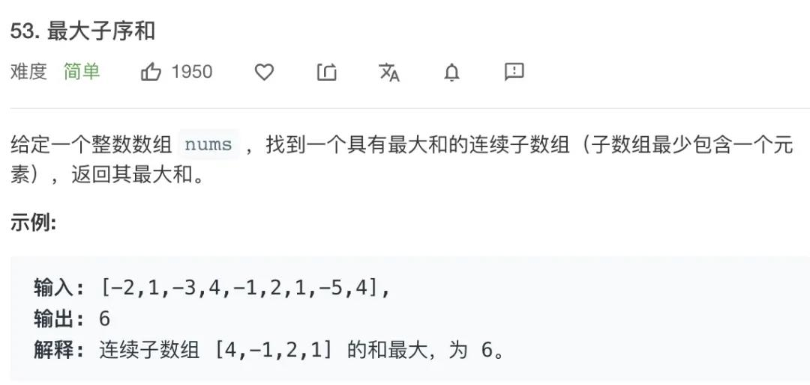
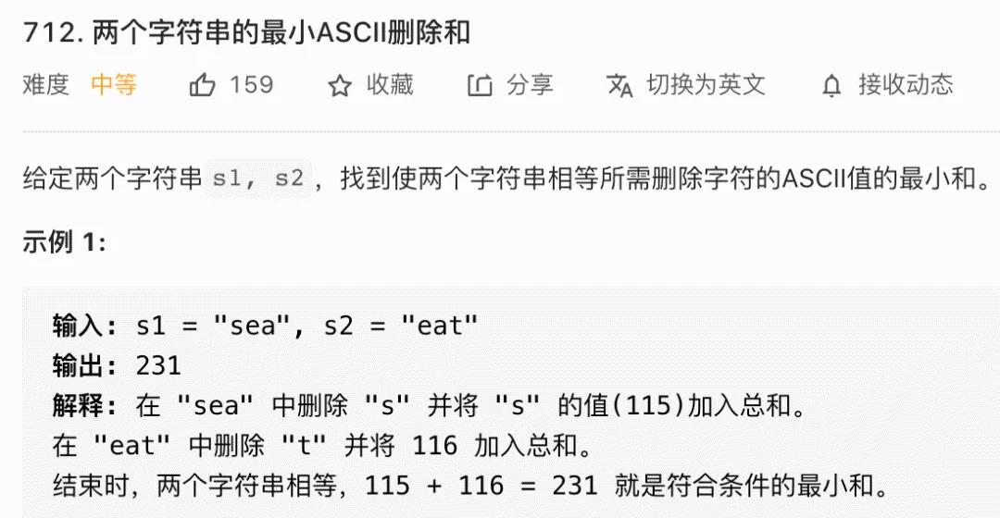
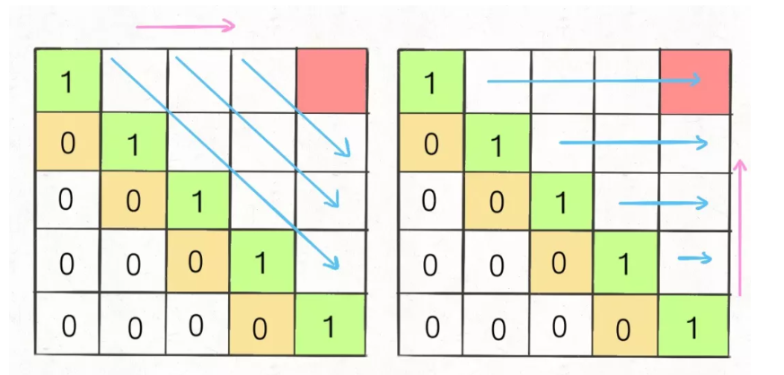

 <h1 style="font-size:60px;text-align:center;">动态规划</h1>

# 1. 动态规划概念

 **动态规划问题的一般形式就是求最值**。

- **重叠子问题**: 最终点问题是由**某一单步小问题**的重复，这些 **小问题的求解可能会重复计算**。
- **最优子结构**: 当前步骤的最优只与"上一步"有关。根据这个特点可以**状态压缩**
- **状态转移方程**: 递推式，解决问题的核心。

> [!note|style:flat]
> **认为`dp[i][j-1]`就是问题在状态`i,j-1`下的结果，`dp[i-1][j-1]`就是问题在状态`i-1,j-1`下的结果，其余之前的状态同理。** <span style="color:red;font-weight:bold"> 也就是说，抵达`i,j`状态之前，`dp[][]`已经将`i,j`状态之前的状态全部尝试了一遍，并得到了相应的结果。</span>

## 1.1. 解题框架

1. **明确 base case**: 如何初始化`dp[]`；确定边界条件。
1. **明确「状态」**: **推进子问题向大问题演变的变量。就是`dp[i]`的游标`i`的含义。**
2. **明确「选择」**: **可以使得由过去的状态`i-1,i-2,i-3...`向当前状态`i`推进的 「选择」。**
3. **定义 dp 数组/函数**:  dp值 = f（当前状态）
    - **dp函数**: 参数就是上面说到的「状态」。函数的返回值就是「结果」。
    - **`dp[i]` 数组**：`i`为「状态」，「结果」为`dp[i]`

```cpp

# 2. 初始化
dp[] = init

# 3. 边界条件
dp[0][0][...] = base

# 4. 进行状态转移
for 状态1 in 状态1的所有取值：
    for 状态2 in 状态2的所有取值：
        for ...
            dp[状态1][状态2][...] = 求最值(选择1，选择2...)
```
## 4.1. 流程方向

- **自顶向下: 从目标开始，把大问题拆解小问题，直到到初始条件。**
    - 暴力递归: 把大问题拆成小的，递归下去
    - **备忘录递归**: 算过的值记录下来，不在重复算
-  **自底向上: 从初始开始，根据递推式，一步一步迭代，直到目标结束。** 
    - **dp数组**: 从初始状态，根据递推关系，算到目标状态，**循环数组，不用递归。**

## 4.2. 重复子问题的确定

```cpp
    dp[i][j] = min{
        dp[i-1][j] + 1,
        dp[i][i-1] + 1,
        dp[i-1][j-1] + 1
    }
```
&emsp;&emsp;**当从`dp[i-1][j-1]`过度到`dp[i][j]`的求解有多种路径时，就存在解重叠的情况。采用备忘录和dp数组解决。**

## 4.3. 状态遍历顺序


> [!note|style:flat]
> 1. **确定二维表`dp[][]`初始值**
> 1. **确定递推式`dp[i][j]`的依赖情况（上图左边）**
> 1. **根据依赖关系填充二维表，满足横向填充或者纵向填充**

```cpp
    // i = 0, j = 0 的情况是边界条件，已经初始化好了。 
    for (int i = 1; i <= m; i++){
        for (int j = 1; j <= n;j++){
            dp[i][j] = f(dp[i-1][j-1],dp[i][j-1],dp[i-1][j]);
        }
    }
```


# 5. 斐波那契级数

**题目：**
某人有一对兔子饲养在围果它们每个月生`1`对兔子，且新的兔子在第`2`个月后(`3`个月为周期)也是每个月生`1`对兔子,问一年后围墙中共有多少对兔子。

**递推式：**
$$
f(n) = f(n-1) + f(n - 2)
$$

**序列为：**`1，1，3，5，8，13，21，34，55，89。。。`

# 6. 凑零钱问题

**题目：**
给你k种面值的硬币，面值分别为`c1, c2 ... ck`，每种硬币的数量无限，再给一个总金额`amount`，问你最少需要几枚硬币凑出这个金额，如果不可能凑出，算法返回 `-1 `。

**分析：**

> [!tip]
> - **状态：** `amount` 能推荐问题递推，问题的结果由`amount`影响
> - **选择：** 每次「状态」的推进，由`c1, c2 ... ck`确定。
> - **dp[amount]定义：**`dp[amount]`表示，当总金额为`amount`时，最少硬币数为`dp[aomunt]`

<!--sec data-title="实现代码" data-id="coinchange" data-show=true data-collapse=true ces-->
```cpp
int coinChange(const int * coins,int n,int amount){

    // 定义dp[i]: 状态为钱总数；结果为当前总价最少钱币数
    // 初始化放入极端值,由于是求解最小，所以放入一个大值
    vector<int> dp(amount + 1,amount + 1);

    // 边界条件
    dp[0] = 0;

    for(int i=2;i <= amount ; i++){
        // 选择当前的货币
        for(int j=0;j < n;j++){
            if(i >= coins[j]){
                dp[i] = min(dp[i],dp[i - coins[j]] + 1);
            }
        }
    } 

    // 找不到
    if (dp[amount] == amount + 1)
    {
        return -1;
    }
    
    return dp[amount];
}
```
<!--endsec-->

# 7. 子序列问题
## 7.1. 最长递增(递减)子序列

<p style="text-align:center;"></p>

**问题特征：**

> [!note|style:flat]
> - **首先给一组`1`维的长序列**，<span style="color:red;font-weight:bold"> 若是`2`维问题，看看能不能排序降为`1`维问题。 </span>
> - **要求子序列具有「某种单调关系」**
> - **目标子序列是关系下的「最长子序列」**


**分析：**

> [!tip]
> - **状态：** 当前查找的序列的以索引`i`结束
> - **选择：** 选择`dp[i-1],dp[i-2]...`确定`dp[i]`。
> - **dp[i]定义：** 以索引`i`结束的序列，最长子序列的长度`dp[i]`

<!--sec data-title="实现代码" data-id="lis" data-show=true data-collapse=true ces-->
```cpp
int lengthOfLIS(vector<int>& seq){

    vector<int> dp(seq.size(),1);

    dp[0] = 1;
    // 状态从 1 索引开始
    for(int i=1;i<seq.size();i++){

        for(int j=0; j < i; j++){
            if(seq[i] > seq[j]){
                dp[i] = max(dp[i],dp[j] + 1);
            }
        } 
    }

    int max = 1;
    for(int item:dp){
        if(item > max) max = item;
    }

    return max;
}
```
<!--endsec-->

## 7.2. 信封嵌套问题

<p style="text-align:center;"></p>

### 7.2.1. 降维
<p style="text-align:center;"></p>

> [!note|style:flat]
> **嵌套问题是要求`[w,h]`「两个」数据均有「单调的大小」关系，属于`2`维问题。而递增子序列问题是`1`维问题。** <span style="color:red;font-weight:bold"> 将「`2`维问题」转「`1`维问题」可以使用「排序」，先确定一个维度的关系，然后就只用关心一个维度。 </span> <br>
> **排序**：**对于`[v1,v2]`形式，一般优先`v1`升序，若`v1`相等，则`v2`降序**

<br>

### 7.2.2. 问题求解

> [!tip]
> - **排序** : **保证对`1`维序列进行操作**，两点（`[v1，v2]`）数据，先排序：**`v1`升序，`v2`降序**
> - **状态：** 当前查找的序列的以索引`i`结束
> - **选择：** 选择`dp[i-1],dp[i-2]...`确定`dp[i]`。
> - **dp[i]定义：** 以索引`i`结束的序列，最长子序列的长度`dp[i]`

<!--sec data-title="实现代码" data-id="maxEnvelopes" data-show=true data-collapse=true ces-->
```cpp

struct Envelope
{
    int width;
    int height;

    bool greatThan(const Envelope& temp){
        if (this->width > temp.width && this->height > temp.height)
        {
            return true;
        }
        return false; 
    }
};

int maxEnvelopeLen(vector<Envelope> &envelopes){

    // width 升序，hight 降序
    sort(envelopes.begin(), envelopes.end(),[](const Envelope & A, const Envelope & B)->bool{
        if (A.width < B.width)
        {
            return true;
        }else if(A.width == B.width){
            if(A.height > B.height){
                return true;
            }
        }
        return false;
    });

    vector<int> dp(envelopes.size(),1);

    for(int i=0;i<envelopes.size();i++){
        // 选择
        for(int j=0;j<i;j++){

            if (envelopes[i].greatThan(envelopes[j]))
            {
                dp[i] = max(dp[i],dp[j] + 1);
            }
        }
    }

    int max = 0;
    for(int item:dp){
        if (max < item)
        {
            max = item;
        }
    }

    return max; 
}

```
<!--endsec-->

## 7.3. 最小编辑距离

<p style="text-align:center;"></p>

> [!tip]
> - **状态：** <span style="color:red;font-weight:bold"> 解决两个字符串的动态规划问题，一般都是用「两个指针」，即「两个状态」。</span> 源头字符串的前`j`个字符，目标字符串的前`i`个字符。
> - **选择：** 删除，插入，替换，跳过
> - **`dp[i][j]`定义：** 目标字符串的前`i`个字符变为源头字符串的前`j`个字符，所做的小操作距离


**插入：** 目标字符串前`i`个字符与源字符串的前`j-1`个字符相同的情况，变当前状态`i,j`

$$
dp[i][j] = dp[i][j-1] + 1
$$

<p style="text-align:center;"></p>


**删除：** 目标字符串前`i-1`个字符与源字符串的前`j`个字符相同的情况，变当前状态`i,j`

$$
dp[i][j] = dp[i-1][j] + 1;
$$

<p style="text-align:center;"></p>

**替换：** 目标字符串前`i-1`个字符与源字符串的前`j-1`个字符相同的情况，变当前状态`i,j`

<p style="text-align:center;"></p>

$$
dp[i][j] = dp[i-1][j-1] + 1;
$$


> [!warning|style:flat]
> **动态规划状态的迁移：永远是之前已经得出结论的状态，迁移到当前状态；根据`1.4`的状态遍历，之前的状态默认是已经提前都计算好，不必深究。**


<!--sec data-title="代码实现" data-id="minEditDistance" data-show=true data-collapse=true ces-->

```cpp
int minDistance(const string & S,const string & T){

    // 在S的j位置，在T的i位置时，操作数最小
    vector< vector<int> > dp(T.length()+1,vector<int>(S.length()+1,0));

    // 初始化，当目标是空串时
    for(int i=1;i<=S.size();i++){
        dp[0][i] = i;
    }

    // 初始化，当源是空串时
    for(int i=1;i<=T.length();i++){
        dp[i][0] = i;
    }

    for(int i=1;i<=T.length();i++){
        for (int j = 1; j <= S.length(); j++)
        {
            if (T[i-1] == S[j-1])
            {
                dp[i][j] = dp[i-1][j-1];
            }else{
                // 替换
                dp[i][j] = dp[i-1][j-1] + 1;
                // 删除
                dp[i][j] = min(dp[i][j],dp[i-1][j] + 1);
                // 插入
                dp[i][j] = min(dp[i][j],dp[i][j-1] + 1);
            }
        }
    }
    return dp[T.length()][S.length()];
}
```
<!--endsec-->

## 7.4. 最大子数组之和

<p style="text-align:center;"></p>

> [!tip]
> - **状态：** 数组的当前索引`i`
> - **选择：** 由于是「连续子数组」，那就只能和挨着的对比，即`dp[i],dp[i-1]`
> - **`dp[i]`定义：** 以`nums[i]`为结尾的「最大子数组和」为`dp[i]`


<!--sec data-title="实现源码" data-id="maxsumsub" data-show=true data-collapse=true ces-->

```cpp
int maxSum(vector<int> &nums){

    // 初始化
    vector<int> dp(nums);

    for (int i = 1; i < nums.size(); i++)
    {
        dp[i] = max(dp[i],dp[i-1] + nums[i]);
    }
    
    sort(dp.begin(),dp.end());

    return dp[dp.size()-1];
}

```
<!--endsec-->

## 7.5. 最长公共子序列问题

### 7.5.1. 算法 

**问题：**
输入`s1 = "zabcde", s2 = "acez"`，它俩的最长公共子序列是`lcs = "ace"`，长度为 `3`，所以算法返回 `3`。

> [!tip]
> - **状态：** <span style="color:red;font-weight:bold"> 解决两个字符串的动态规划问题，一般都是用「两个指针」，即「两个状态」。</span> `s1`的前`i`个字符，`s2`的前`j`个字符。
> - **选择：** 当`s1[i]==s2[j]`时，`dp[i-1][j-1] + 1`；当`s1[i]!=s2[j]`时，要找一个目前最大子串长度值`max(dp[i-1][j],dp[i][j-1])`（有可能`s1[i]`子序列中，有可能`s2[j]`子序列中）
> - **`dp[i][j]`定义：** 在`s1`的前`i`个字符，`s2`的前`j`个字符时，最大子序列的最大长度。


<!--sec data-title="源码实现" data-id="maxPublicSub" data-show=true data-collapse=true ces-->

```cpp
int maxPublicSub(const string& strA,const string& strB){

    vector< vector<int> > dp(strB.size()+1,vector<int>(strA.size()+1,0));


    for (int i = 1; i <= strB.size(); i++)
    {
        for (int j = 1; j <= strA.size(); j++)
        {
            if ( strA[j-1] == strB[i-1])
            {
                dp[i][j] = dp[i-1][j-1] + 1;
            }else{
                dp[i][j] = max(dp[i-1][j],dp[i][j-1]);
            }
        }
    }

    return dp[strB.size()][strA.size()];
}

```

<!--endsec-->

### 7.5.2. 字符串的删除操作

<p style="text-align:center;"></p>

### 7.5.3. 最小 ASCII 删除和

<p style="text-align:center;"></p>

> [!tip]
> - **状态：** <span style="color:red;font-weight:bold"> 解决两个字符串的动态规划问题，一般都是用「两个指针」，即「两个状态」。</span> `s1`的前`i`个字符，`s2`的前`j`个字符。
> - **选择：** 当`s1[i]==s2[j]`时，最小的是`dp[i-1][j-1]`；当`s1[i]!=s2[j]`时，要删除一个`min(dp[i-1][j] + (int)strB[i-1],dp[i][j-1] + (int)strA[j-1])`（有可能`s1[i]`在子序列中，有可能`s2[j]`在子序列中）
> - **`dp[i][j]`定义：** 在`s1`的前`i`个字符，`s2`的前`j`个字符时，被删除的ascii码最小。

<!--sec data-title="实现代码" data-id="minASCII" data-show=true data-collapse=true ces-->
```cpp
int minDeleteASCII(const string& strA,const string& strB){

    vector< vector<int> > dp(strB.size()+1,vector<int>(strA.size()+1,0));

    // 当strA为空时
    for (int i = 1; i <= strB.size(); i++)
    {
        dp[i][0] = dp[i-1][0] + (int)strB[i-1]; 
    }
    
    // 当strB为空时
    for (int i = 1; i <= strA.size(); i++)
    {
        dp[0][i] = dp[0][i-1] + (int)strA[i-1]; 
    }

    for (int i = 1; i <= strB.size(); i++)
    {
        for (int j = 1; j <= strA.size(); j++)
        {
            if ( strA[j-1] == strB[i-1])
            {
                dp[i][j] = dp[i-1][j-1];
            }else{
                dp[i][j] = min(dp[i-1][j] + (int)strB[i-1],dp[i][j-1] + (int)strA[j-1]);
            }
        }
    }

    return dp[strB.size()][strA.size()];
}
```
<!--endsec-->


## 7.6. 子序列/子串问题总结

> [!note|style:flat]
> - **子串：** 
>   - `dp[i]`的定义，一般为 **「以`i`结尾的连续子串。。。。」**
> - **子序列：**
>   - `dp[i]`的定义，一般为 **「从`0`到`i`位/置的子串。。。。」**
> -  **涉及两个字符串/数组时，要用双状态**
> - **特例：一个数组，双指针**
> - **通过排序，可也把`[v1,v2]`转为子序列问题。**

## 7.7. 特例：最长子序列回文

<p style="text-align:center;"></p>

> [!tip]
> - **状态：** `i`到`j`的子串。
> - **选择：** 当`s1[i]==s1[j]`时，增加两个`dp[i][j] = dp[i+1][j-1] + 2;`；当`s1[i]!=s1[j]`时，有一个可能在回文里，找最大的`dp[i][j] = max(dp[i+1][j],dp[i][j-1]);`（有可能`s1[i]`在子序列中，有可能`s1[j]`在子序列）
> - **`dp[i][j]`定义：** `i`到`j`的子串，最大回文数为`dp[i][j]`。
> - **初始：** `dp[][]`的下半部不会涉及到，所以为`0`；当`i==j`时，`dp[i][j]=1`。

<p style="text-align:center;">  </p>


> [!note|style:flat]
> **由于`dp[i][j]`与`dp[i+1][j-1],dp[i+1][j],dp[i][j-1]`有关，所以要重新设置遍历顺序。** 

<!--sec data-title="代码实现" data-id="maxlenmirror" data-show=true data-collapse=true ces-->
```cpp
int maxLenMirror(const string &str){

    vector< vector<int> > dp(str.length(),vector<int>(str.length(),0));

    // 初始化
    for (int i = 0; i < str.length(); i++)
    {
        dp[i][i] = 1;
    }

    for (int i = str.length() - 2; i>=0; i--)
    {
        for (int j = i + 1; j < str.length(); j++)
        {
            if(str[i] == str[j]){
                dp[i][j] = dp[i+1][j-1] + 2;
            }else {
                dp[i][j] = max(dp[i+1][j],dp[i][j-1l]);
            }
        }
    }

    return dp[0][dp.size()-1];
}
```
<!--endsec-->