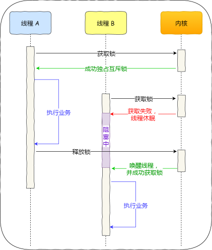
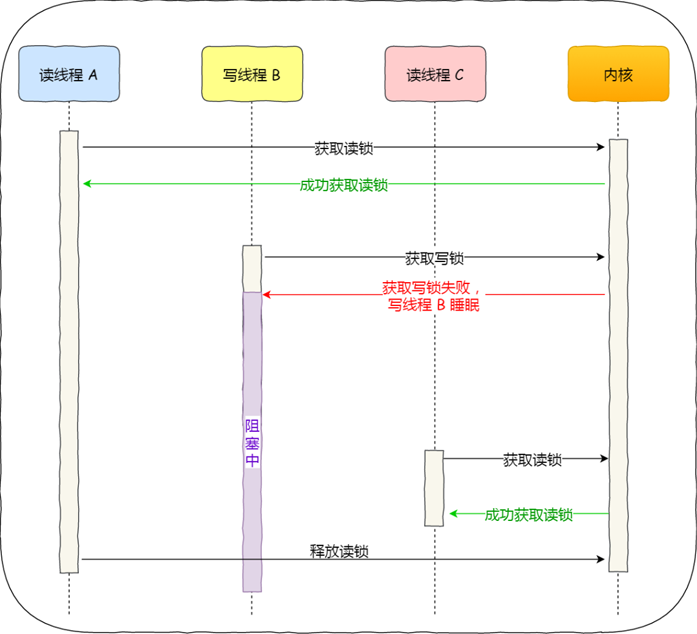
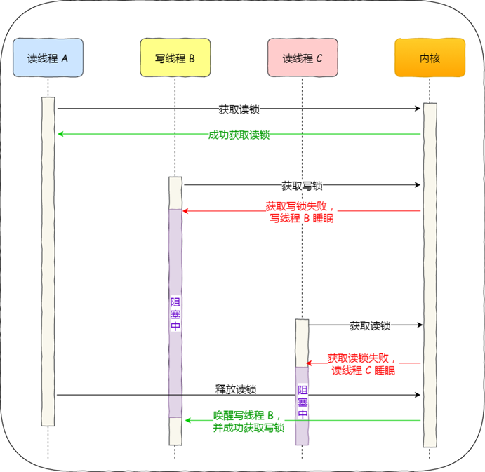
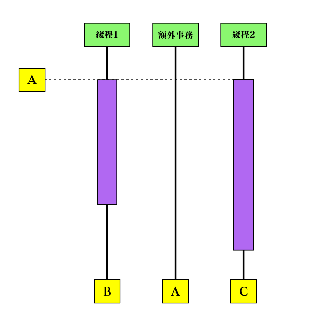
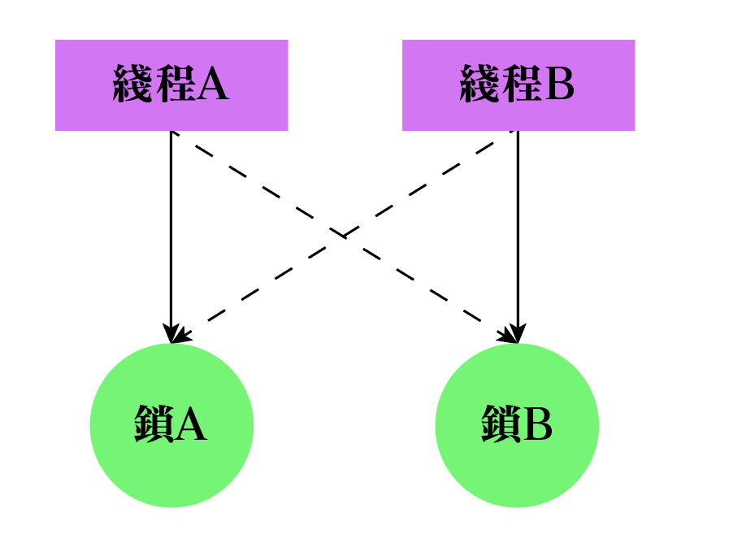

 <h1 style="font-size:60px;text-align:center;">锁</h1>

参考博客：
- [你说说互斥锁、自旋锁、读写锁、悲观锁、乐观锁的应用场景](https://cloud.tencent.com/developer/article/1700079)
- [CAS原理](https://www.jianshu.com/p/ab2c8fce878b)
- [什么是乐观锁，什么是悲观锁](https://www.jianshu.com/p/d2ac26ca6525)
- [经典的ABA问题与解决方法](https://blog.csdn.net/qq_42576040/article/details/88240595)


# 1. 为什么要锁

高并发的场景下，线程（进程）胡乱使用「公共资源」，会造成资源混乱，没有做好并发控制，就可能导致「脏读、幻读和不可重复读」等问题。「锁」便是用来控制进程（线程）有序利用「公共资源」的手段。

如果选择了错误的锁，那么在一些高并发的场景下，可能会降低系统的性能。

# 2. 互斥锁与自旋锁

> [!note|style:flat]
> - **作用：当已经有一个线程加锁后，其他线程加锁则就会失败**
> - 地位：最底层的两种锁，其他高级锁都是靠这两种锁演变而来
> 
> **区别**
> - **「互斥锁」加锁失败后，线程会释放 `CPU` ，给其他线程**
> - **「自旋锁」加锁失败后，线程会忙占用 `CPU`，直到它拿到锁**

## 2.1. 互斥锁

<p style="text-align:center;"></p>

互斥锁是一种「独占锁」，比如当线程 `A` 加锁成功后，此时互斥锁已经被线程 `A` 独占了，只要线程 `A` 没有释放手中的锁，线程 `B` 加锁就会失败，于是就会释放 `CPU` 让给其他线程，线程 `B` 加锁的代码就会被阻塞。

对于互斥锁加锁失败而阻塞的现象，是由操作系统内核实现的。内核会将线程置为「睡眠」状态，等到锁被释放后，内核会唤醒线程，线程 `B`成功获取到锁后继续执行，否则继续阻塞。

互斥锁加锁失败时，会从用户态陷入到内核态，让内核帮我们切换线程，虽然简化了使用锁的难度，但是存在一定的性能开销成本。

> [!tip|style:flat]
> **两次线程上下文切换的成本**
> - **当线程加锁失败时，内核会把线程的状态从「运行」状态设置为「睡眠」状态，然后把 CPU 切换给其他线程运行；**
> - **当锁被释放时，之前「睡眠」状态的线程会变为「就绪」状态，然后内核会在合适的时间，把 CPU 切换给该线程运行。**
> 
> **上下文切换了啥？**
> 
> **虚拟内存资源是进程申请的，这个线程管不着，但是线程运行用的栈、寄存器是得靠自己维护：**
> - <span style="color:blue;font-weight:bold"> 从`cpu`切换出去时，需要把自己的堆栈、寄存器进行备份处理 </span>
> - <span style="color:blue;font-weight:bold"> 把线程加载回`cpu`时，又需要把备份的堆栈、寄存器进行恢复，这样线程程序才能正常执行。 </span>
> 
> <span style="color:red;font-weight:bold"> 如果锁住的代码执行时间比较短，那可能上下文切换的时间都比你锁住的代码执行时间还要长 </span>

## 2.2. 互旋锁

自旋锁：在「用户态」完成加锁和解锁操作，不会主动产生线程上下文切换，所以相比互斥锁来说，会快一些，开销也小一些。

> [!tip]
> **锁运行流程**
> 1. **查看锁的状态**
> 1. **锁空闲：将锁设置为当前线程持有。「完成加锁操作」**
> 1. **锁繁忙：线程会「忙等待」，直到它拿到锁。这里的「忙等待」可以用 `while` 循环等待实现，不过最好是使用 `CPU` 提供的 `PAUSE` 指令来实现「忙等待」，因为可以减少循环等待时的耗电量。「加锁失败」**
>
> **注意：**
> - **在单核 `CPU `上，需要「抢占式的调度器」（即不断通过时钟中断一个线程，运行其他线程）。否则，自旋锁在单 `CPU` 上无法使用，因为一个自旋的线程永远不会放弃 `CPU`。(不能让「自旋锁」占着茅坑不拉屎，单核`CPU`不工作了。)**
> - **自旋的时间和被锁住的代码执行的时间是成「正比」的关系**

# 3. 读写锁

## 3.1. 概念
读写锁：由「读锁」和「写锁」两部分构成；只「读取」共享资源用「读锁」加锁，「修改」共享资源则用「写锁」加锁。**读写锁适用于能明确区分读操作和写操作的场景。**

> [!tip]
> - **「读锁」: 当「写锁」没有被线程持有时，多个线程能够并发地持有「读锁」。只要没人「写」，大家都能来「读」，不存在互斥。**
> - **「写锁」：独占锁（可以利用「互斥锁和自旋锁实现」），一旦有线程持有了「写锁」，想要「读」的线程和想要「写」的线程都被「堵塞」，只允许持有「写锁」的线程修改「公共资源」。**

## 3.2. 读优先锁

<p style="text-align:center;"></p>

> [!tip]
> **优先服务于「读」的线程操作。**
> - **首先，读线程`A`进入，拿到「读锁」开始读**
> - **然后，写线程`B`进入，抢「写锁」失败，被堵塞**
> - **最后，读线程`C`进入，仍然可以拿「读锁」开始读。**
> - **只有「读线程」全部操作完成释放了所有「读锁」，「写线程」才能继续抢锁。**


## 3.3. 写优先锁

<p style="text-align:center;"></p>

> [!tip]
> **优先服务于「写」的线程操作。**
> - **首先，读线程`A`进入，拿到「读锁」开始读**
> - **然后，写线程`B`进入，抢「写锁」失败，被堵塞**
> - **最后，读线程`C`进入，拿「读锁」失败，被堵塞，因为「写线程`B`」还没完成工作，读线程`C`被叫停。**
> - **只有「读线程`A`」释放了「读锁」，「写线程`B`」拿到「写锁」完成写操作后，「读线程`C`」才能继续读。**

## 3.4. 公平读写锁

**对于「优先读」方案，当「读线程」进来得太多，「写线程」就一直等着，没法工作，就会造成写线程「饥饿」。同样，对于「优先写」方案也是一样，会造成读线程「饥饿」。**

<span style="color:red;font-weight:bold"> 为了防止「饥饿」的产生，可以采用「公平读写锁」方案：用「队列」把获取锁的线程排队，不管是写线程还是读线程都按照「先进先出」的原则加锁即可，这样读线程仍然可以并发。 </span>

# 4. 乐观锁与悲观锁

## 4.1. 对比

| 类型   | 描述                                                                                                                                                                                                                                        |              应用              |
| ------ | ------------------------------------------------------------------------------------------------------------------------------------------------------------------------------------------------------------------------------------------- | :----------------------------: |
| 悲观锁 | 假设：**多线程同时修改共享资源的概率比较高，容易出现冲突** <br> 结果：访问共享资源前，先要上锁。                                                                                                                                            | 互斥锁 <br> 自旋锁 <br> 读写锁 |
| 乐观锁 | 假定：**多线程同时修改共享资源的概率比较低，不容易冲突**                 <br>  结果：先修改完共享资源，再验证这段时间内有没有发生「冲突」，如果没有其他线程在修改资源，那么操作完成，如果发现有其他线程已经修改过这个资源，就放弃本次操作。 |              git               |

## 4.2. 乐观锁

<span style="font-size:24px;font-weight:bold" class="section2">实现方式</span>

- **`CAS` 实现**：`Compare And Swap`对比之后交换数据
- **版本号控制**：一般是在数据表中加上一个数据版本号 `version` 字段，表示数据被修改的次数。当数据被修改时，`version` 值会 +1。当线程 A 要更新数据时，在读取数据的同时也会读取 `version` 值，在提交更新时，若刚才读取到的 `version` 值与当前数据库中的 `version` 值相等时才更新，否则重试更新操作，直到更新成功。

<span style="font-size:24px;font-weight:bold" class="section2">`CAS`实现原理</span>

> [!note|style:flat]
> - **三个数据：内存位置(`V`)、原值(`A`)和新值(`B`)**
> - **运行逻辑：如果内存位置`V`的值与原值`A`一样时，就将内存位置`V`修改为新值`B`，否则什么都不做。**
> - **竞争处理：通过`CAS`校验完成新值提交的线程竞争成功，否则竞争失败；对于失败的线程并不会被挂起，而是被告知这次竞争中失败，并可以再次发起尝试。**

```cpp
/**
* 校验成功：返回true，并提交新值
* 校验失败：返回false，放弃新值
*/
bool cas(V,A,B){
    // 如果内存 V 的值没有被修改
    if(*V == A){
        // 提交 B
        *V = B;
        return true;
    }else{
        return false;
    }
}

// 共享资源
share *V;

void threadRun(){
    do{
    // 备份内存v的值
    A = *V;

    // 得到新值
    B = getB();

    }while(!cas(V,A,B));
}

```

> [!tip]
> **优点**
> - **对死锁问题天生免疫**
> - **要比基于锁的方式拥有更优越的性能**
> - **加大了数据吞吐量**
> 
> **缺点**
> - **`cas`方法只对「公共资源」的前后结果进行了比较，并不清楚「公共资源」的修改过程，因此会导致「ABA问题」**


<span style="font-size:24px;font-weight:bold" class="section2">ABA问题</span>


<p style="text-align:center;"></p>

此时，线程`1`与线程`2`需要对资源（黄色方框代表资源`V`）进行修改操作；两个线程开始时备份的原始值都是`A`；线程`1`运算得快，首先提交修改将资源修改为`B`，这时线程`2`还在运算中；这时突然来了个第三者额外事务，将资源值又重新修改回了`A`；这样的情况下，等到线程`2`执行完毕，进行`CAS`检验成功完成提交，将资源修改为了`C`。**这就造成了「ABA问题」。**

> [!note|style:flat]
> **资源不一定是被「外部事务」修改`A`，还可以是线程`1`先把资源修改为`B`后提交，又紧接着执行了一次把值给修改为了`A`。**

<!--sec data-title="ABA问题的直观案列" data-id="ABAProblem" data-show=true data-collapse=true ces-->
**案列：**

一家火锅店为了生意推出了一个特别活动，凡是在五一期间的老用户凡是卡里余额小于20的，赠送10元，但是这种活动没人只可享受一次。然后火锅店的后台程序员小王开始工作了，很简单就用cas技术，先去用户卡里的余额，然后包装成AtomicInteger，写一个判断，开启10个线程，然后判断小于20的，一律加20，然后就很开心的交差了。可是过了一段时间，发现账面亏损的厉害，老板起先的预支是2000块，因为店里的会员总共也就100多个，就算每人都符合条件，最多也就2000啊，怎么预支了这么多。小王一下就懵逼了，赶紧debug，tail -f一下日志，这不看不知道，一看吓一跳，有个客户被充值了10次!

**问题：**

假设有个线程A去判断账户里的钱此时是15，满足条件，直接+20，这时候卡里余额是35.但是此时不巧，正好在连锁店里，这个客人正在消费，又消费了20，此时卡里余额又为15，线程B去执行扫描账户的时候，发现它又小于20，又用过cas给它加了20，这样的话就相当于加了两次，这样循环往复肯定把老板的钱就坑没了！
<!--endsec-->

> [!note|style:flat]
> **解决思路：增加一个`version`变量，进行「版本控制」，具体实现见上面「版本控制」所述。**

# 5. 死锁

参考视频：[b站最新的死锁和解决方案](https://www.bilibili.com/video/BV1YV411d7Yr)

## 5.1. 定义

> [!note]
> **死锁：指多个进程（线程）在执行过程中，由于竞争资源或者由于彼此通信而造成的一种阻塞的现象（互相挂起等待），若无外力作用，它们都将无法推进下去。**

<p style="text-align:center;"></p>

> [!tip|style:flat]
> - 线程`A`持有了锁`A`；线程`B`持有了锁`B`
> - 线程`A`想要锁`B`；线程`B`想要锁`A`
> - 线程`A`不放手锁`A`，等锁`B`；线程`B`不放手锁`B`，等锁`A`

## 5.2. 死锁原因

> [!note]
> <span style="font-size:24px;font-weight:bold" class="section2">术语版本</span>
> - **互斥条件**
>   - 临界资源只能一个进程(线程)使用。
> - **占有和等待条件**
>   - 进程在请求资源得不到满足而等待时，不释放已占有资源。
> - **不剥夺条件**
>   - 已获资源只能由进程自愿释放，不允许被其他进程剥夺
> - **循环等待条件**
>   - 每个进程都在等待链中等待下一个进程所持有的资源
> 
> <span style="font-size:24px;font-weight:bold" class="section2">人话版本</span>
> - **`m >= 2`个线程（进程）争夺`n >= 2`个资源，并且`m >= n`**
> - **进程（线程）去争夺资源的顺序不一样（会导致循环等待）**
> - **自己拿不到需求的资源，不放手**

## 5.3. 死锁后果

> [!note|style:flat]
> **大家都别玩，都在那儿等着，程序卡死不运行。**

## 5.4. 解决死锁

> [!tip]
> **三种解决方法：**
> - 死锁防止：打破四个必要条件中的一条
> - 死锁避免：银行家算法
> - 死锁检测和恢复：检测到死锁出事了，采取措施进行恢复。

## 5.5. 死锁防止

<span style="font-size:24px;font-weight:bold" class="section2">1. 破坏互斥条件</span>

**对于「只读」资源，可以不用锁进行资源管理。**

<span style="font-size:24px;font-weight:bold" class="section2">2. 破坏占有和等待条件 </span>

**静态分配的方式：进程必须在执行之前就申请需要的全部资源，且直至所要的资源全部得到满足后才开始执行。(资源管够，大家都别抢。)**

<span style="font-size:24px;font-weight:bold" class="section2">3. 破坏不剥夺条件</span>

方法一：占有资源的进程若要申请新资源，必须主动释放已占有资源，若需要此资源，应该向系统重新申请。

方法二：资源分配管理程序为进程分配新资源时，若有则分配；否则将剥夺此进程已占有的全部资源，并让进程进入等待资源状态，资源充足后再唤醒它重新申请所有所需资源。

<span style="font-size:24px;font-weight:bold" class="section2">4. 破坏循环等待条件</span>

**给系统的所有资源编号，规定进程请求所需资源的顺序必须按照资源的编号依次进行。(大家按照规定顺序拿资源。)**

