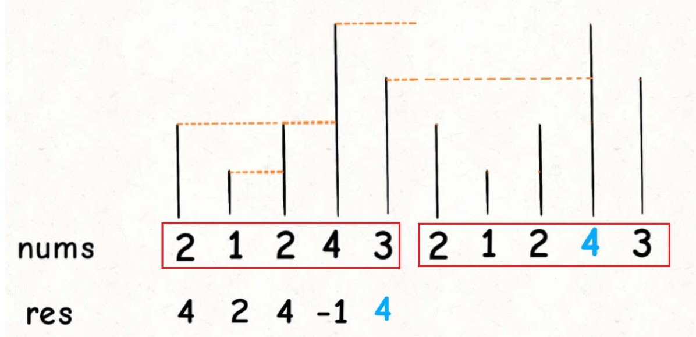

 <h1 style="font-size:60px;text-align:center;">单调栈</h1>


# 单调栈作用

**根据当前入栈的值，栈内部会维持顺序（递增或递减）。**

- `while (!s.empty() && s.top() <= nums[i])`: **比`nums[i]`小的都滚了，现在`nums[i]`最小，所以`s`是递减的**

- `while (!s.empty() && s.top() >= nums[i])`: **比`nums[i]`大的都滚了，现在`nums[i]`最大，所以`s`是递增的**

```cpp
    void monotonousStack(int* nums,int n){
        stack<int> s;

        // 值入栈
        for (int i = n-1; i >= 0; i--){
            
            // 确保当前值在栈中是最小的
            while (!s.empty() && s.top() <= nums[i])
            {
                // 栈顶的值小于等于当前值，直接弹出
                s.pop();
            }

            // 当前的 nums[i] 入栈
            s.push(nums[i]);
            
        }
    }
```

# Next Greater Number





**主要解决问题 Next Greater Number: 在当前数组中，比当前数更大的下一个数**

- `for` 循环: **要从后往前扫描元素**，因为我们借助的是栈的结构，倒着入栈，其实是正着出栈。

- `while`循环: 是把两个“高个”元素之间的元素排除

```cpp
    void nextGreater(int* nums,int n,int* out){
        stack<int> s;
        for (int i = n-1; i >= 0; i--){
            
            while (!s.empty() && s.top() <= nums[i])
            {
                // 栈顶的值小于等于当前值，滚蛋
                s.pop();
            }

            // 栈空的：没找到；不为空：栈顶就是
            if (s.empty())
            {
                out[i] = -1;
            }else{
                out[i] = s.top();
            }

            // 当前的 nums[i] 入栈
            s.push(nums[i]);
        }
    }
```

# 「循环」的Next Greater Number

将数组扩展一倍，然后用单调栈

# 与 Next Greater Number之间的距离

```cpp
    void nextGreaterInterval(int* nums,int n,int* out){
        // 栈中存放索引
        stack<int> s;
        for (int i = n-1; i >= 0; i--){

            while (!s.empty() && nums[s.top()] >= nums[i])
            {
                // 栈顶的值小于等于当前值，索引滚蛋
                s.pop();
            }

            // 栈空的：没找到；不为空：栈顶就是
            if (s.empty())
            {
                out[i] = -1;
            }else{
                out[i] = s.top() - i;
            }

            // 当前的 i 入栈
            s.push(i);
        }
    }
```


# 无序数组，去除重复值

>1. 要去重
>1. 重字符串中的字符顺序不能打乱s中字符出现的相对顺序
>1. 在所有符合上一条要求的去重字符串中，字典序最小的作为最终结果

**字典序：指从前到后比较两个字符串大小的方法。首先比较第1个字符，如果不同则第1个字符较小的字符串更小，一直这样子比较下去。**

```cpp
void rmDuplicate(const string & str){

    // 字符计数
    map<char,int> count;

    // 储存最终序列，以当前字符，内部是单增的
    stack<char> s;

    // 是否重复
    map<char,int> inStack;

    // 计数
    pair<map<char,int>::iterator,bool> res;
    for(char ch:str){
        res = count.insert(pair<char,int>(ch,1));
        if (res.second == false)
        {
            count[ch] += 1;
        }
    }

    for(char ch:str){
        // 取出一个
        count[ch] --;

        // 栈里面有，去重复
        if (inStack.count(ch) && inStack[ch] == true)
        {
            continue;
        }

        // 最小字典序：s是单调增加的
        while (!s.empty() && s.top() > ch)
        {
            // 后面已经没了，不能在弹出
           if (count[s.top()] == 0)
           {
               break;
           }

           inStack[s.top()] = false;
           s.pop();
        }

        s.push(ch);
        inStack[ch] = true;
    }
    
    string out = "";
    while (!s.empty())
    {
        out += s.top();
        s.pop();
    }
    for(int i = out.length() - 1;i >=0;i--){
        cout << out[i];
    }
    cout << endl;
}

```

- `map<char,int> count`: 记录存在个数
- `map<char,int> inStack`: **用来去重复**
- `stack<char> s`: **用于存放结果，并利用单调栈的特性，实现最小字典序**