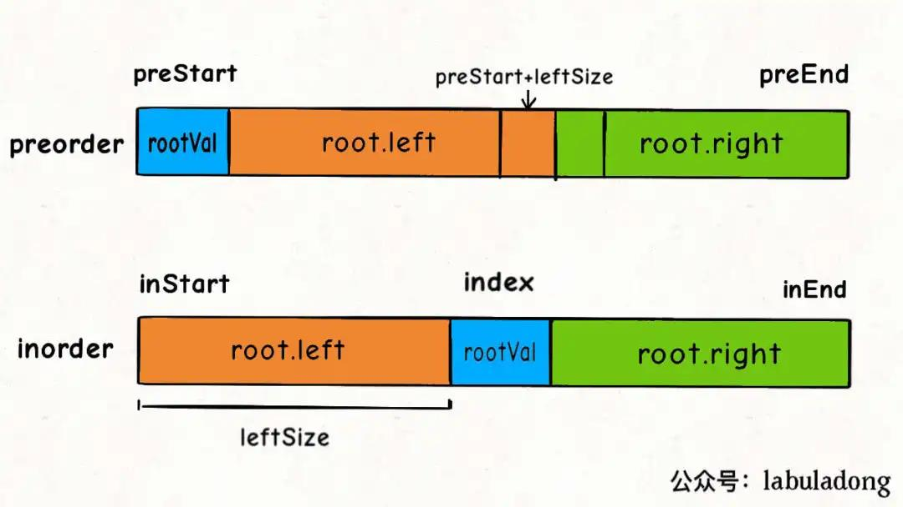
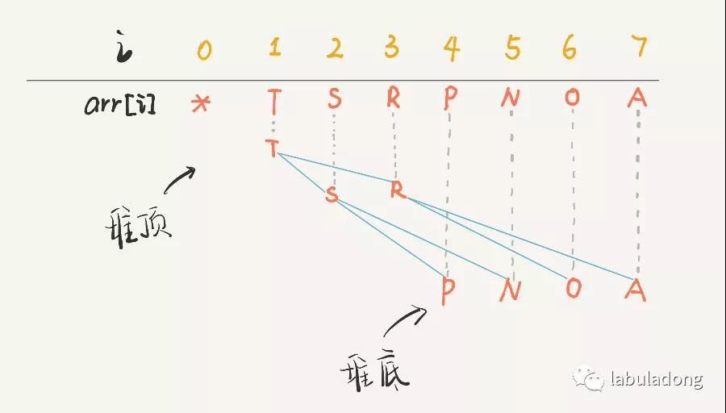
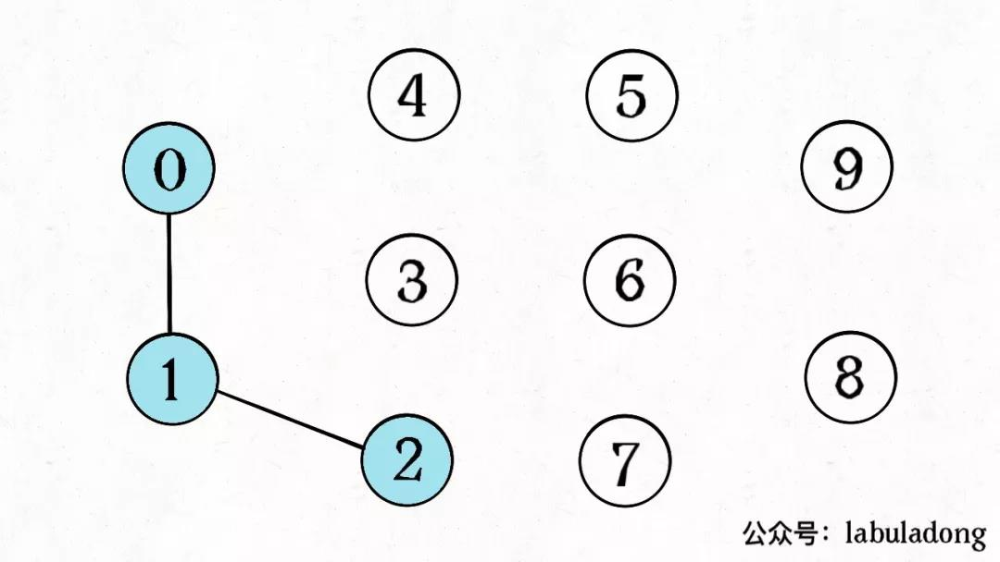
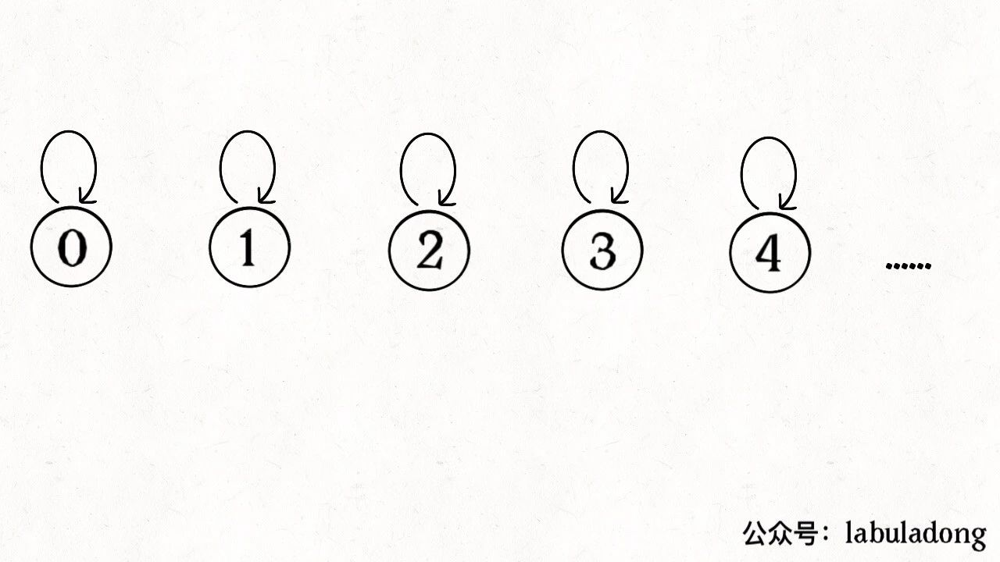
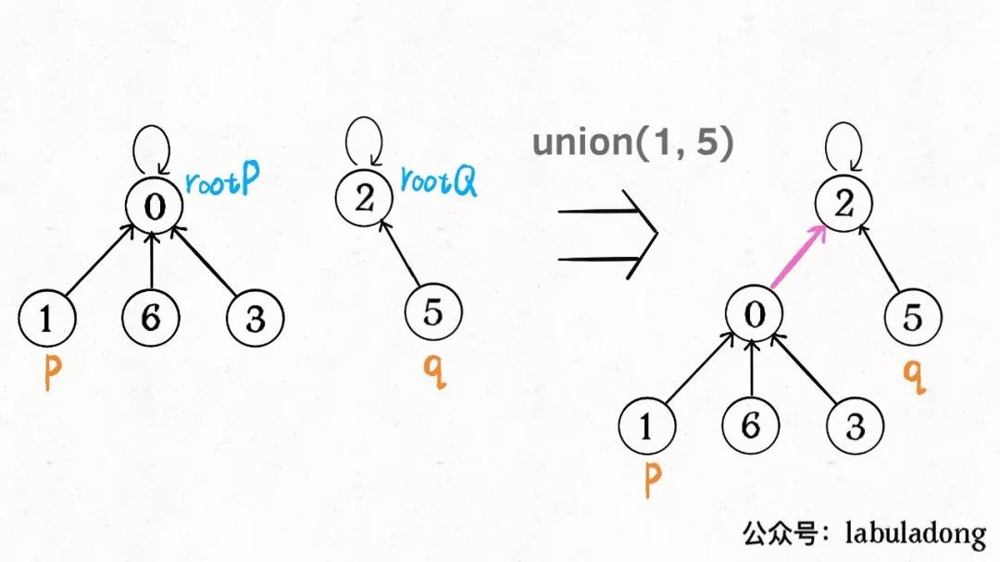
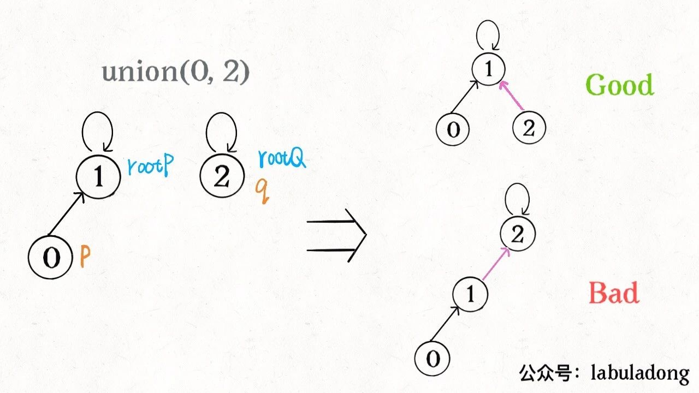
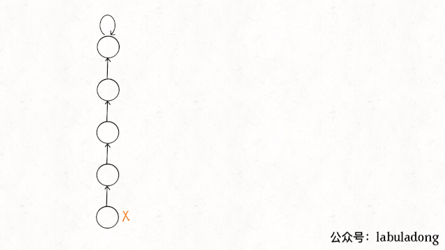

 <h1 style="font-size:60px;text-align:center;">树结构</h1>

参考博客：
- [二叉树的相关概念及原理](https://cloud.tencent.com/developer/article/1819519)
- [整理得吐血了，二叉树、红黑树、B&B+树超齐全，快速搞定数据结构](https://zhuanlan.zhihu.com/p/152599308)

# 基本概念

<p style="text-align:center;"></p>

- **子树：** 树集合中的一个子集，如图所示。
- **节点(node)：** 一个结点包括一个数据元素和若干指向其子树分支。
- **根节点(node)：** 一颗树只有一个树根
- **度（Degree）：** 一个结点拥有的子树数；例如结点`A `的度为 `3`，结点 `H` 的度为 `1`
- **叶子（Leaf）：** 度为 `0` 的结点被称为叶子结点
- **分支结点：**  度不为 `0` 的结点
- **内部结点：** 在树内部的结点，即不是根结点和叶子结点的结点。
- **层次（Level）：** 从根结点开始，同辈分的节点为一层；<span style="color:blue;font-weight:bold"> 起始编号为`1` </span>；例如节点`E`在第`3`层
- **深度（Depth）/ 高度：** 指树的最大层次
- **有序树：** 结点的各子树从左到右是有次序的、不能颠倒，则为有序树


# 树的递归特性

> [!tip]
> 树的层级关系可以用来描述一个「族谱」：
> - **父结点：** 层级靠前的结点
> - **子结点：** 层级为与父结点相连的下一层的节点。
> - **兄弟结点：** 同一层级的结点

<p style="text-align:center;"></p>

> [!note]
> **递归特性：**
> - 在树中，子树仍是一颗树，子树的子树仍是一棵树。(保证存储数据类型是一样的；数据的结构是一样的)
> - 父结点下存在子结点（`null`，也可以视为一个子结点），对于子结点又可成以成为子树的父结点。(保证存储数据间的关系是类似的，可以利用同一个代码逻辑进行问题处理)

```cpp

// 传入一颗以root为根结点的树
void recursion(Node* root){

    业务逻辑处理

    // 子结点又是子树的根结点
    recursion(root->child);
}

```

# 二叉树

## 基本概念
> [!note|style:flat]
> **定义：限制了孩子数量，即每个结点最多只能有两个孩子（左孩子和右孩子）**

<p style="text-align:center;"></p>

- **第`k`层的结点数： $\le 2^{k-1}$ 。**

- **深度为`h`的二叉树的总结点数：$\le 2^h - 1$**

    $$
    \begin{aligned}
        n_{node} &= 1 + 2 + 4 + \dotsm + 2^{h-1} \\
        &= \frac{2^{h} - 1}{2 - 1} \\
        &= 2^h - 1
    \end{aligned} \tag{1}
    $$

## 满二叉树 `full binary Tree`

<p style="text-align:center;"></p>

> [!note|style:flat]
> **定义：一个二叉树的深度为`h`，且结点总数是 $2^h - 1$；一棵二叉树的结点要么是叶子结点，要么该结点有两个子结点**

## 完全二叉树 `complete binary tree`

<p style="text-align:center;"></p>

> [!note|style:flat]
> **定义：叶子结点只能出现在最下层和次下层，且最下层的叶子结点集中在树的左部。**

## 满二叉树与完全二叉树

<p style="text-align:center;"></p>

> [!note]
> <span style="color:red;font-weight:bold"> 对于满二叉树与完全二叉树，一般可以采用「数组」的形式进行存储。 </span>

1. 父节点的编号为`k`，子左节点编号为`2k`，子右节点的编号为`2k+1`
2. 子节点的编号为`x`，父节点的编号为 $\lfloor \frac{x}{2} \rfloor$
3. 从上往下最后一个父节点的编号为 $\lfloor \frac{n}{2} \rfloor $ (`n`为总节点数)

# 二叉树遍历

## 遍历框架

- 前序遍历
- 中序遍历
- 后序遍历

```cpp
void Traversal(Node* root){

    // 退出条件
    if(root == nullptr) return;

    // 前序遍历

    Traversal(root->left);

    // 中序遍历

    Traversal(root->right);

    // 后序遍历
}
```

## 前序遍历

<p style="text-align:center;"></p>

> [!tip]
> <span style="color:red;font-weight:bold"> 以当前节点作为根节点的子树 </span>
> 1. **当前结点先输出，再进入「左子结点」**
>       - **若「左子结点」为`null`，则回退「父结点」**
> 1. **然后再进入「右子结点」**
>       - **若「右子结点」为`null`，则回退「父结点」**
> 1. **「右子结点」查询完，返回「父结点」**

## 中序遍历

<p style="text-align:center;"></p>

> [!tip]
> <span style="color:red;font-weight:bold"> 以当前节点作为根节点的子树 </span>
> 1. **先进入「左子结点」**
>       - **「左子结点」若为`null`，则回退「父结点」**
> 1. **「左边」查询完毕，输出当前结点；然后进入「右子结点」** 
>       - **「右子结点」若为`null`，则回退「父结点」**
> 1. **「右子结点」查询完，返回「父结点」**

## 后序遍历

<p style="text-align:center;"></p>

> [!tip]
> <span style="color:red;font-weight:bold"> 以当前节点作为根节点的子树 </span>
> 1. **先进入「左子结点」**
>       - **「左子结点」若为`null`，则回退「父结点」**
> 1. **然后进入「右子结点」** 
>       - **「右子结点」若为`null`，则回退「父结点」**
> 1. **「右子结点」查询完，输出当前结点值，返回「父结点」**

## 层级遍历

> [!note|style:flat]
> **广度优先搜索：** 详细代码见「二叉树章节」

<p style="text-align:center;"></p>


## 二叉树的建立

**通过「前序和中序」遍历结果构造二叉树：详细代码见「二叉树章节」**


**通过「中序和后序」遍历结果构造二叉树：详细代码见「二叉树章节」**


> [!tip]
> 1. **先从「前/后序列」结果中找到`rootVal`**
> 1. **然后，再「中序列」结果中找到`rootVal`**
> 1. **根据`rootVal`将「中序列」拆成「左，右」两半；根据`leftSize`位置关系将「前/后序列」拆成「左，右」两半** 
> 1. **「左半」是「左子树」，「右半」是「右子树」；「左、右子树」重复上述步骤，直到所有结点都找完。**


# 二叉查找树 `Binary Search Tree`

> [!note|style:flat]
> **二叉查找树：「根节点」的值大于其左子树中任意一个节点的值，小于其右子树中任意一节点的值，且该规则适用于树中的每一个节点。**
> $$ V_{lefts} <  V_{root} < V_{rights} \tag{2} $$
> 二叉查找树的查询效率介于`O(log n) ~ O(n)`之间


# 平衡二叉搜索树 `Balanced binary search trees`

> [!note|style:flat]
> **`AVL`树：「自平衡二叉搜索树」，树中任一节点的两个子树的高度差最大为`1`，所以它也被称为高度平衡树**
> - **其查找、插入和删除在平均和最坏情况下的时间复杂度都是O(log n)。**
> 
> **特点：**
> - **具有二叉查找树的特点(左子树任一节点小于父节点，右子树任一节点大于父节点)，任何一个节点的左子树与右子树都是平衡二叉树**
> - **任一节点的左右子树高度差小于1，即平衡因子为范围为[-1,1]**

# 二叉堆



> [!tip]
> <span style="color:blue;font-weight:bold"> 采用「完全二叉树」结构进行实现 </span>
> - **最大二叉堆**：<span style="color:red;font-weight:bold"> 每个节点 >= 子节点 </span>
> - **最小二叉堆**：<span style="color:red;font-weight:bold"> 每个节点 <= 子节点 </span>

# 生成树和最小生成树

- **生成树：** 「连通图」进行遍历（就涉及全部结点），过程中所经过的边和顶点的组合可看做是一棵普通树，通常称为生成树，是原图的一个子图。
  - **「连通图」有`n`个顶点，生成树有就有`n-1`条边**
  - **如果生成树中再添加一条边，则必定成环**

<p style="text-align:center;"></p>

- **最小生成树：** 代价和最小的「生成树」，就是边上面的数字和最小。

<p style="text-align:center;"></p>


# 并查集（union_find）

## 概念



> [!note|style:flat]
> **使用前提：**
> - **一堆独立的元素**
> - **问题与关于这些元素「能否动态连通」有关，即将问题转为「元素之间连没连通」。「连通」也可以理解为共性，等效。**
>
> **并查集解题思路：想办法让元素「分门别类」，建立动态连通关系。**

```java
class UF {
    /* 将 p 和 q 连接 */
    public void union(int p, int q);
    /* 判断 p 和 q 是否连通 */
    public boolean connected(int p, int q);
    /* 返回图中有多少个连通分量 */
    public int count();
    /* 找根 */
    public int findRoot(int q);
}

```

<!--sec data-title="完整代码" data-id="union_set" data-show=true data-collapse=true ces-->

```cpp
class UnionSet{
public:
    vector<int> parents;
    vector<int> weights;
    // 统计连通分量
    int count;

    void initialize(int n){
        for(int i = 0; i < n;i++){
            parents.push_back(i);
            weights.push_back(1);
        }
        count = parents.size();
    }

    // 查找
    int findRoot(int element){

        while (element != parents[element])
        {
            // 把当前父节点跳一级，实现路径压缩
            parents[element] = parents[parents[element]];

            element = parents[element];
        }

       return element; 
    }

    void connect(int a,int b){
        // 找根
        int rootA = findRoot(a);
        int rootB = findRoot(b);

        if(rootA == rootB){
            return;
        }

        // 增加重量的连接，让树长得更加均匀
        if (weights[rootA] > weights[rootB])
        {
            parents[rootB] = rootA;
            weights[rootA] += weights[rootB];
        }else{
            parents[rootA] = rootB;
            weights[rootB] += weights[rootA];
        }

        count--;
    }

    bool isConnect(int a,int b){
        int rootA = findRoot(a);
        int rootB = findRoot(b);

        if (rootA == rootB)
        {
            return true;
        }
        return false; 
    } 

};
```

<!--endsec-->

> [!note]
> <span style="color:blue;font-weight:bold"> 并查集：一个集合有多少元素毫不相关；一个集合中的两个元素是否连通。 </span>
> - **连通分量：集合中毫不相关的元素有多少。比如上图为`8`。**
> - **连通：**
>   - 自反：自己和自己连通
>   - 对称：两个元素互相连通
>   - 传递：`a`与`b`连通，`b`与`c`连通，则`c`与`a`之间也是连通的。

## 基本实现

### 数据结构

利用一个数组`parent[]`来储存集合元素，来实现一个图存储：
1）**数组的索引为元素值；**
2）**数组的值为元素的父节点**。

**元素的初始存储形式：**


### 合并



>[!tip]
> 1. 将两个元素遍历到根节点
> 1. 将两个根节点连接起来

<!--sec data-title="合并代码" data-id="merge" data-show=true data-collapse=true ces-->
```cpp
    void merge(int a,int b){
        // 找根
        int rootA = findRoot(a);
        int rootB = findRoot(b);

        if(rootA == rootB){
            return;
        }

        // 连接
        parents[rootA] = rootB;

        count--;
    }
```
<!--endsec-->

### 连通

> [!tip]
> 1. 将两个元素遍历到各自的根
> 1. 对比根是否一样？连通：不连通

<!--sec data-title="是否连通" data-id="is_connect" data-show=true data-collapse=true ces-->
```cpp
    // 是否连通
    bool isConnect(int a,int b){

        // 查根
        int rootA = findRoot(a);
        int rootB = findRoot(b);

        if (rootA == rootB)
        {
            return true;
        }

        return false; 
    } 
```
<!--endsec-->

## 平衡性优化



当合并两颗树时，将节点多的一颗树接到轻的树上时，就会造成树的生长不稳定，所以在接树的时候，需要对比两颗树的节点数，少数服从多数。

<!--sec data-title="优化连接" data-id="optimize_balance" data-show=true data-collapse=true ces-->

```cpp
    void connect(int a,int b){
        // 找根
        int rootA = findRoot(a);
        int rootB = findRoot(b);

        if(rootA == rootB){
            return;
        }

        // 连接
        if (weights[rootA] > weights[rootB])
        {
            parents[rootB] = rootA;
            weights[rootA] += weights[rootB];
        }else{
            parents[rootA] = rootB;
            weights[rootB] += weights[rootA];
        }

        count--;
    }
```
<!--endsec-->

## 路径压缩（最重要）



> [!note|style:flat]
> **`element != parents[element]`，节点与父节点不一样，就能跳过父节节点，直达爷节点。由于父节点自己指向自己，两个节点时，不会越界。**

```cpp
    // 查找
    int findRoot(int element){

        while (element != parents[element])
        {
            // 把当前节点的父节点跳一级，实现路径压缩
            parents[element] = parents[parents[element]];

            element = parents[element];
        }

       return element; 
    }
```

> [!tip|style:flat]
> <span style="color:red;font-weight:bold"> 压缩路径的优化性能较强与平衡性优化，平衡性优化可以不用写。 </span>

## 判定合法算式

**题目：**

给一组`["a==b","b!=c","c==a"]`的关系式，判断这些式子能否成立。
- `==`：当成两个元素连通
- `!=`: 两个元素不通