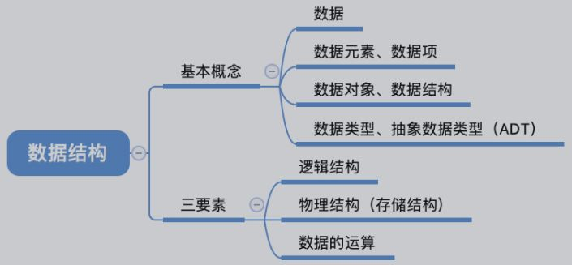
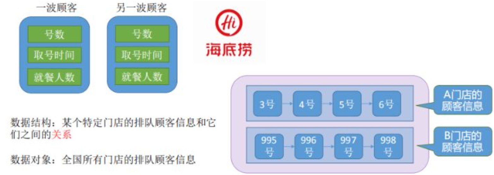
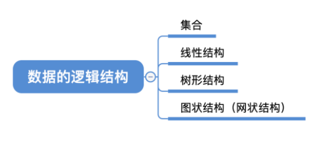
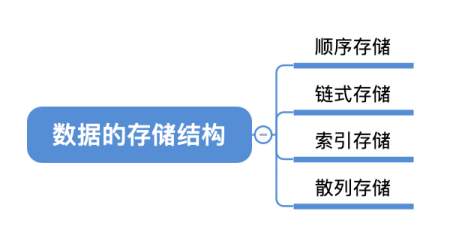

 <h1 style="font-size:60px;text-align:center;">数据结构</h1>

参考博客：
- [数据结构基础概念篇](https://blog.csdn.net/qq_31196849/article/details/78529724)
- [数据结构的基本概念](https://zhuanlan.zhihu.com/p/109110396#:~:text=%E6%95%B0%E6%8D%AE%E7%BB%93%E6%9E%84%EF%BC%88Data%20Structure%EF%BC%89%E6%98%AF%E6%8C%87%E7%9B%B8%E4%BA%92%E4%B9%8B%E9%97%B4%E5%AD%98%E5%9C%A8%E4%B8%80%E7%A7%8D%E6%88%96%E5%A4%9A%E7%A7%8D%E7%89%B9%E5%AE%9A%E5%85%B3%E7%B3%BB%E7%9A%84%E6%95%B0%E6%8D%AE%E5%85%83%E7%B4%A0%E7%9A%84%E9%9B%86%E5%90%88%E3%80%82%20%E6%95%B0%E6%8D%AE%E7%BB%93%E6%9E%84%E5%8C%85%E6%8B%AC,3%20%20%E6%96%B9%E9%9D%A2%E7%9A%84%E5%86%85%E5%AE%B9%EF%BC%9A%E9%80%BB%E8%BE%91%E7%BB%93%E6%9E%84%EF%BC%8C%E5%AD%98%E5%82%A8%E7%BB%93%E6%9E%84%E5%92%8C%E5%AF%B9%E6%95%B0%E6%8D%AE%E7%9A%84%E8%BF%90%E7%AE%97%E3%80%82%20%E6%95%B0%E6%8D%AE%E7%9A%84%E9%80%BB%E8%BE%91%E7%BB%93%E6%9E%84%E6%98%AF%E5%AF%B9%E6%95%B0%E6%8D%AE%E4%B9%8B%E9%97%B4%E5%85%B3%E7%B3%BB%E7%9A%84%E6%8F%8F%E8%BF%B0%EF%BC%8C%E5%AE%83%E4%B8%8E%E6%95%B0%E6%8D%AE%E7%9A%84%E5%AD%98%E5%82%A8%E7%BB%93%E6%9E%84%E6%97%A0%E5%85%B3%EF%BC%8C%E5%90%8C%E4%B8%80%E7%A7%8D%E9%80%BB%E8%BE%91%E7%BB%93%E6%9E%84%E5%8F%AF%E4%BB%A5%E6%9C%89%E5%A4%9A%E7%A7%8D%E5%AD%98%E5%82%A8%E7%BB%93%E6%9E%84%E3%80%82)

# 数据结构


<p style="text-align:center;"></p>

## 基本概念

- **数据** 
    
对客观事物的符号表示，指所有能输入到计算机中并被计算机程序处理的「**符号总称**」。

- **数据元素**

**数据元素（`data element`）数据的基本单位**，也称结点（node）或记录（record），在计算机程序中通常将其作为一个整体进行考虑和处理。有时，一个数据元素可由若干个「**数据项**」组成。

> 例子：一本书的书目信息为一个数据元素，而书目信息的每一项（如书名，作者名等）为一个数据项。

- **数据项**

数据项（`data item`）是数据结构中讨论的「最小单位」，是数据记录中最基本的，不可分的数据单位，也称域（`field`）。

- **数据对象**

数据对象（`Data Object`）是在数据中，**所有**性质相同的「数据元素」的集合，是数据的一个子集。

> 例如：大写字母就是一个数据对象，大写字母数据对象是集合{’A’,’B’……’Z’}。

- **数据结构**

数据结构（`Data Structure`）是指相互之间存在一种或多种特定**关系**的「数据元素」的集合。

<p style="text-align:center;"></p>


## 数据结构

<span style="font-size:24px;font-weight:bold" class="section2">1. 数据的逻辑结构</span>

**定义：对数据之间「关系」的描述，它与数据的「存储结构」无关，同一种逻辑结构可以有多种存储结构。**

<p style="text-align:center;"></p>

> [!tip]
> - **集合** : 结构中的数据元素除了同属于一种类型外，别无其它关系。
> - **线性结构** : 数据元素之间一对一的关系
> - **树形结构** : 数据元素之间一对多的关系
> - **图状结构或网状结构** : 结构中的数据元素之间存在多对多的关系

- **线性结构：** 一个数据元素的有序（次序）集合，「数据元素（结点）」之间存在着「一对一」的**关系**，例如：链表，数组
  - 集合中必存在唯一的一个「第一个元素」
  - 集合中必存在唯一的一个「最后的元素」
  - 除最后元素之外，其它数据元素均有唯一的「后继」
  - 除第一元素之外，其它数据元素均有唯一的「前驱」

- **非线性结构：** 非线性结构中的「结点（数据元素）」存在着「一对多」的**关系**，例如：图，树


<span style="font-size:24px;font-weight:bold" class="section2">2. 数据的物理结构</span>

**定义：又称为存储结构，是数据的逻辑结构在计算机中的「表示」（又称映像），它包括数据元素的表示和关系的表示。**

<p style="text-align:center;"></p>

- **顺序存储结构**：数组，内存都挨着的

- **链式存储结构**：链表，东一块西一块的

<span style="font-size:24px;font-weight:bold" class="section2">3. 数据结构设计准则</span>

**「逻辑结构」与「物理结构」的解耦。**
- 「逻辑结构」：数据结构在「应用程序」上的「具体操作」
- 「物理结构」：数据结构在「物理存储」上的「具体实现」

> [!tip]
> - **顺序表：** 线性（逻辑结构）表采用顺序存储（物理结构），即逻辑结构和物理结果均是线性的，例如：数组。

# 字符串

## c风格

- 字符串结尾标志为  `\0` 
-  ` " " ` : 自带 `\0` 
-  `strcat` : <font color="#4c9df8">会自动加  `\0` </font>

```cpp
#include <string.h>

// 创建
char str[] = "RUNOOB";
char *str =  "fuck";
char str[7] = {'R', 'U', 'N', 'O', 'O', 'B', '\0'};

// 拷贝字符串
strcpy(char *dest, const char *src); // 将src拷贝到dest，拷贝以 \0 作终止;
char *strncpy(char *dest, const char *src, size_t n); // n指定长度，更安全

// 拼接字符串
char *strcat(char *dest, const char *src); // 往dest上加字符串

// 字符串长度
strlen(str); // \0 终止

// 比较字符串
int strcmp(const char *s1, const char *s2); // 相同返回 0

// 查找
char *strchr(const char *str, int c); //返回第一个字符位置，没有返回NULL
char *strstr(const char *haystack, const char *needle); // 返回第一个字符串位置，没有返回NULL
```

##  c++字符串

-  `string` 是一个对象
-  `string` 的结尾没有结束标志  `\0` 
-  `==` 可以用来判断字符串是否相同

```cpp
#include <string>

// 创建
string str; // s1的值为NULL
string str = "c plus plus";
string str(c风格);

// 字符串长度
str.length();

// 转c风格
str.c_str();

// 访问字符
str[i];

// 数字转字符串
string to_string(int value);
string to_string(long value);
string to_string(double value);

// 字符转数字
atoi(const char*);
stoi(const string&);
strtoi(const char *);

// 插入
string& insert (size_t pos, const string& str);

// 删除
string& erase (size_t pos = 0, size_t len = npos);

// 获取子串
string substr (size_t pos = 0, size_t len = npos) const;

// 查找 返回第一个找到的位置，没找到返回一个无穷数
size_t find (const string& str, size_t pos = 0) const;
size_t find (const char* s, size_t pos = 0) const;
find_first_of(const string& str); // 子字符串和字符串共同具有的字符在字符串中首次出现的位置

```

# 栈 stack

- <font color="#f44336"> 没有迭代器功能。 </font>

```cpp
#include <stack>
#include <vector>
stack<int> s;
stack< int, vector<int> > stk;  //覆盖基础容器类型，使用vector实现stk
s.empty();  //判断stack是否为空，为空返回true，否则返回false
s.size();   //返回stack中元素的个数

s.pop();    //删除栈顶元素，但不返回其值
s.top();    //返回栈顶元素的值，但不删除此元素

s.push(item);   //在栈顶压入新元素item
```
# 队列 queue

- <font color="#f44336"> 没有迭代器功能。 </font>

```cpp
queue<int> q; //priority_queue<int> q;
q.empty();  //判断队列是否为空
q.size();   //返回队列长度

// 出队和入队
q.push(item);   //对于queue，在队尾压入一个新元素
q.pop();  //删除 queue 中的第一个元素

// 队列访问
q.front();  //返回队首元素的值，但不删除该元素
q.back();   //返回队尾元素的值，但不删除该元素
```

# vector

## 底层实现

<p style="text-align:center;"></p>


> [!tip]
> **`vector`是一个可以动态扩容的「数组」。`_Myfirst` 指向的是 `vector` 容器对象的起始字节位置；`_Mylast` 指向当前最后一个元素的末尾字节；`_myend` 指向整个 `vector` 容器所占用内存空间的末尾字节。**


## vector与list

| 条目     | vector       | list     |
| -------- | ------------ | -------- |
| 实现     | 动态扩容数组 | 双向链表 |
| 随机访问 | `O(1)`       | `O(n)`   |
| 插入删除 | `O(n)`       | `O(1)`   |

<!--sec data-title="具体操作" data-id="vector_operator" data-show=true data-collapse=true ces-->

```cpp
#include <vector>

// 创建
vector<T> vec;
vector<T> vec(int nSize); // 指定容器初始大小
vector(int nSize,const T& initValue):// 指定容器初始值

// 增加
vec.push_back(const T& item); // 在屁股添加
iterator vec.insert(iterator it,const T& item); // 迭代器指定位置插入元素

// 删除
vec.pop_back(); // 删除屁股
iterator erase(iterator it); // 删除迭代器指定位置元素
vec.clear(); // 删除全部

// 查找
vec[i];
vec.at(i); // 会检查是否越界，提高稳定性

// 容器内储存元素个数
vec.size();

// 容器是否有东西
vec.empty();

// 迭代器位置
vector<int>::iterator it = vec.begin(); // 起始位置
vector<int>::iterator it = vec.end(); // 结束位置
int a = *it; //获取值
*it += 1; 

// 定义二维数组
 vector< vector<int> > obj(row); // row定义行数
```
<!--endsec-->

## 内存管理

### 内存属性
- `size = _Mylast - _Myfirst`: 数据真正存储了多少个。
- `capacity = _Myend - _Myfirst`：预分配的内存空间。

```cpp
vector::size(); // 获取 size
vecotr::capacity(); // 获取 capacity
```

### 内存修改

- `reserve(int)`：<span style="color:red;font-weight:bold"> 仅仅只修改`capacity`，但不会真正的创建对象。 </span>

- `resize(int)`：<span style="color:red;font-weight:bold"> 分配了空间，也创建了对象。默认初始化为`0`。同时修改了`size `和` capacity` 。</span>


### 内存扩展

当`size == capacity`时，表示`vector`申请的内存已经被存储完了，需要进行内存扩张：
1. **完全弃用现有的内存空间，重新申请更大的内存空间；**
2. **将旧内存空间中的数据，按原有顺序移动到新的内存空间中；**
3. **最后将旧的内存空间释放。** 

> [!note|style:flat]
> vector 容器在进行扩容后，与其相关的指针、引用以及迭代器可能会失效。

## 排序

- `>` : 从大到小排序
- `<` : 从小到大排序，默认方式

```cpp
class Compare{
public:
    // 对象最好用引用进行传递 
    bool operator()(T const & a,T const & b){
        return a > b;
    } 
};

// 调用函数
sort(vec.begin(),vec.end(),Compare());
```

# map/multimap

- <font color="#f44336">map支持[ ]运算符，multimap不支持[ ]运算符。在用法上没什么区别。</font>
- `key` **不允许修改**

```cpp
//头文件
#include<map>
 
// 创建
map<int, string> map;

// 使用{}赋值是从c++11开始的，因此编译器版本过低时会报错，如visual studio 2012
map<int, string> map = {
                { 2015, "Jim" },
                { 2016, "Tom" },
                { 2017, "Bob" } };

map<int, string,Compare> map; // 指定排序规则

// 迭代器
map<int,string>::iterator it = map.begin(); 
map<int,string>::iterator it = map.end();
it->first; // key
it->second; // 值

// 添加key value 
pair<iterator,bool> state;// 能判断是否插入成功;插入key存在时，返回false
state = map.insert(pair<int, string>(1, "student_one")); 
state = map.insert(map<int, string>::value_type (1, "student_one")); 

map[key] = value; // key存在就覆盖，key没有就创建

// 查找
// 关键字查询，找到则返回指向该关键字的迭代器，否则返回指向end的迭代器
// 根据map的类型，返回的迭代器为 iterator 或者 const_iterator
iterator find (const key_type& k);
const_iterator find (const key_type& k) const;

// 删除
// 删除迭代器指向位置的键值对，并返回一个指向下一元素的迭代器
iterator erase( iterator pos );

 // 根据Key来进行删除， 返回删除的元素数量，在map里结果非0即1
size_t erase( const key_type& key );

// 删除一定范围内的元素，并返回一个指向下一元素的迭代器
iterator erase( const_iterator first, const_iterator last );
 
// 清空map，清空后的size为0
void clear();

// 查询map是否为空
bool empty();
 
// 查询map中键值对的数量
size_t size();

// 查询关键字为key的元素的个数，在map里结果非0即1 ，可用于检测key是否包含
size_t count( const Key& key ) const; 

```

**排序：**

 - `>` : 从大到小排序
 - `<` : 从小到大排序，默认方式
 - `map<string,int,Compaer>`
 - **`map` 对 `key` 进行排序。**
 - `map` <span style="color:red;font-weight:bold"> 不允许对 `key` 进行修改，所以 `operator()`引用与函数必须为 `const`  </span>
   
```cpp
class Compare{
public:
    bool operator()(const string & a,const string & b) const {
        return a.c_str()[0] < b.c_str()[0];
    } 
};
map<string,int,Compare> names;
```

# set/multiset

- **搜索、移除和插入计算速度 `O(log(n))`**。 
- set 通常以红黑树实现。
- **set不允许两个元素有相同值**。
- <font color="#f44336">不能通过set的迭代器去修改set元素，原因是修改元素会破坏set组织。</font> : ~~*it += 1~~

```cpp
#include <set>

// 创建
set<string> names;
set<string,Compare> names; // 指定排序规则 

// 添加
pair<set<int>::iterator, bool> ret = names.insert(name);

// 删除
names.erease(name);
names.clear();

// 查找，找不到返回 end()
set<string>::iterator it = names.find(name);

// 迭代器
set<string>::iterator it = names.begin();
set<string>::iterator it = names.end();
*it;

// 计数
names.count(name);

names.size();
names.empty();
```

**排序：**

 - `>` : 从大到小排序
 - `<` : 从小到大排序，默认方式
 - `set` <span style="color:red;font-weight:bold"> 不允许对 `key` 进行修改，所以 `operator()`引用必须为 `const`  </span>
   
```cpp
class Compare{
public:
    bool operator()(const string & a,const string & b) const {
        return a.c_str()[0] < b.c_str()[0];
    } 
};
set<string,Compare> names;
```

# deque

```cpp
    #include <deque>

    // 创建
    deque<string> que;
    
    // 首尾操作 
    que.push_back(item);
    que.pop_back();
    que.push_front();
    que.pop_back();
    que.front();
    que.back();

    // 删除
    que.erase(it);
    que.clear();

    // 查找 没有查找 用 #include<algorithm> 库中的 find

```


