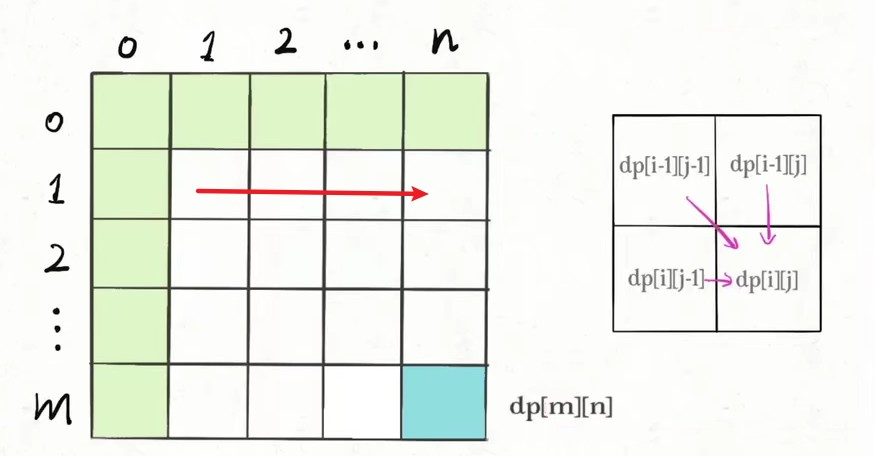

 <h1 style="font-size:60px;text-align:center;">动态规划</h1>

# 1 动态规划概念

 **动态规划问题的一般形式就是求最值**。

- **重叠子问题**: 最终点问题是由**某一单步小问题**的重复，这些 **小问题的求解可能会重复计算**。
- **最优子结构**: 当前步骤的最优只与"上一步"有关。根据这个特点可以**状态压缩**
- **状态转移方程**: 递推式，解决问题的核心。

## 1.1. 解题框架

1. 明确 base case: 初始条件
1. 明确「状态」: **推进子问题向大问题演变的变量。**
1. 明确「选择」: 也就是导致「状态」产生变化的行为。**「状态」能取哪些值**
1. 定义 dp 数组/函数:  dp值 = f（当前状态）
    - dp函数: 参数就是上面说到的「状态」。函数的返回值就是题目要求我们计算的量。
    - **dp 数组**：当状态为「状态」，问题结果为dp[状态]

```cpp

# 初始化
dp[] = init

# 边界条件
dp[0][0][...] = base

# 进行状态转移
for 状态1 in 状态1的所有取值：
    for 状态2 in 状态2的所有取值：
        for ...
            dp[状态1][状态2][...] = 求最值(选择1，选择2...)
```
## 1.2. 流程方向

- **自顶向下: 从目标开始，把大问题拆解小问题，直到到初始条件。**
    - 暴力递归: 把大问题拆成小的，递归下去
    - **备忘录递归**: 算过的值记录下来，不在重复算
-  **自底向上: 从初始开始，根据递推式，一步一步迭代，直到目标结束。** 
    - **dp数组**: 从初始状态，根据递推关系，算到目标状态，**循环数组，不用递归。**

## 1.3. 重复子问题的确定

```cpp
    dp[i][j] = min{
        dp[i-1][j] + 1,
        dp[i][i-1] + 1,
        dp[i-1][j-1] + 1
    }
```
&emsp;&emsp;**当从`dp[i-1][j-1]`过度到`dp[i][j]`的求解有多种路径时，就存在解重叠的情况。采用备忘录和dp数组解决。**

## 1.4. 状态遍历顺序



> [!note|style:flat]
> 1. **确定二维表`dp[][]`初始值**
> 1. **确定递推式`dp[i][j]`的依赖情况（上图左边）**
> 1. **根据依赖关系填充二维表，满足横向填充或者纵向填充**

```cpp
    // i = 0, j = 0 的情况是边界条件，已经初始化好了。 
    for (int i = 1; i <= m; i++){
        for (int j = 1; j <= n;j++){
            dp[i][j] = f(dp[i-1][j-1],dp[i][j-1],dp[i-1][j]);
        }
    }
```