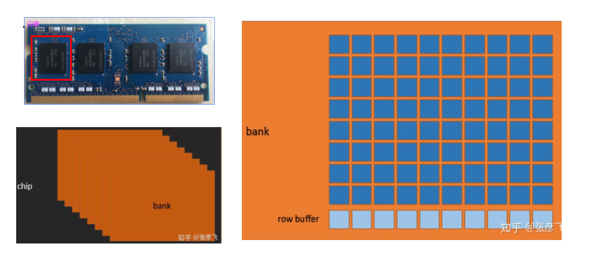
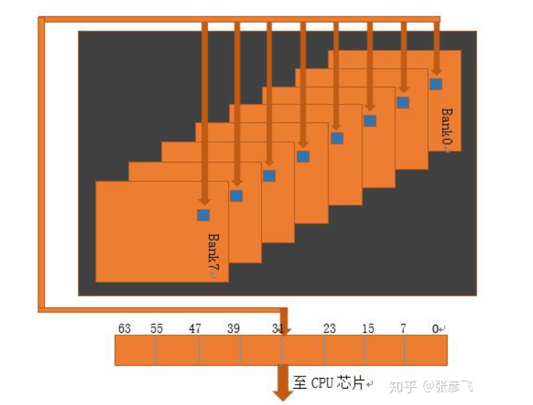
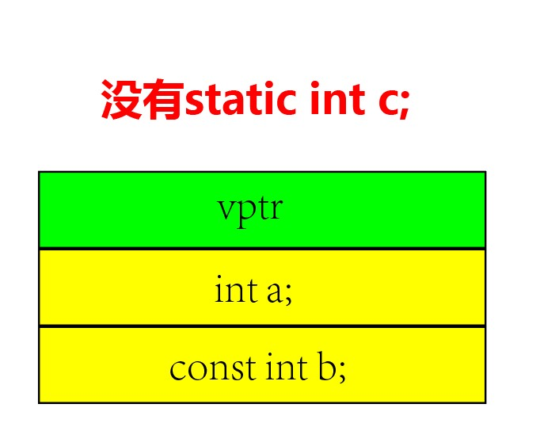
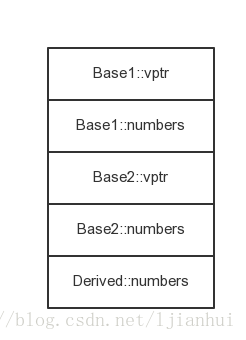

 <h1 style="font-size:60px;text-align:center;">内存</h1>

# 代码内存分布


| 内存空间       | 存放内容                                                            | 读写权限             |
| -------------- | ------------------------------------------------------------------- | -------------------- |
| 内核空间       | 操作系统运行的内存空间。栈，堆。。齐全                              | 应用程序不能直接操作 |
| 栈             | 函数局部变量，形参                                                  | 读/写                |
| 堆             | `new/malloc`申请空间                                                | 读/写                |
| 全局的数据空间 | 全局变量，`static`变量。包括初始化化的（data），未初始化的（bss）。 | 读写                 |
| 只读数据段     | `"fuck you"`等字符串常量                                            | 读                   |
| 代码段         | 程序代码最终的指令集                                                | 读                   |

# 内存泄露/栈溢出

- **内存泄露**: 堆使用了，没清空，内存大量浪费
- **栈溢出**: 使劲增加局部变量，栈用完了


# 字符存储编码
 
- **ASCII 码**: 使用指定的7 位或8 位二进制数组合来表示128 或256 种可能的字符。

- **BCD码**: （Binary-Coded Decimal‎）亦称二进码十进数或二-十进制代码。用4位二进制数来表示1个十进制数中的0~9这10个数码。

- **内码**: 指汉字系统中使用的二进制字符编码。 

# 字节对齐

## 介绍

### 概念

**内存空间按照字节划分，在访问特定类型变量时经常在特定的内存地址访问，这就需要各种类型数据按照一定的规则在空间上排列，而不是顺序一个接一个地存放，这就是对齐**。

### 原因

- 不同硬件平台对存储空间的处理上存在很大的不同。某些平台对特定类型的数据只能从特定地址开始存取，不能任意存放数据。
- 不按照平台要求对数据存放进行对齐，会带来存取效率上的损失。例如：一个32位的数据没有存放在4字节整除的内存地址处，那么处理器就需要2个总线周期对其进行访问。
- <span style="color:red;font-weight:bold"> 说白了就是为了CPU读写数据时，统一规则，能一大块一大块的拿，节约时间。 </span>

## 字节对齐计算

### 字节对齐值

> [!note]
> - **数据类型「自身对齐值」**：char型数据自身对齐值为1字节，short型数据为2字节，int/float型为4字节，double型为8字节。
> - **结构体或类的「自身对齐值」：`max(成员中自身对齐值)`**
> - **指定对齐值：`#pragma pack (对齐值)`**
> - **结构体和类的「有效对齐值」：`min{类，结构体自身对齐值，当前指定的pack值}`。** 
> - **数据成员的「有效对齐值」：`min{成员自身对齐值，当前指定的pack值}`**
> - **默认对齐值** ：`64`位，`8`字节；`32`位，`4`字节。 
### 字节对齐准则

> [!warning|style:flat]
> - <span style="color:red;font-weight:bold"> 有效对齐值`N`最终决定数据存放地址方式。表示「对齐在`N`上」，即存放的起始地址满足 `起始地址 % N == 0` </span>
> - **数据结构中的数据变量都是按定义的先后顺序存放。第一个数据变量的起始地址就是数据结构的起始地址。** <span style="color:red;font-weight:bold"> 类，结构体的成员变量要对齐存放 </span>
> - **结构体本身也要根据自身的「有效对齐值」圆整**，<span style="color:red;font-weight:bold"> 即结构体成员变量占用总长度为结构体「有效对齐值」的整数倍，不足也要补足。 </span>

### 储存字节计算

```cpp
#pragma pack() 
struct TestA{
    char ch;
    int i;
    double d;
    const char cch;
};

struct TestB{
    char chb;
    struct TestA a;
    int ib;
};
#pragma pack() // 缺省，恢复默认的对齐字节

int main(void){
    struct TestB b;

    printf("amount: %d\n",sizeof(b));

    printf("b.a: %d\n",
          (unsigned int)(void*)&b.a  - (unsigned int)(void*)&b);

    printf("b.a.ch: %d\n",
          (unsigned int)(void*)&b.a.ch  - (unsigned int)(void*)&b);

    printf("b.a.i: %d\n",
          (unsigned int)(void*)&b.a.i  - (unsigned int)(void*)&b);

    printf("b.a.d: %d\n",
          (unsigned int)(void*)&b.a.d  - (unsigned int)(void*)&b);

    printf("b.a.cch: %d\n",
          (unsigned int)(void*)&b.a.cch  - (unsigned int)(void*)&b);

    printf("b.ib: %d\n",
          (unsigned int)(void*)&b.ib  - (unsigned int)(void*)&b);
    return 0;
}
```

<!--sec data-title="运行结果" data-id="code_res" data-show=true data-collapse=true ces-->

```cpp
triangle@DESKTOP-RDTVBUO:/mnt/c/Users/GOD/Desktop/test/testcpp$ ./a.out 
amount: 40
b.a: 8
b.a.ch: 8
b.a.i: 12
b.a.d: 16
b.a.cch: 24
b.ib: 32
triangle@DESKTOP-RDTVBUO:/mnt/c/Users/GOD/Desktop/test/testcpp$ 
```
<!--endsec-->

**对`TestB`的储存结构进行说明：**

<main style="width: 100%;display: flex">
   <div  style="width: 70%;">
     1. <code>64</code>位系统，默认对齐字节<code>8</code>；<br>
     2. <code>char chb</code>：<code>char</code>的自身对齐值<code>min{1,8}</code>，所以存储地址首地址<code>0 % 1 == 0</code>成立。<br>
     3. <code>TestA a</code>：<code>double d;</code>字节数最大，所以其「自身对齐值」为<code>8</code>，有效对齐值为<code>min{8,8}</code>，存储地址首地址<code> 8 % 8 == 0 </code>成立。<br>
     <br>
     ===开始对<code>TestA a</code>内部字节<code>8 ~ 31</code>进行划分。===<br> <br>
     1. <code>char ch;</code>：就按照<code>TestA a</code>首地址往下存。<br>
     2. <code>int i;</code>：<code>int</code>的自身对齐值<code>min{4,8}</code>，所以存储地址首地址<code>12 % 4 == 0</code>成立。<br>
     3. <code>double d;</code>：<code>double</code>的自身对齐值<code>min{8,8}</code>，所以存储地址首地址<code>16 % 8 == 0</code>成立。<br>
     4. <code>const char cch;</code>：<code>char</code>的自身对齐值<code>min{1,8}</code>，所以存储地址首地址<code>24 % 1 == 0</code>成立。<br>
     5. <span style="color:red;font-weight:bold"> 由于<code>TestA a</code>的「有效对齐值」为 <code> min(8,8) </code>，根据「圆整准则」<code>TestA a</code> 的大小必须为  <code> n*8 </code>，所以最后的<code> 25 ~ 31 </code> 为编译器填充。 </span> <br><br>
     ===对<code>TestB</code>进行最后圆整收尾===<br> <br>
     1. <span style="color:red;font-weight:bold"> 对于<code>TestB</code>而言成员最大的对齐值是<code>TestA a </code>，「有效对齐值」为 <code> min(8,8) </code>，所以<code>TestB</code> 的大小必须为  <code> n*8 </code>，最后进行了<code> 36 ~ 39 </code> 的填充。 </span> 
   </div>
   <div style="width: 30%" align="center"></div>
</main>

### `# pragma pack()`

> [!note]
> - `# pragma pack(对齐值)`:**可以重新定义默认的对齐字节值，计算方法就是`3.`中的默认值替换掉，然后同上计算。** <span style="color:red;font-weight:bold"> 对齐值只能为 $2^n$ </span>。
> - `# pragma pack()`: **缺省，表示使用默认。**
> - `# pragma pack(push)`: **将当前对齐字节值保存**
> - `# pragma pack(pop)`: **将保存的对齐字节值弹出**

## 字节对齐的隐患

### 问题

```cpp
// 案列一
int main(void){
    unsigned int i = 0x12345678;
    unsigned char *p = (unsigned char *)&i;

    *p = 0x00;
    unsigned short *p1 = (unsigned short *)(p+1);

    return 0;
}

// 案列二
void Func(struct B *p2){
    //Code
}
```

> [!note|style:flat]
> **案列一：`p1`访问内存数值时，由于指向为奇数，对于`32`位会降低速度，对于特殊CPU则会异常。** <br>
> **案列二：`p2`如果是跨CPU访问，对齐要求不同，也会导致异常。**

### 解决方案

> [!tip|style:flat]
> **对于案列二，可以选择修改对齐方式，然后重新赋值，让编译器解决。**
> ```cpp
> #pragma pack(对齐值)
> void Func(struct B *p){
>     struct B tData;
>     memmove(&tData, p, sizeof(struct B));
>     //此后可安全访问tData.a，因为编译器已将tData分配在正确的起始地址上
> }
> ```
> 
> **规划好字节排序：**
> - **同一类型尽量放一起**
> - **默认对齐字节整数倍大小的紧凑放最前**
> - **接着放能够凑成默认对齐字节大小的**
> - **不够默认对齐字节的放最后，并添加几个填充字符。**
> 
> ```cpp
>    typedef struct tag_T_MSG{
>       // 默认对齐字节大小
>       int  ParaA;
>       int  ParaB;
>       // 凑默认对齐字节大小
>       short ParaC；
>       char  ParaD;
>       //填充字节      
>       char  Pad;  
>    }T_MSG;   
> ```

## 默认对齐字节的由来

### 内存的结构

一个内存是由若干个「黑色的内存颗粒」构成；一个内存颗粒叫做一个「chip」；每个「chip」内部，是由`8`个「bank」组成的；每一个「bank」是一个二维平面上的矩阵，每一个元素中都是保存了`1 byte`，也就是`8 bit`。

<p style="text-align:center;"></p>


### 内存地址

**内存地址编号：**
<span style="color:red;font-weight:bold"> 一个地址编号对应一个字节，对于地址`0x0000-0x0007`地址，是在第一个「chip」上，是由重叠的`8`个「bank」相同位置上的元素从`bank0 ~ bank7`进行编号，`8`个「bank」是可以并行工作，加快读写速度。</span> 

**`8`个「bank」：**
<span style="color:blue;font-weight:bold"> `64`位cpu对内存的一次操作只能操作`8 byte`，因为`64`位cpu的寄存器是`64`位的，只能放`8 * 8 bit`的值。 </span>


<p style="text-align:center;"></p>

### 字节对齐默认值

> [!note|style:flat]
> <span style="color:red;font-weight:bold">`64`位的cpu，默认对齐字节为`8`， 这就能保证，小于等于`8`字节的数据存储位置，是cpu能一次操作就能成功获取完毕的。 </span> <br> <br>
> 假如: 你指定要获取的是`0x0005 ~ 0x0009`的数据：内存只好先工作一次把`0x0000-0x0007`取出来，然后再把`0x0008-0x0000f`取出来，最后再把两次的结果合并，把最终结果返回。<br><br>
><span style="color:red;font-weight:bold"> 同理`32`位的cpu默认对齐字节位`4`，因为`32`位cpu的寄存器是`32`位的。 </span> 


# 类/结构体的内存分布

## 类

<p style="text-align:center;"> </p>


**一个类在内存中的组成：**
- <span style="color:blue;font-weight:bold"> 若有`virtual`方法：第一个为`vptr`，所占字节数根据操作系统来：`64位：8 byte`，`32位：4 byte`。 </span>
- <span style="color:red;font-weight:bold"> 非`static`变量 ，`static`变量在静态区。</span>
- <span style="color:red;font-weight:bold"> `const`变量也在里面，虽然编译器会对常量进行优化放到常量表，但是根还在这儿。 </span>
- **对象变量指向第一个内存位置的地址** 
- **属性存放顺序与定义顺序一样** 


## 子类

 <p style="text-align:center;"></p>

> [!note]
> - **父类的若有`vptr` 就放第一个**，
> - **接着是父类的非static属性**
> - **最后放子类的属性**
> - <font color="#f44336">防止多重继承，出现属性多次定义，继承时，使用 virtual 进行修饰。</font>

## 结构体

<span style="color:blue;font-weight:bold"> 与类一样。唯一不同点，就是没有`vptr`。 </span>

## 字节计算

- **类：`sizeof(vptr)` +  `5.2`的结果；`sizeof(vptr)`由操作系统定，`64位，8 byte`；`32位，4 byte`**
- **结构体：`5.2`的结果**

<!--sec data-title="思考题" data-id="problem" data-show=true data-collapse=true ces-->
**在`64位`操作系统，`sizeof(TestB)`的大小为`24`。**
```cpp
class TestA{
public:
    const int b;
    virtual void fcn(){}
};

class TestB{
public:
    int c;
    TestA a;
};
```
<!--endsec-->

# 对象与类

| 类型 | 描述                         | 储存                                                              |
| ---- | ---------------------------- | ----------------------------------------------------------------- |
| 类   | 模板，包括属性和行为         | 无                                                                |
| 对象 | 类的实例化，主要是数据的集合 | 主要只储存了属性，储存位置看具体情况 ; 函数放代码段，所有对象通用 |


> [!warning|style:flat]
> **类的概念没有占用内存，但是`sizeof(类名)`是有值的，等于`sizeof(实列)`计算结果。**

#  8 代码地址

- **运行时地址起始位置**：它芯片公司指定的一开始运行代码的位置。

- **运行地址**: 就在从运行时地址起始位置（包括起始位置）往后排都是运行时地址。(程序代码被搬过来执行)

- **链接地址起始位置**：链接脚本设定，这个位置在程序链接之后，就会确定下来。(用来计算偏移量的伪地址，之后重定向)

- **链接地址**: 就是从链接地址起始位置（包括起始位置）往后排都是链接地址。(类似汇编地址)

- **加载地址**: 从flash的那个地方开始读取程序，加载内存中去。

- **存储地址**: 程序存储在哪儿的。

