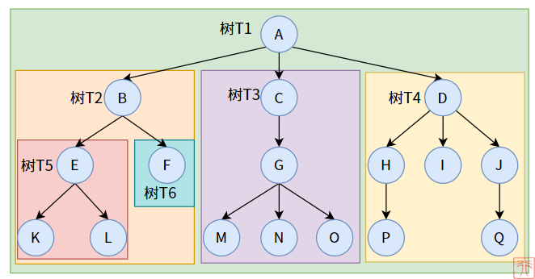
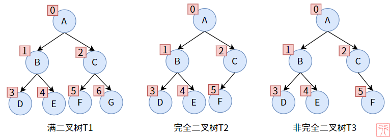
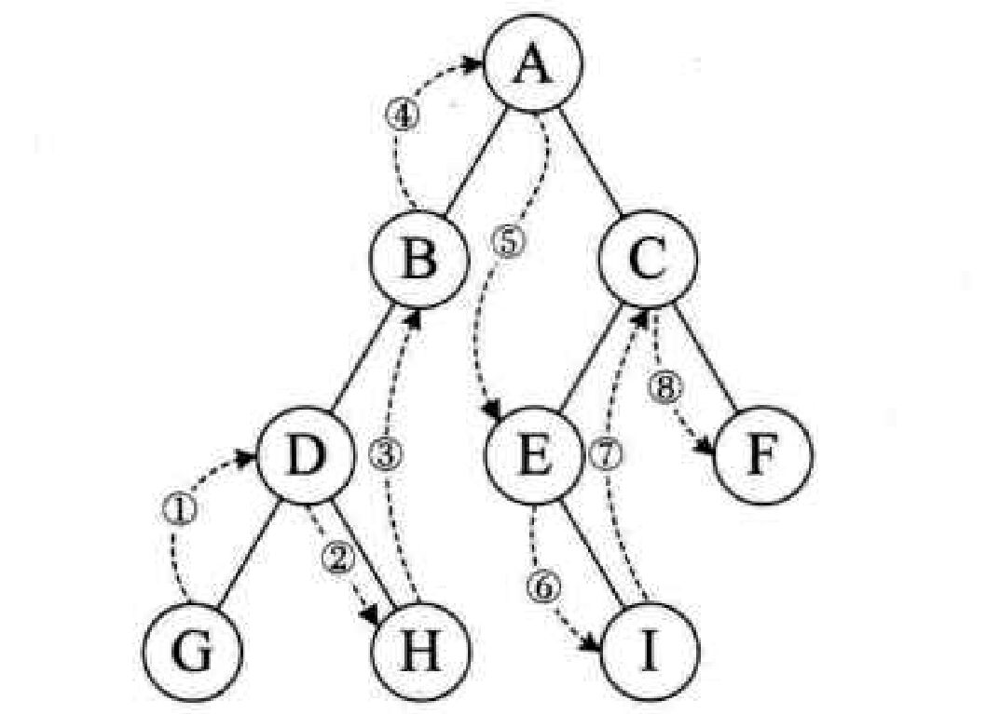
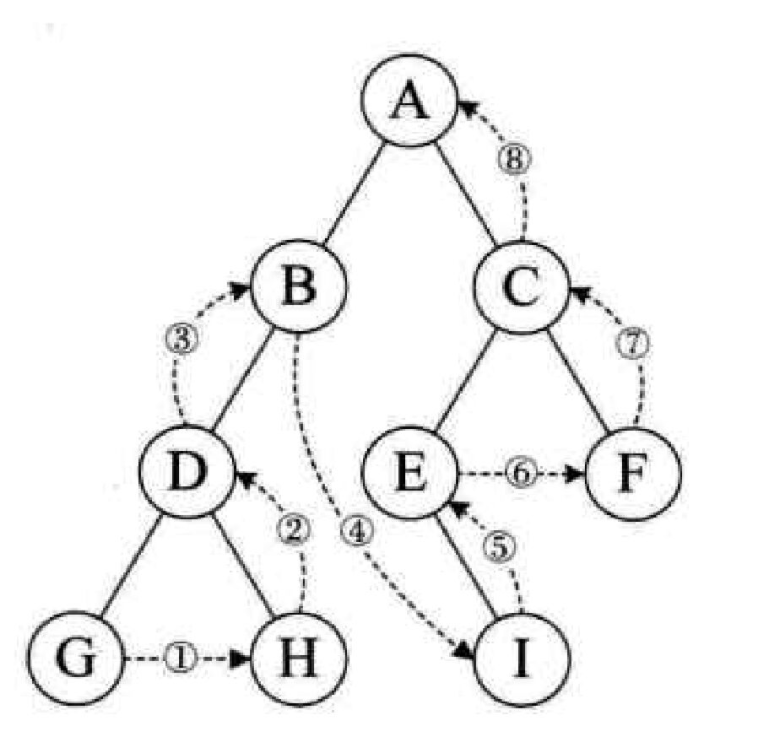
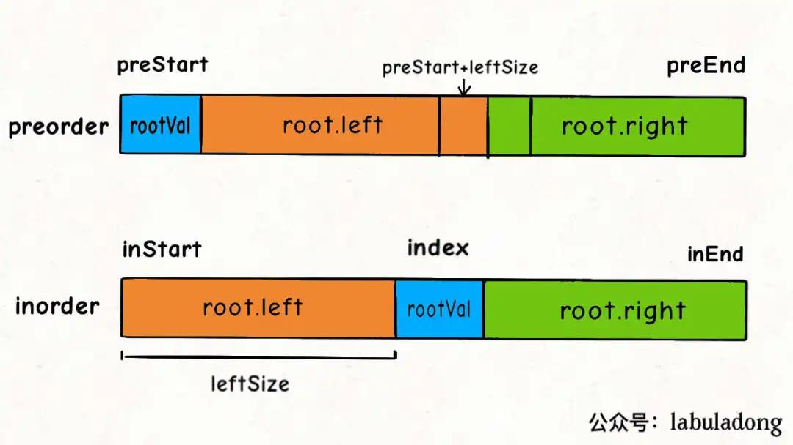
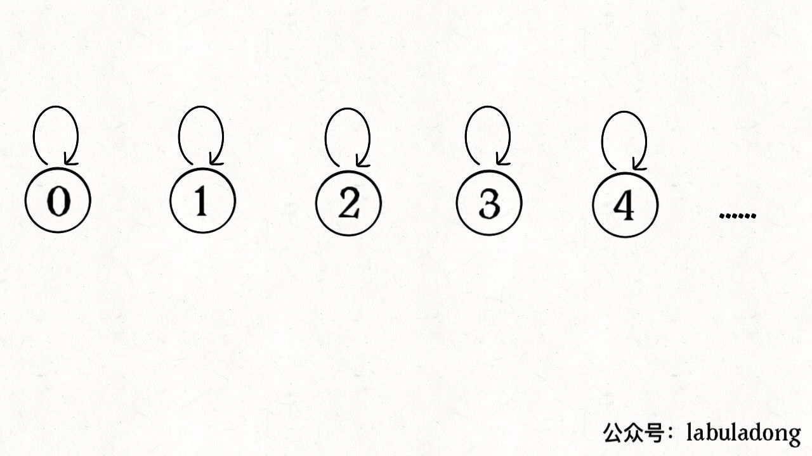
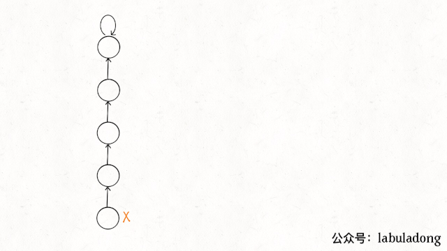

 <h1 style="font-size:60px;text-align:center;">树结构</h1>

参考博客：
- [二叉树的相关概念及原理](https://cloud.tencent.com/developer/article/1819519)
- [整理得吐血了，二叉树、红黑树、B&B+树超齐全，快速搞定数据结构](https://zhuanlan.zhihu.com/p/152599308)

# 1. 基本概念

<p style="text-align:center;"></p>

- **子树：** 树集合中的一个子集，如图所示。
- **节点(node)：** 一个结点包括一个数据元素和若干指向其子树分支。
- **根节点(node)：** 一颗树只有一个树根
- **度（Degree）：** 一个结点拥有的子树数；例如结点`A `的度为 `3`，结点 `H` 的度为 `1`
- **叶子（Leaf）：** 度为 `0` 的结点被称为叶子结点
- **分支结点：**  度不为 `0` 的结点
- **内部结点：** 在树内部的结点，即不是根结点和叶子结点的结点。
- **层次（Level）：** 从根结点开始，同辈分的节点为一层；<span style="color:blue;font-weight:bold"> 起始编号为`1` </span>；例如节点`E`在第`3`层
- **深度（Depth）/ 高度：** 指树的最大层次
- **有序树：** 结点的各子树从左到右是有次序的、不能颠倒，则为有序树


# 2. 树的递归特性

> [!tip]
> 树的层级关系可以用来描述一个「族谱」：
> - **父结点：** 层级靠前的结点
> - **子结点：** 层级为与父结点相连的下一层的节点。
> - **兄弟结点：** 同一层级的结点

<p style="text-align:center;"></p>

> [!note]
> **递归特性：**
> - 在树中，子树仍是一颗树，子树的子树仍是一棵树。(保证存储数据类型是一样的；数据的结构是一样的)
> - 父结点下存在子结点（`null`，也可以视为一个子结点），对于子结点又可成以成为子树的父结点。(保证存储数据间的关系是类似的，可以利用同一个代码逻辑进行问题处理)

```cpp

// 传入一颗以root为根结点的树
void recursion(Node* root){

    业务逻辑处理

    // 子结点又是子树的根结点
    recursion(root->child);
}

```

# 3. 二叉树

## 3.1. 基本概念
> [!note|style:flat]
> **定义：限制了孩子数量，即每个结点最多只能有两个孩子（左孩子和右孩子）**

<p style="text-align:center;"></p>

- **第`k`层的结点数： $\le 2^{k-1}$ 。**

- **深度为`h`的二叉树的总结点数：$\le 2^h - 1$**

    $$
    \begin{aligned}
        n_{node} &= 1 + 2 + 4 + \dotsm + 2^{h-1} \\
        &= \frac{2^{h} - 1}{2 - 1} \\
        &= 2^h - 1
    \end{aligned} \tag{1}
    $$

## 3.2. 满二叉树 `full binary Tree`

<p style="text-align:center;"></p>

> [!note|style:flat]
> **定义：一个二叉树的深度为`h`，且结点总数是 $2^h - 1$；一棵二叉树的结点要么是叶子结点，要么该结点有两个子结点**

## 3.3. 完全二叉树 `complete binary tree`

<p style="text-align:center;"></p>

> [!note|style:flat]
> **定义：叶子结点只能出现在最下层和次下层，且最下层的叶子结点集中在树的左部。**

## 3.4. 满二叉树与完全二叉树

<p style="text-align:center;"></p>

> [!note]
> <span style="color:red;font-weight:bold"> 对于满二叉树与完全二叉树，一般可以采用「数组」的形式进行存储。 </span>

1. 父节点的编号为`k`，子左节点编号为`2k`，子右节点的编号为`2k+1`
2. 子节点的编号为`x`，父节点的编号为 $\lfloor \frac{x}{2} \rfloor$
3. 从上往下最后一个父节点的编号为 $\lfloor \frac{n}{2} \rfloor $ (`n`为总节点数)

# 4. 二叉树遍历

## 4.1. 遍历框架

- 前序遍历
- 中序遍历
- 后序遍历

```cpp
void Traversal(Node* root){

    // 退出条件
    if(root == nullptr) return;

    // 前序遍历

    Traversal(root->left);

    // 中序遍历

    Traversal(root->right);

    // 后序遍历
}
```

## 4.2. 前序遍历

<p style="text-align:center;"></p>

> [!tip]
> <span style="color:red;font-weight:bold"> 以当前节点作为根节点的子树 </span>
> 1. **当前结点先输出，再进入「左子结点」**
>       - **若「左子结点」为`null`，则回退「父结点」**
> 1. **然后再进入「右子结点」**
>       - **若「右子结点」为`null`，则回退「父结点」**
> 1. **「右子结点」查询完，返回「父结点」**

## 4.3. 中序遍历

<p style="text-align:center;"></p>

> [!tip]
> <span style="color:red;font-weight:bold"> 以当前节点作为根节点的子树 </span>
> 1. **先进入「左子结点」**
>       - **「左子结点」若为`null`，则回退「父结点」**
> 1. **「左边」查询完毕，输出当前结点；然后进入「右子结点」** 
>       - **「右子结点」若为`null`，则回退「父结点」**
> 1. **「右子结点」查询完，返回「父结点」**

## 4.4. 后序遍历

<p style="text-align:center;"></p>

> [!tip]
> <span style="color:red;font-weight:bold"> 以当前节点作为根节点的子树 </span>
> 1. **先进入「左子结点」**
>       - **「左子结点」若为`null`，则回退「父结点」**
> 1. **然后进入「右子结点」** 
>       - **「右子结点」若为`null`，则回退「父结点」**
> 1. **「右子结点」查询完，输出当前结点值，返回「父结点」**

## 4.5. 层级遍历

> [!note|style:flat]
> **广度优先搜索：** 详细代码见「二叉树章节」

<p style="text-align:center;"></p>


## 4.6. 二叉树的建立

**通过「前序和中序」遍历结果构造二叉树：详细代码见「二叉树章节」**


**通过「中序和后序」遍历结果构造二叉树：详细代码见「二叉树章节」**


> [!tip]
> 1. **先从「前/后序列」结果中找到`rootVal`**
> 1. **然后，再「中序列」结果中找到`rootVal`**
> 1. **根据`rootVal`将「中序列」拆成「左，右」两半；根据`leftSize`位置关系将「前/后序列」拆成「左，右」两半** 
> 1. **「左半」是「左子树」，「右半」是「右子树」；「左、右子树」重复上述步骤，直到所有结点都找完。**


# 5. 二叉查找树 `Binary Search Tree`

> [!note|style:flat]
> - **二叉查找树：「根节点」的值大于其左子树中任意一个节点的值，小于其右子树中任意一节点的值，且该规则适用于树中的每一个节点。**
> $$ V_{lefts} <  V_{root} < V_{rights} \tag{2} $$
> - 「中序遍历」为升序
> - 二叉查找树的查询效率介于`O(log n) ~ O(n)`之间，最大糟糕的查差次数为「二叉树高度」。

<!--sec data-title="完整实现代码" data-id="bst" data-show=true data-collapse=true ces-->
```cpp
class Note
{
public:
    int val;
    Note *left;
    Note *right;
    Note(int val) : val(val)
    {
        left = nullptr;
        right = nullptr;
    }

    ~Note()
    {
        if (left != nullptr)
        {
            delete left;
        }

        if (right != nullptr)
        {
            delete right;
        }
    }
};

class BinarySearchTree
{
public:
    Note *parent;
    Note *search(Note *root, int val)
    {

        // 搜索完毕都没找到：返回 nullptr ；找到了 ：返回找到的结点
        if (root == nullptr || root->val == val)
        {
            return root;
        }

        // 往子结点找
        if (root->val < val)
        {
            parent = root;
            return search(root->right, val);
        }
        else
        {
            parent = root;
            return search(root->left, val);
        }
    }

    // 该数据元素的插入位置一定位于二叉排序树的叶子结点，并且一定是查找失败时访问的最后一个结点的左孩子或者右孩子。
    bool insert(Note *root, int val)
    {
        parent = nullptr;
        // 没找到
        if (search(root, val) == nullptr)
        {
            Note *cur = new Note(val);
            if (val < parent->val)
            {
                parent->left = cur;
            }
            else
            {
                parent->right = cur;
            }
            return true;
        }

        // 找到了，就啥也不干
        return false;
    }

    Note* remove(Note *root, int val)
    {

        parent = nullptr;
        Note *target = search(root, val);
        Note* del;

        if (target == nullptr)
        {
            return root;
        }

        // target 没有左
        if (target->left == nullptr)
        {
            // 当删除点是 根
            if(target == root){
                root = target->right;
            }else{
                if(parent->left == target){
                    parent->left = target->right;
                }else{
                    parent->right = target->right;
                }
            }

            del = target;
        }
        // target 没有右
        else if(target->right == nullptr){
            // 当删除点是 根
            if(target == root){
                root = target->left;
            }else{
                if(parent->left == target){
                    parent->left = target->left;
                }else{
                    parent->right = target->left;
                }
            }
            del = target;
        }
        // 左右都有
        else{
            Note* sub = target->left;
 
            // 找到 中序 前驱动
            while (sub->right != nullptr)
            {
                parent = sub;
                sub = sub->right;
            }

            target->val = sub->val;
            del = sub;

            if(parent->left == sub){
                parent->left = sub->left; 
            }
            else{
                parent->right = sub->left;
            }
        }

        del->left = nullptr;
        del->right = nullptr;
        delete del;

        return root;
    }

    void sort(Note *root)
    {
        if (root == nullptr)
        {
            return;
        }

        traverse(root->left);

        printf("%d \n", root->val);

        traverse(root->right);
    }

    void traverse(Note *root)
    {
        if (root == nullptr)
        {
            printf("#\n");
            return;
        }

        printf("%d \n", root->val);
        traverse(root->left);
        traverse(root->right);
    }
};

int main(int argc, char const *argv[])
{
    BinarySearchTree bst;

    Note *root = new Note(40);

    bst.insert(root, 12);
    bst.insert(root, 15);
    bst.insert(root, 20);
    bst.insert(root, 42);
    bst.insert(root, 42);
    bst.insert(root, 43);

    bst.traverse(root);

    root = bst.remove(root,40);

    bst.traverse(root);

    delete root;
    return 0;
}

```
<!--endsec-->

<span style="font-size:24px;font-weight:bold" class="section2">1. 查找</span>

**根据二叉搜索树的特点，左右找；最差的查找次数，就是二叉搜索树的高度。**

```cpp
Note *search(Note *root, int val)
{
    // 搜索完毕都没找到：返回 nullptr ；找到了 ：返回找到的结点
    if (root == nullptr || root->val == val)
    {
        return root;
    }

    // 往子结点找
    if (root->val < val)
    {
        parent = root;
        return search(root->right, val);
    }
    else
    {
        parent = root;
        return search(root->left, val);
    }
}
```

<span style="font-size:24px;font-weight:bold" class="section2">2. 插入</span>

- **插入位置一定位于二叉排序树的「叶子结点」**
- **该「叶子结点」一定是查找失败时访问的最后一个结点**

```cpp
bool insert(Note *root, int val)
{
    parent = nullptr;
    // 没找到
    if (search(root, val) == nullptr)
    {
        Note *cur = new Note(val);
        if (val < parent->val)
        {
            parent->left = cur;
        }
        else
        {
            parent->right = cur;
        }
        return true;
    }

    // 找到了，就啥也不干
    return false;
}
```

<span style="font-size:24px;font-weight:bold" class="section2">3. 删除</span>

> [!tip]
> **要删除结点存在四种情况：**
> 1. 要删除的结点无孩子结点
>       - 直接删除该结点；整合到情况 `1` 和 `2`
> 1. 要删除的结点只有左孩子结点
>       - 删除该结点；且使被删除节点的父结点指向被删除节点的左孩子结点
> 1. 要删除的结点只有右孩子结点
>       - 删除该结点；且使被删除节点的父结点指向被删除节点的右孩子结点
> 1. 要删除的结点有左、右孩子结点
>       - 见图
> 1. 删除结点为根结点
>


<p style="text-align:center;"></p>

> **要删除`p`**，在对`p`左子树进行「中序遍历」时，得到的结点 `p` 的直接前驱结点为结点 `s`，所以直接用结点`s` 「覆盖」 `p`的值，由于结点 `s` 还有左孩子，根据第 `2` 条规则，直接将其变为父结点的右孩子。

```cpp
Note* remove(Note *root, int val)
{

    parent = nullptr;
    Note *target = search(root, val);
    Note* del;

    if (target == nullptr)
    {
        return root;
    }

    // target 没有左
    if (target->left == nullptr)
    {
        // 当删除点是 根
        if(target == root){
            root = target->right;
        }else{
            if(parent->left == target){
                parent->left = target->right;
            }else{
                parent->right = target->right;
            }
        }

        del = target;
    }
    // target 没有右
    else if(target->right == nullptr){
        // 当删除点是 根
        if(target == root){
            root = target->left;
        }else{
            if(parent->left == target){
                parent->left = target->left;
            }else{
                parent->right = target->left;
            }
        }
        del = target;
    }
    // 左右都有
    else{
        Note* sub = target->left;

        // 找到 中序 前驱动
        while (sub->right != nullptr)
        {
            parent = sub;
            sub = sub->right;
        }

        // 覆盖
        target->val = sub->val;
        del = sub;

        // 重新组织结构
        if(parent->left == sub){
            parent->left = sub->left; 
        }
        else{
            parent->right = sub->left;
        }
    }

    del->left = nullptr;
    del->right = nullptr;
    delete del;

    return root;
}
```

# 6. 平衡二叉搜索树 `Balanced binary search trees`

参考：
- [什么是平衡二叉树（AVL）](https://zhuanlan.zhihu.com/p/56066942)
- [简单粗暴的方式解决平衡二叉树的调整](https://www.bilibili.com/video/BV1Ro4y1S7wb?from=search&seid=1054540468683481348&spm_id_from=333.337.0.0)

> [!note]
> **`AVL`树：「自平衡二叉搜索树」，树中任一节点的两个子树的高度差最大为`1`，所以它也被称为高度平衡树。由于二叉搜索树添加节点后，可能会朝着某一方向生长，造成二叉树倾斜，二叉树层次增大，导致查找时间边长。平衡二叉搜索树的作用就是通过自身调节，让二叉搜索树平衡生长，层次稳定增长。**
> - **其查找、插入和删除在平均和最坏情况下的时间复杂度都是O(log n)。**
> - **一种特殊的「二叉搜索树」**
> - **|平衡因子| $\leq$ 1**

<p style="text-align:center;"></p>

<p style="text-align:center;"></p>

## 6.1. 平衡因子

> [!note|style:flat]
> 一个节点的平衡因子 = 左子树层次 - 右子树层次

<p style="text-align:center;"></p>

## 6.2. 失衡调整

<span style="font-size:24px;font-weight:bold" class="section2">1. 最小失衡子树</span>

**定义**：在新插入的结点向上查找，以第一个平衡因子的绝对值超过 `1` 的结点为根的子树称为最小不平衡子树。下图的最小失衡子树的根结点是`66`。**只要调整最小的不平衡子树，就能够将不平衡的树调整为平衡的树**。

<p style="text-align:center;"></p>


<span style="font-size:24px;font-weight:bold" class="section2">2. LL型</span>

**问题**：插入的新结点在最小不平衡树的「根结点」的「左孩子」的「左子树」上。

**调整：LL型，右旋，右子树变左子树**
- 「左孩子`B`」变「根结点」，
- `B`的「右子树`BR`」变为「右结点`A`」的「左子树」

<p style="text-align:center;"></p>

<span style="font-size:24px;font-weight:bold" class="section2">3. RR型</span>

**问题**：插入的新结点在最小不平衡树的「根结点」的「右孩子」的「右子树」上。

**调整：RR型，左旋，左子树变右子树**
- 「右孩子`B`」变「根结点」，
- `B`的「左子树`BL`」变为「左结点`A`」的「右子树」

<p style="text-align:center;"></p>

<span style="font-size:24px;font-weight:bold" class="section2">4. LR型</span>

**问题**：插入的新结点在最小不平衡树的「根结点」的「左孩子」的「右子树」上。

**调整：LR型，先左旋，左子树变右子树，再右旋，右子树变左子树**
- 「黄结点」变「根结点」，
- 左旋：黄结点与左孩结点，黄结点的「左子树」变为了左孩结点的「右子树」
- 右旋：黄结点与右孩结点，黄结点的「右子树」变为了右孩结点的「左子树」

<p style="text-align:center;"></p>

<span style="font-size:24px;font-weight:bold" class="section2">5. RL型</span>

**问题**：插入的新结点在最小不平衡树的「根结点」的「右孩子」的「左子树」上。

**调整：RL型，先右旋，右子树变左子树，再左旋，左子树变右子树**
- 「黄结点」变「根结点」，
- 右旋：黄结点与右孩结点，黄结点的「右子树」变为了右孩结点的「左子树」
- 左旋：黄结点与左孩结点，黄结点的「左子树」变为了左孩结点的「右子树」

<p style="text-align:center;"></p>

# 7. 2-3-4 树

## 7.1. 介绍

> [!note]
> **概念：** 四阶的「B树（balance tree）」，一种多路查找树
> - 所有叶子结点具有同样的深度
> - 左孩子结点元素 < 父结点元素 < 右孩子结点元素
> - 2-3-4树包含三种结点
>   - 2结点：可有2个子结点，1个元素，例如`5`、`3`、`4`
>   - 3结点：可有3个子结点，2个元素，例如`7 9`、`1 2`
>   - 4结点：可有4个子结点，3个元素，例如`10 11 12`
>
> **生成**：[2-3-4树的生成](https://www.bilibili.com/video/BV1d64y1z7Uk?p=7&spm_id_from=pageDriver)


<p style="text-align:center;"></p>

## 7.2. 分裂

当一个结点由「4」个元素所合并成时，需要对该结点进行分裂。将第二个元素分裂出去作为「父结点」。

<p style="text-align:center;"></p>

## 7.3. 234树与红黑树的等价关系

<p style="text-align:center;"></p>

<p style="text-align:center;"></p>

<p style="text-align:center;"></p>

<p style="text-align:center;"></p>

# 8. 红黑树

参考：
- [终于有人把红黑树讲明白了，史上最详细的视频解析，傻瓜都能看懂](https://www.bilibili.com/video/BV1d64y1z7Uk?p=6)

## 8.1. 概念

> [!note]
> **作用**：红黑树（red-black tree）的产生是由于`AVL`的自我结构调整过于频繁，会导致调整的时间可能使用查找的时间还要多，而红黑树的自我调整要求相对于`AVL`树更松一些。
>
> **性质**：
> - 结点要么黑，要么红
> - 根结点为黑
> - `NULL`被视为叶子结点，且为黑
> - 两个红色的结点，不能构成父子关系
> - 任意一根结点到任意一个叶子结点的路径，所经过的黑色结点个数一样。

<p style="text-align:center;"></p>

<p style="text-align:center;"></p>


# 9. 二叉堆


> [!tip]
> <span style="color:blue;font-weight:bold"> 采用「完全二叉树」结构进行实现 </span>
> - **最大二叉堆**：<span style="color:red;font-weight:bold"> 每个节点 >= 子节点 </span>
> - **最小二叉堆**：<span style="color:red;font-weight:bold"> 每个节点 <= 子节点 </span>

# 10. 生成树和最小生成树

- **生成树：** 「连通图」进行遍历（就涉及全部结点），过程中所经过的边和顶点的组合可看做是一棵普通树，通常称为生成树，是原图的一个子图。
  - **「连通图」有`n`个顶点，生成树有就有`n-1`条边**
  - **如果生成树中再添加一条边，则必定成环**

<p style="text-align:center;"></p>

- **最小生成树：** 代价和最小的「生成树」，就是边上面的数字和最小。

<p style="text-align:center;"></p>


# 11. 并查集（union_find）

## 11.1. 概念


> [!note|style:flat]
> **使用前提：**
> - **一堆独立的元素**
> - **问题与关于这些元素「能否动态连通」有关，即将问题转为「元素之间连没连通」。「连通」也可以理解为共性，等效。**
>
> **并查集解题思路：想办法让元素「分门别类」，建立动态连通关系。**

```java
class UF {
    /* 将 p 和 q 连接 */
    public void union(int p, int q);
    /* 判断 p 和 q 是否连通 */
    public boolean connected(int p, int q);
    /* 返回图中有多少个连通分量 */
    public int count();
    /* 找根 */
    public int findRoot(int q);
}

```

<!--sec data-title="完整代码" data-id="union_set" data-show=true data-collapse=true ces-->

```cpp
class UnionSet{
public:
    vector<int> parents;
    vector<int> weights;
    // 统计连通分量
    int count;

    void initialize(int n){
        for(int i = 0; i < n;i++){
            parents.push_back(i);
            weights.push_back(1);
        }
        count = parents.size();
    }

    // 查找
    int findRoot(int element){

        while (element != parents[element])
        {
            // 把当前父节点跳一级，实现路径压缩
            parents[element] = parents[parents[element]];

            element = parents[element];
        }

       return element; 
    }

    void connect(int a,int b){
        // 找根
        int rootA = findRoot(a);
        int rootB = findRoot(b);

        if(rootA == rootB){
            return;
        }

        // 增加重量的连接，让树长得更加均匀
        if (weights[rootA] > weights[rootB])
        {
            parents[rootB] = rootA;
            weights[rootA] += weights[rootB];
        }else{
            parents[rootA] = rootB;
            weights[rootB] += weights[rootA];
        }

        count--;
    }

    bool isConnect(int a,int b){
        int rootA = findRoot(a);
        int rootB = findRoot(b);

        if (rootA == rootB)
        {
            return true;
        }
        return false; 
    } 

};
```

<!--endsec-->

> [!note]
> <span style="color:blue;font-weight:bold"> 并查集：一个集合有多少元素毫不相关；一个集合中的两个元素是否连通。 </span>
> - **连通分量：集合中毫不相关的元素有多少。比如上图为`8`。**
> - **连通：**
>   - 自反：自己和自己连通
>   - 对称：两个元素互相连通
>   - 传递：`a`与`b`连通，`b`与`c`连通，则`c`与`a`之间也是连通的。

## 11.2. 基本实现

### 11.2.1. 数据结构

利用一个数组`parent[]`来储存集合元素，来实现一个图存储：
1）**数组的索引为元素值；**
2）**数组的值为元素的父节点**。

**元素的初始存储形式：**


### 11.2.2. 合并


>[!tip]
> 1. 将两个元素遍历到根节点
> 1. 将两个根节点连接起来

<!--sec data-title="合并代码" data-id="merge" data-show=true data-collapse=true ces-->
```cpp
    void merge(int a,int b){
        // 找根
        int rootA = findRoot(a);
        int rootB = findRoot(b);

        if(rootA == rootB){
            return;
        }

        // 连接
        parents[rootA] = rootB;

        count--;
    }
```
<!--endsec-->

### 11.2.3. 连通

> [!tip]
> 1. 将两个元素遍历到各自的根
> 1. 对比根是否一样？连通：不连通

<!--sec data-title="是否连通" data-id="is_connect" data-show=true data-collapse=true ces-->
```cpp
    // 是否连通
    bool isConnect(int a,int b){

        // 查根
        int rootA = findRoot(a);
        int rootB = findRoot(b);

        if (rootA == rootB)
        {
            return true;
        }

        return false; 
    } 
```
<!--endsec-->

## 11.3. 平衡性优化


当合并两颗树时，将节点多的一颗树接到轻的树上时，就会造成树的生长不稳定，所以在接树的时候，需要对比两颗树的节点数，少数服从多数。

<!--sec data-title="优化连接" data-id="optimize_balance" data-show=true data-collapse=true ces-->

```cpp
    void connect(int a,int b){
        // 找根
        int rootA = findRoot(a);
        int rootB = findRoot(b);

        if(rootA == rootB){
            return;
        }

        // 连接
        if (weights[rootA] > weights[rootB])
        {
            parents[rootB] = rootA;
            weights[rootA] += weights[rootB];
        }else{
            parents[rootA] = rootB;
            weights[rootB] += weights[rootA];
        }

        count--;
    }
```
<!--endsec-->

## 11.4. 路径压缩（最重要）



> [!note|style:flat]
> **`element != parents[element]`，节点与父节点不一样，就能跳过父节节点，直达爷节点。由于父节点自己指向自己，两个节点时，不会越界。**

```cpp
    // 查找
    int findRoot(int element){

        while (element != parents[element])
        {
            // 把当前节点的父节点跳一级，实现路径压缩
            parents[element] = parents[parents[element]];

            element = parents[element];
        }

       return element; 
    }
```

> [!tip|style:flat]
> <span style="color:red;font-weight:bold"> 压缩路径的优化性能较强与平衡性优化，平衡性优化可以不用写。 </span>

## 11.5. 判定合法算式

**题目：**

给一组`["a==b","b!=c","c==a"]`的关系式，判断这些式子能否成立。
- `==`：当成两个元素连通
- `!=`: 两个元素不通