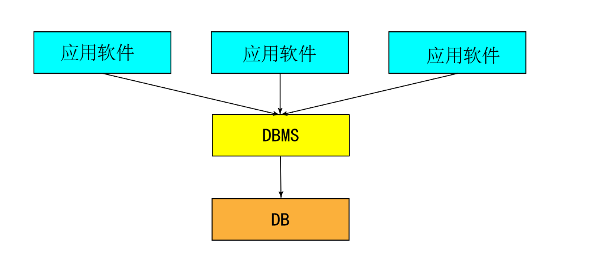

 <h1 style="font-size:60px;text-align:center;">简介</h1>

# 数据库系统（Database System，DBS）

**定义：** 是由数据库及其管理软件组成的系统。

**组成：**
- 数据库（DataBase)
- 数据库管理系统（DataBase Management System）
- 应用系统
- 数据库管理员（DataBase Administrator）

<p style="text-align:center;"></p>

# 数据库 (Database,DB)

**定义：**  数据仓库，存储数据的一个「**文件**」。 ==`<= 500w`的数据随便存储，超过了就需要优化。==

**作用：** 存储数据。

# 数据库管理系统（DBMS）

## 概念

**定义：** `Database Manager System`，一个操作数据库的「**软件**」，可以管理，维护，获取数据。数据存储在数据库文件里面，`DBMS`则是读写这个数据文件的软件。

**作用：** 操作管理数据库文件的软件。


## 分类

- **关系型数据库`SQL`**: 
  - 定义：通过表和表之间，行和列之间的关系进行数据存储。（类似 `excel`）
  - 产品：MySQL，Oracle，Sql server，DB2
  
- **非关系型数据库`NOSQL (Not Only SQL)`**
  - 定义：对象储存，通过对象的自身属性来存储数据。（类似 `Json`）
  - 产品：Redis，MongDB

# MySQL简介

- **类型：** 关系型数据库管理系统（Relational Database Management System）。
- **公司：** 由瑞典 `MySQL AB` 公司开发，属于 `Oracle` 旗下产品。
- **特点：** 开源免费，体积小，成本低，适用于大中小网站。

> [!tip]
> [MySQL安装](https://blog.csdn.net/qq_33472557/article/details/77861692)

# MySQL简单使用

- 启动`MySQL`服务

```term
triangle@LEARN_FUCK:~/mysql$ net start mysql
```

- 停止`MySQL`服务

```term
triangle@LEARN_FUCK:~/mysql$ net stop mysql 
```

- 终端登录`MySQL`

`-p`后面是直接跟密码，不要有空格。

```term
triangle@LEARN_FUCK:~/mysql$ mysql -u root -p # -u [user]；-p [password]
```

- 清理干净`MySQL`

```term
triangle@LEARN_FUCK:~/mysql$ sc delete mysql
```

