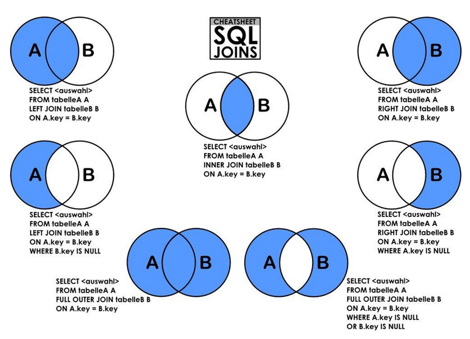
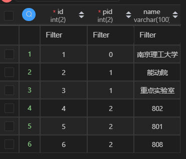

 <h1 style="font-size:60px;text-align:center;">数据操作</h1>

# 1. 外键
## 1.1. 概念
<span style="color:blue;font-weight:bold"> 将两个表的字段关联起来，形成表间关系。 </span>

## 1.2. 外键的创建

> [!note]
> 1. 设置为外键的字段不能为主键
> 2. 改键所参考的字段必须为主键
> 3. 两个字段必须有相同的数据类型和约束

### 1.2.1. 生成表时创建

1. 定义外键
2. 添加约束

```sql
create table if not exists `grade`(
    `gradeId` int(10) not null AUTO_INCREMENT COMMENT '班级id',
    `name` VARCHAR(5) not null DEFAULT '一班' COMMENT '班级名',
    primary key (`gradeId`)
)engine=INNODB charset=utf8;

create table if not exists `student`(
    `id` int(11) not null auto_increment comment '主键',
    `name` VARCHAR(10) not null default '李华' comment '名字',
    `gradeId` int(10) not null comment '班级',
    primary key (`id`),

    -- 定义外键
    key `FK_grade` (`gradeId`),
    -- 添加约束
    constraint `FK_grade` FOREIGN key (`gradeId`) references  `grade` (`gradeId`)

)engine=INNODB charset=utf8;
```

### 1.2.2. 已经存在的表

```sql
alter table `student` add constraint `FK_gradeId` FOREIGN key (`gradeId`) REFERENCES `grade` (`gradeId`);
```

## 1.3. 外键表删除顺序

1. 先删除「引用的表（从表）」
2. 再删除「被引用的表（主表）」

## 1.4. 重点

> [!note|style:flat]
> <span style="color:red;font-weight:bold"> 不推荐使用外键在数据库层面关联两张表，而是利用代码在应用层对表进行关联。 </span>

# 2. DML语言(重点)

## 2.1. 概念

`DML`: **数据操作语言（Data Manipulation Language）** 是用于数据库操作，对数据库其中的对象和数据运行访问工作的编程语句。
- `insert`：**增**
- `delete`：**删**
- `update`：**改**

> [!note|style:flat]
> **设置了`not null`的字段，在`insert,update`时，不能赋值为`null`。**

## 2.2. 增 `insert` 

```sql
-- 对应字段插入一行数据
insert into `表名` ([`字段1`,`字段2`,...]) values (`值1`,`值2`,`值3`,...);

-- 主键自增可以不用管，不写字段，值就默认与表的字段顺序一一对应
insert into `表名` values (`值1`,`值2`,`值3`,...);

-- 对应字段，插入多行数据
insert into `表名` ([`字段1`,`字段2`,...]) values
(`值1`,`值2`,`值3`,...),
(`值1`,`值2`,`值3`,...),
...
(`值1`,`值2`,`值3`,...);
```

- **auto_increment**: 带有自增属性的值，可以不用插入值。

<!--sec data-title="案例代码" data-id="insert_example" data-show=true data-collapse=true ces-->
```sql
insert into `student` (`name`,`age`) values 
('小明','20'),
('小红','18'),
('马里奥','30'),
('路易吉','29');
```
<!--endsec-->

## 2.3. 改 `update`

```sql

-- 修改指定位置的内容
update `表名` set `字段1`= value1,`字段2`= value2... where 条件;

-- 修改整个字段的全部值
update `表名` set `字段`=value;

```

- `value`: 可以是具体的值，也可以是变量。


## 2.4. 删 

### 2.4.1. `delete`

- **对数据是一行，一行的删除。**

```sql
delete from `表名` where 条件;
-- 清空表，不建议用
delete from `表名`;
```
### 2.4.2. `truncate`

- 清空表中所有数据。

```sql
truncate table `表名`;
```
### 2.4.3. 对比

- 相同：都能清空数据，不会修改表结构（`alter table`才能修能表结构）。
- `truncate`不同：
  - `auto_increment`可以归`0`
  - 不会影响事务。
- `delete`不同：
  - `INNODB`：重启数据库后，`auto_increment`会归`0`（在内存中）
  - `MYISAM`：重启后数据库后，`auto_increment`不会归`0`（在硬盘文件中）

# 3. DQL语言(重点)

<!--sec data-title="案例代码" data-id="dql_example" data-show=true data-collapse=true ces-->
```sql
/*
SQLyog Ultimate v13.1.1 (64 bit)
MySQL - 5.7.33 : Database - school
*********************************************************************
*/

/*!40101 SET NAMES utf8 */;

/*!40101 SET SQL_MODE = ''*/;

/*!40014 SET @OLD_UNIQUE_CHECKS = @@UNIQUE_CHECKS, UNIQUE_CHECKS = 0 */;
/*!40014 SET @OLD_FOREIGN_KEY_CHECKS = @@FOREIGN_KEY_CHECKS, FOREIGN_KEY_CHECKS = 0 */;
/*!40101 SET @OLD_SQL_MODE = @@SQL_MODE, SQL_MODE = 'NO_AUTO_VALUE_ON_ZERO' */;
/*!40111 SET @OLD_SQL_NOTES = @@SQL_NOTES, SQL_NOTES = 0 */;
CREATE DATABASE /*!32312 IF NOT EXISTS */`school` /*!40100 DEFAULT CHARACTER SET utf8 */;

USE `school`;

/*Table structure for table `grade` */

DROP TABLE IF EXISTS `grade`;

CREATE TABLE `grade`
(
    `GradeID`   INT(11)     NOT NULL AUTO_INCREMENT COMMENT '年级编号',
    `GradeName` VARCHAR(50) NOT NULL COMMENT '年级名称',
    PRIMARY KEY (`GradeID`)
) ENGINE = InnoDB
  DEFAULT CHARSET = utf8;

/*Data for the table `grade` */

INSERT INTO `grade`(`GradeID`, `GradeName`)
VALUES (1, '大一'),
       (2, '大二'),
       (3, '大三'),
       (4, '大四'),
       (5, '预科班');

/*Table structure for table `result` */

DROP TABLE IF EXISTS `result`;

CREATE TABLE `result`
(
    `StudentNo`     INT(4)   NOT NULL COMMENT '学号',
    `SubjectNo`     INT(4)   NOT NULL COMMENT '课程编号',
    `ExamDate`      DATETIME NOT NULL COMMENT '考试日期',
    `StudentResult` INT(4)   NOT NULL COMMENT '考试成绩',
    KEY `SubjectNo` (`SubjectNo`)
) ENGINE = InnoDB
  DEFAULT CHARSET = utf8;

/*Data for the table `result` */

INSERT INTO `result`(`StudentNo`, `SubjectNo`, `ExamDate`, `StudentResult`)
VALUES (1000, 1, '2013-11-11 16:00:00', 85),
       (1000, 2, '2013-11-12 16:00:00', 70),
       (1000, 3, '2013-11-11 09:00:00', 68),
       (1000, 4, '2013-11-13 16:00:00', 98),
       (1000, 5, '2013-11-14 16:00:00', 58);

/*Table structure for table `student` */

DROP TABLE IF EXISTS `student`;

CREATE TABLE `student`
(
    `StudentNo`    INT(4)       NOT NULL COMMENT '学号',
    `LoginPwd`     VARCHAR(20) DEFAULT NULL,
    `StudentName`  VARCHAR(20) DEFAULT NULL COMMENT '学生姓名',
    `Sex`          TINYINT(1)  DEFAULT NULL COMMENT '性别，0或1',
    `GradeId`      INT(11)     DEFAULT NULL COMMENT '年级编号',
    `Phone`        VARCHAR(50)  NOT NULL COMMENT '联系电话，允许为空',
    `Address`      VARCHAR(255) NOT NULL COMMENT '地址，允许为空',
    `BornDate`     DATETIME    DEFAULT NULL COMMENT '出生时间',
    `Email`        VARCHAR(50)  NOT NULL COMMENT '邮箱账号允许为空',
    `IdentityCard` VARCHAR(18) DEFAULT NULL COMMENT '身份证号',
    PRIMARY KEY (`StudentNo`),
    UNIQUE KEY `IdentityCard` (`IdentityCard`),
    KEY `Email` (`Email`)
) ENGINE = MyISAM
  DEFAULT CHARSET = utf8;

/*Data for the table `student` */

INSERT INTO `student`(`StudentNo`, `LoginPwd`, `StudentName`, `Sex`, `GradeId`, `Phone`, `Address`, `BornDate`, `Email`,
                      `IdentityCard`)
VALUES (1000, '123456', '张伟', 0, 2, '13800001234', '北京朝阳', '1980-01-01 00:00:00', 'text123@qq.com',
        '123456198001011234'),
       (1001, '123456', '赵强', 1, 3, '13800002222', '广东深圳', '1990-01-01 00:00:00', 'text111@qq.com',
        '123456199001011233');

/*Table structure for table `subject` */

DROP TABLE IF EXISTS `subject`;

CREATE TABLE `subject`
(
    `SubjectNo`   INT(11) NOT NULL AUTO_INCREMENT COMMENT '课程编号',
    `SubjectName` VARCHAR(50) DEFAULT NULL COMMENT '课程名称',
    `ClassHour`   INT(4)      DEFAULT NULL COMMENT '学时',
    `GradeID`     INT(4)      DEFAULT NULL COMMENT '年级编号',
    PRIMARY KEY (`SubjectNo`)
) ENGINE = InnoDB
  DEFAULT CHARSET = utf8;

/*Data for the table `subject` */

INSERT INTO `subject`(`SubjectNo`, `SubjectName`, `ClassHour`, `GradeID`)
VALUES (1, '高等数学-1', 110, 1),
       (2, '高等数学-2', 110, 2),
       (3, '高等数学-3', 100, 3),
       (4, '高等数学-4', 130, 4),
       (5, 'C语言-1', 110, 1),
       (6, 'C语言-2', 110, 2),
       (7, 'C语言-3', 100, 3),
       (8, 'C语言-4', 130, 4),
       (9, 'Java程序设计-1', 110, 1),
       (10, 'Java程序设计-2', 110, 2),
       (11, 'Java程序设计-3', 100, 3),
       (12, 'Java程序设计-4', 130, 4),
       (13, '数据库结构-1', 110, 1),
       (14, '数据库结构-2', 110, 2),
       (15, '数据库结构-3', 100, 3),
       (16, '数据库结构-4', 130, 4),
       (17, 'C#基础', 130, 1);

/*!40101 SET SQL_MODE = @OLD_SQL_MODE */;
/*!40014 SET FOREIGN_KEY_CHECKS = @OLD_FOREIGN_KEY_CHECKS */;
/*!40014 SET UNIQUE_CHECKS = @OLD_UNIQUE_CHECKS */;
/*!40111 SET SQL_NOTES = @OLD_SQL_NOTES */;

```
<!--endsec-->

## 3.1. 概念

`DQL`：**数据查询语言（Data Query Language），「查」部分**。

- `select`：所有数据内容的查询
- **核心语句，使用频率最高。**

## 3.2. 基础用法

### 3.2.1. 查询字段
- `*`：表示查询全部字段
```sql
select `字段1`,`字段2`,...  from  `表名`; 
```

> [!note|style:flat]
> <span style="color:red;font-weight:bold"> 起了别名后，在之后的`sql`语句中，只能用别名。 </span>

### 3.2.2. `as`别名
- **可以给字段，表名给定一个别名，方便查看。**

```sql
select `字段1` as 别名,`字段2` as 别名,...  from  `表名` as 别名; 
```

### 3.2.3. 数据添加字符串

**作用：给查询出来的数据中添加一个字符串。**

```sql
select concat('字符串',`字段`,'字符串') as 别名 from `表名` as 别名;
```

<!--sec data-title="案例代码" data-id="concat_example" data-show=true data-collapse=true ces-->
```sql
select CONCAT('科目名：',`SubjectName`,' fuck') from subject;
```
<!--endsec-->

### 3.2.4. 查函数

```sql
select version();
```

### 3.2.5. 数学计算

```sql
select 2/5 + 1 as 结果;
```

### 3.2.6. 查系统变量

```sql
select @@auto_increment_increment ;
```

### 3.2.7. 去重 `distinct`

**作用：去除`select`查询出来的重复数据。**

```sql
select distinct `字段1` as 别名,`字段2` as 别名,...  from  `表名` as 别名; 
```

### 3.2.8. 选择性查询`where`

```sql
select `字段1`,`字段2`,...  from  `表名` where 条件; 
```

## 3.3. 表达式

**数据库中的表达式：**
- 文本值
- 列字段
- Null
- 函数
- 计算表达式
- 系统变量

> [!note|style:flat]
> **「表达式」都能使用 `select` 进行查询。**


# 4. 条件过滤`where`

**作用：检测对应条件的值。**

- `where`：查找成功，就执行指令；否则，不执行，并不会报错。
- `and/or`：是连接两个条件的，对两个条件的结果进行判定。
- `()`：改变条件运算的优先级。

## 4.1. 一般条件

|  操作符   | 含义           |
| :-------: | -------------- |
|    `=`    | 等于           |
|  `<>,!=`  | 不等于         |
|   `>,<`   | 大于，小于     |
|  `>=,<=`  | 不小于，不大于 |
| `and &&`  | 并             |
| `or ｜｜` | 或             |
|  `not !`  | 非             |
|   `()`    | 指定优先级     |

<!--sec data-title="案例代码" data-id="where_example" data-show=true data-collapse=true ces-->
```sql
update `student` set `name`= '*' where (`age`=29) or (`age`=10);
update `student` set `age` = 10 where `age` < 20;
```
<!--endsec-->

## 4.2. 模糊条件

|         条件          | 描述                                                 |
| :-------------------: | ---------------------------------------------------- |
|       `is null`       | 是否为空                                             |
|     `is not null`     | 是否不为空                                           |
|     `like 匹配式`     | 1. `%`: 类似`*`，通配所有 <br>  2. `_`：**一个字符** |
| `in (值1,值2,值3...)` | 在`()`中是否存在                                     |
|   `between a and b`   | 是否在[a,b]区间内                                    |


<!--sec data-title="案例代码" data-id="search_fuzzy" data-show=true data-collapse=true ces-->
```sql
-- in 查找
SELECT * from result where `SubjectNo` in (3,4,1);
-- 判断是否为 null
select * from result where `ExamDate` is not null;
-- like 匹配查找
select `StudentName`,`LoginPwd` from student WHERE `Address` like '北京%';
```
<!--endsec-->

> [!note|style:flat]
> - **不能使用`where 字段 = null`，得用`where 字段 is null`**
> - **`in` 与 `=`**
>   - **结果集只有一个值时：`A = B` 与 `A in ('B')` 等价。** 
>   - **结果集只有一个值时：`A = B or A = C` 与`A in (B,C)`等价。**

# 5. 联表查询

## 5.1. 概念

**作用：对「两张表」进行联合查询，利用两张表的「相同的字段」进行连接，然后将查询结果作为「当作一张表」输出。** 

```sql
select a的字段,b的字段 (全部要输出的字段)
from tableA [as] a
方式 join tableB [as] b
on 两张表的连接条件字段

where 对最终合成表，再进行查询 ;
```

> [!note|style:flat]
> - **`tableA , tableB`：两张表根据写的先后顺序，具有左右之分。**
> - **`tableA [as] a`：`as`可以省略不写**
> - **`join on`：可以将查询的结果作为一张表，再与第三张表`tableC`进行链接** 
> - **`表名/别名.字段`：可以对重复的字段名进行区别。**
> - <span style="color:red;font-weight:bold"> 查询结果：以指定「连接方式」拼接出一个「基准表」；然后再对`select`字段的数据进行选择，并将将选择结果「当作一张新的表」；最后通过`where`筛选数据。 </span>

<!--sec data-title="案例代码" data-id="joinon_example" data-show=true data-collapse=true ces-->
```sql
-- 所有需要查看的字段
select stu.`StudentNo`,`StudentName`,`StudentResult`,`SubjectName` 
-- 先连两张表
from student as stu
LEFT join result as res
on stu.StudentNo = res.StudentNo
-- 连第三张表
inner join subject 
on subject.SubjectNo = res.SubjectNo
-- 查询
where subject.SubjectName like 'c%';
```
<!--endsec-->

## 5.2. 连接方式

<p style="text-align:center;"></p>

| 方式    | 字段                                   | 描述                                                         |
| ------- | -------------------------------------- | ------------------------------------------------------------ |
| `inner` | `from A iner join B on A.key = B.key`  | `A`表与`B`表的`key`，以两边都有的`key`作为基准               |
| `left`  | `from A left join B on A.key = B.key`  | `A`表与`B`表的`key`，以`left`表（`A`）的所有 `A.key`作为基准 |
| `right` | `from A right join B on A.key = B.key` | `A`表与`B`表的`key`，以`right`表（`B`）的所有`B.key`作为基准 |

> [!note|style:flat]
> <span style="color:red;font-weight:bold"> 「连接方式」只是拼接出一个「包含两个表所有字段的基准表（同名字段，`A.name`与`B.name`，算两个字段）」，实际输出还得根据「`select`字段」来。 </span>


# 6. 自连查询（了解）

**作用：将一张表，当作是两张表，然后进行联表查询。**

**要求：将表中的各项，根据层级关系显示出来。表：**

<p style="text-align:center;"></p>

**查询结果：**

<p style="text-align:center;"></p>

<!--sec data-title="案例" data-id="self_query" data-show=true data-collapse=true ces-->

```sql
-- 建表
create table `schoolStruct`(
    `id` int(2) NOT NULL  auto_increment comment 'id号',
    `pid` int(2) not NULL default 0 comment '父id',
    `name` varchar(100) default NULL comment '名称',
    primary key (`id`)
)engine=innodb charset=utf8;

-- 插入数据
insert into `schoolStruct` (`pid`,`name`) values 
(0,'南京理工大学'),
(1,'能动院'),
(1,'重点实验室'),
(2,'802'),
(2,'801'),
(2,'808');

-- 自连查询
select p.`name` as '父',s.`name` as '子'
from `schoolStruct` as p,`schoolStruct` as s
where p.`id` = s.`pid`;
```
<!--endsec-->

# 7. 分组 `group by`

**作用：通过那一个字段进行分组，值一样的分为一组。**

# 8. 组过滤 `having`

> [!note|style:flat]
> **分组之后的数据表，不能再使用`where`进行过滤，必须要用`having`。**

```sql
select `subjectName`,AVG(`studentResult`) as `mean` ,max(`studentResult`),min(`studentResult`)
from `result` r
inner join `subject` sub
on r.SubjectNo = sub.SubjectNo

-- 所有数据进行过滤
where r.StudentResult > 20

group by sub.SubjectName

-- 分组之后的数据进行过滤
having `mean` > 60

order by `mean` desc; 
```

# 9. 排序`order by`

**作用：对数据排序。**
- `asc (ascending)`：**从上往下，从小到大**
- `desc (descending)`：**从上往下，从大到小**


```sql
select * from `表名` ORDER BY `排序字段` desc;
```

# 10. 分页`limit`

**作用：部分显示表**
- <span style="color:red;font-weight:bold"> `limit` 只能放最后。 </span>
- **`limit`：索引从 `0` 开始。**

```sql
select * from `表名` limit 起始索引,显示行数;
```

# 11. 嵌套查询

**对于`where 条件`，可以将`条件`修改为查询语句`select`。**


```sql
/* c语言课成绩最好的，显示名字，学号 */

-- 最后显示的结果
select `studentNo`,`studentName` from `student` 
where `studentNo` = (
    -- 对c语言成绩进行排序
    select `studentNo` from `result` 
    where `subjectNo` in (
        -- 查询c语言课程
        select `subjectNo` from `subject`
        where `subjectName` like 'c%'
    )
    -- 排序
    order by `StudentResult` desc
    -- 取出第一个
    limit 0,1
);

```

> [!note|style:flat]
> <span style="color:red;font-weight:bold"> 该方法，只能用于最终结果都在一张表上的业务。 </span>


# 12. 函数

## 12.1. 常用函数

### 12.1.1. 数学

```sql
select abs(); -- 绝对值
select ceiling(); -- 向上取整
select floor(); -- 向下
select rand(); -- 随机数 0 ~ 1
select sign(); -- 数的符号
```

### 12.1.2. 字符串

```sql
select char_length(''); -- 字符串长度
select concat('','',...); -- 字符串拼接
select insert(src,pos,len,dest); -- 对src的字符串，将pos开始的len个字符，替换为dest
select lower(''); -- 转小写
select upper(''); -- 转大写
```

### 12.1.3. 时间

```sql
select current_date(); -- 获取当前日期
select now(); -- 当前时间
select localtime(); -- 本地时间
select sysdate(); -- 系统时间
select year/month/hour(now()); -- 解析时间
```

### 12.1.4. 系统
```sql
select system_user();
select user();
select version();
```
## 12.2. 聚合函数（重要）


|   函数    | 描述  |
| :-------: | :---: |
| `count()` | 计数  |
|  `sum()`  | 求和  |
|  `avg()`  | 均值  |
|  `max()`  | 最大  |
|  `min()`  | 最小  |


### 12.2.1. `count()`

- `count(字段)`：会忽略所部的`null`。
- `count(*)`：不会忽略`null`，返回表的「行数」。
- `count(1)`：不会忽略`null`，返回表的「行数」。

## 12.3. `MD5()`加密

**作用：增强算法复杂度，并且加密不可逆。**

- **`MD5`的破解：`MD5`不可逆，只能先正向获取到加密内容，然后与要破解的加密内容进行对比，如果一样就破解成功。**

```sql

-- 添加加密数据
insert into `password`(`name`,`pwd`) values 
('小蓝',MD5('12345')),
('小红',MD5('23456'));

-- 查询加密数据
select * from `password` 
where `name` = '小蓝' and `pwd` = MD5('12345');
```

# 13. `select`总结

```sql
-- 显示结果
select [distinct] `字段1`,`字段2`,.... 
-- 表
from `表名1` [as] 别名1
-- 连接一个表
方式 join `表名2` [as] 别名2
on 别名1.`字段` = 别名2.`字段`
-- 行数据过滤
where 过滤
-- 分组
group by `字段`
-- 分组后，再行数据过滤
having 组过滤
-- 排序
order by `字段` asc/desc
-- 显示内容
limit 起始索引,显示列数 ;
```

> [!warning|style:flat]
> <span style="color:red;font-weight:bold"> 顺序不能乱！！！ </span>

