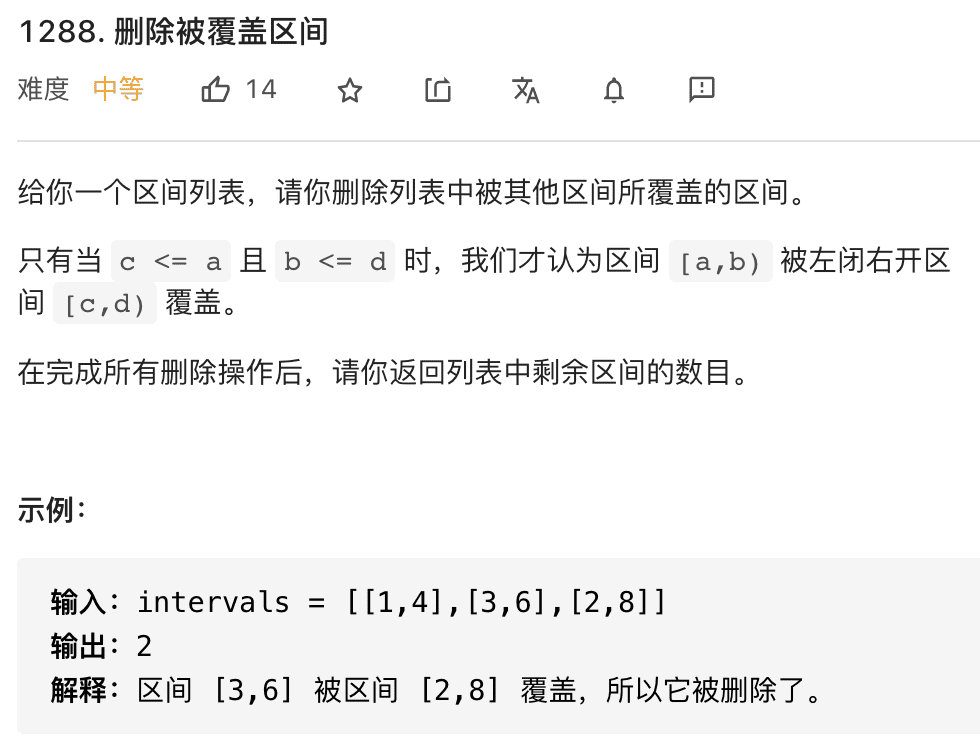
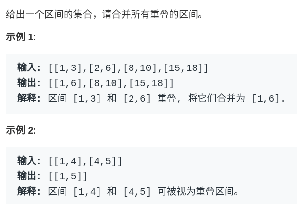
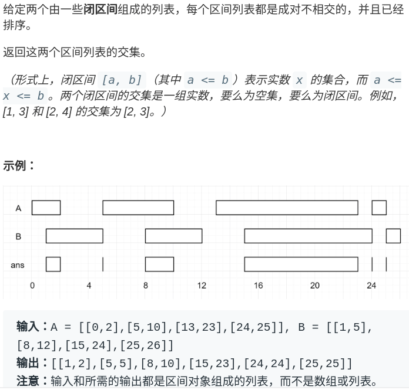
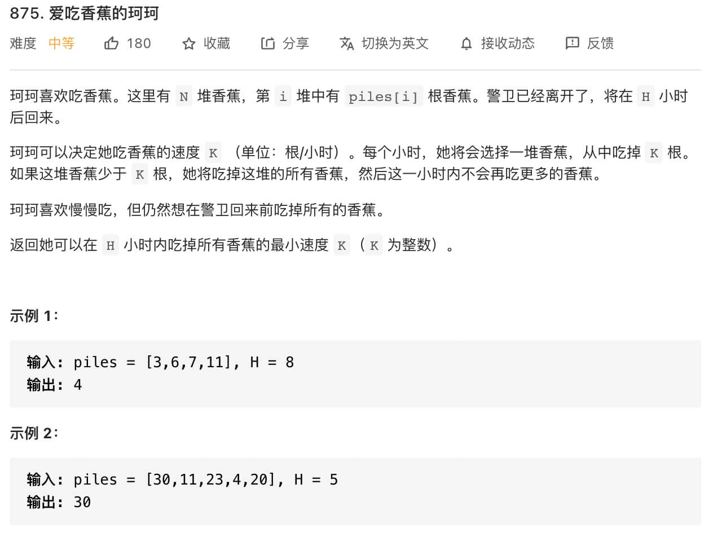
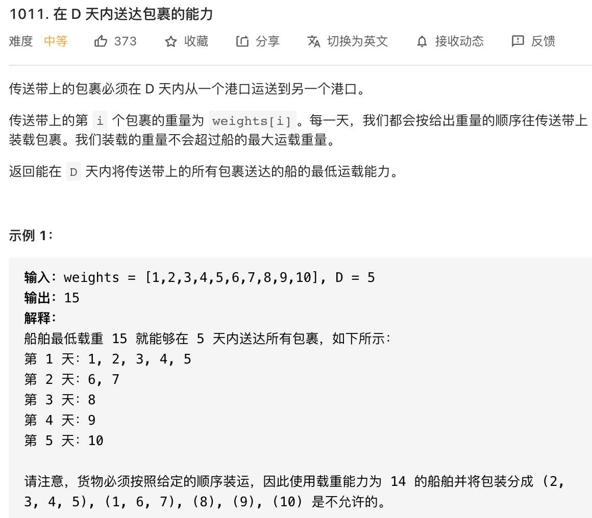
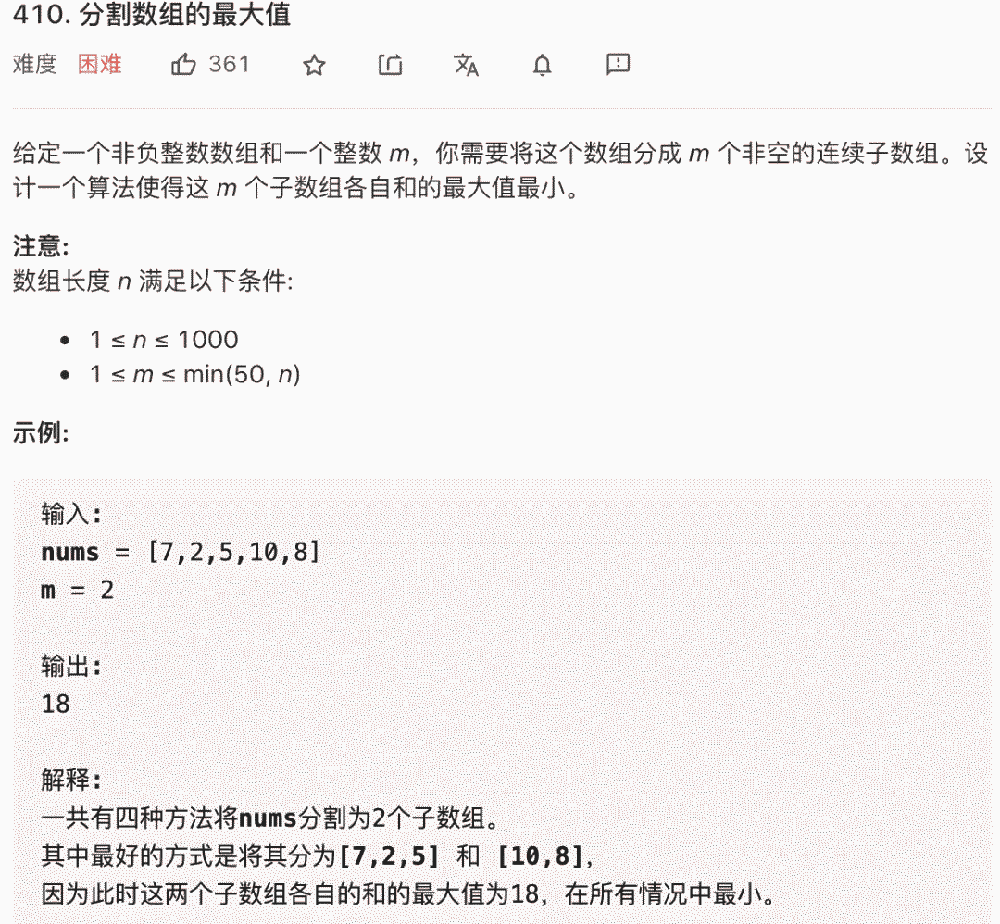
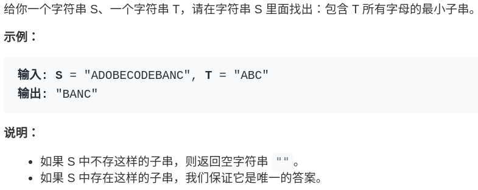

 <h1 style="font-size:60px;text-align:center;">查找问题</h1>


# 1 二分法

## 1.1. 基本的二分搜索

- **`while(left <= right)`一次搜索的区间是：`[left, right]`**
- **`while(left <= right)` 终止条件：`left == right + 1`**: 就两种情况会终止，1）`right`减过头；2）`left`加过头

``` java
    int binarySearch(int[] nums, int target) {
        int left = 0;
        int right = nums.length - 1; // 注意
        while(left <= right) {
            int mid = left + (right - left) / 2;
            if(nums[mid] == target)
                return mid;
            else if (nums[mid] < target)
                left = mid + 1; // 注意
            else if (nums[mid] > target)
                right = mid - 1; // 注意
        }
        return -1;
    }
```

> [!note|style:flat]
> **注：**
> **`nums = [1,2,2,2,3];targe = 2;`找目标的边界，普通二分法无法实现。**

## 1.2. 寻找左侧边界的二分搜索

- **`while(left <= right)`一次搜索的区间是：`[left, right]`**
- **`while(left <= right)` 终止条件：`left == right + 1`**: 就两种情况会终止，1）`right`减过头；2）`left`加过头
- **`left = [0,nums.length]`**
- <span style="color:red;font-weight:bold"> 返回值含义：`nums`中小于`target`的值的个数 </span>
- <span style="color:red;font-weight:bold"> `nums`循序排列，`target`在数组`nums`中。 </span>

``` java
    int left_bound(int[] nums, int target) {
        int left = 0, right = nums.length - 1;
        while (left <= right) {
            int mid = left + (right - left) / 2;
            if (nums[mid] < target) {
                left = mid + 1;
            } else if (nums[mid] > target) {
                right = mid - 1;
            } else if (nums[mid] == target) {
                // 别返回，锁定左侧边界
                right = mid - 1;
            }
        }
        // 最后要检查 left 越界的情况，target值也不在数组中
        if (left >= nums.length || nums[left] != target)
            return -1;
        return left;
    }
```

## 1.3. 寻找右侧边界的二分搜索

- <span style="color:red;font-weight:bold"> 返回值含义：`nums`中大于`target`的值的个数 </span>
- <span style="color:red;font-weight:bold"> `nums`循序排列，`target`在数组`nums`中。 </span>

``` java

int right_bound(int[] nums, int target) {
    int left = 0, right = nums.length - 1;
    while (left <= right) {
        int mid = left + (right - left) / 2;
        if (nums[mid] < target) {
            left = mid + 1;
        } else if (nums[mid] > target) {
            right = mid - 1;
        } else if (nums[mid] == target) {
            // 别返回，锁定右侧边界
            left = mid + 1;
        }
    }
    // 最后要检查 right 越界的情况
    if (right < 0 || nums[right] != target)
        return -1;
    return right;
}
```

**注：**

- **`while(left < right)` 结束条件为 `left == right`**
- **`while(left < right)`一次搜索的区间是：`[left, right)`**
- **`while(left < right)`决定了`left = mid + 1;right = mid;`下一次的搜索区间就是：`[left,mid)`**
- **`[left, right)`就确定了初始条件：`left = 0, right = nums.length`**

``` java
int right_bound(int[] nums, int target) {
    if (nums.length == 0) return -1;
    int left = 0, right = nums.length;

    while (left < right) {
        int mid = left + (right - left) / 2;
        if (nums[mid] == target) {
            left = mid + 1; // 注意
        } else if (nums[mid] < target) {
            left = mid + 1;
        } else if (nums[mid] > target) {
            right = mid;
        }
    }
    if(left == 0 || nums[left - 1] != target){
        return -1;
    }
    return left - 1; // 注意
}
```

# 2 two sum

## 2.1. 问题

> 给一个数组和一个整数`target`，可以保证数组中存在两个数的和为`target`，返回这两个数的索引。
>例:
>输入: `nums = [3,1,3,6],target = 6`
>返回数组: `[0,2]`

## 1.2. 双指针暴力枚举

```cpp
void twoSum(int* nums,int target,int * out){
    for(int i=0;i < nums.size;i++){
       for(int j=i+1;j < nums.size;j++)            {
            if(target == nums[i]+nums[j]){
                out[0]=i;
                out[1]=j;
                return;
            }   
        } 
    }
    
}
```

## 1.3. 哈西表查询第二个值

```cpp
    void twoSumMap(int*nums,int n,int target,int* out){
        // 存储 值-索引
        map<int,int> valIndex;
        for (int i = 0; i < n; i++)
        {
            valIndex[nums[i]] = i;
        }

        // 寻找目标
        for (int i = 0; i < n; i++)
        {
            int other = target - nums[i];
            // 从 值-索引 中找另一半的值
            if (valIndex.count(other) > 0 && valIndex[other] != i)
            {
                out[0]=i;
                out[1]=valIndex[other];
                return;
            }
        }
    }
```

## 1.4. 双指针，升序列，求两数之和

``` java
    int[] twoSum(int[] nums, int target) {
        int left = 0, right = nums.length - 1;
        while (left < right) {
            int sum = nums[left] + nums[right];
            if (sum == target) {
                // 题目要求的索引是从 1 开始的
                return new int[]{left + 1, right + 1};
            } else if (sum < target) {
                left++; // 让 sum 大一点
            } else if (sum > target) {
                right--; // 让 sum 小一点
            }
        }
        return new int[]{-1, -1};
    }
```

## 1.5. 输出所有不重复的组合

```cpp
    void twoSum(vector<int> &nums,int target){
        // 先排序
        sort(nums.begin(),nums.end());

        int left = 0;
        int right = nums.size() - 1; 
        int temp;

        while(left < right){
            int sum = nums[left] + nums[right];

            if (sum < target)
            {
                left ++;
            }else if (sum > target){
                right --;
            }else if(sum == target){

                cout << nums[left] << " " << nums[right] << endl;

                // 左边重复
                temp = nums[left];
                while(left < right && nums[left] == temp){
                    left++;
                }

                // 右边重复
                temp = nums[right];
                while(left < right && nums[right] == temp){
                    right--;
                } 
            }
        }
    }     
```

## 1.6. 3Sum 问题

- `sort()`: 首先进行排序
- 从左向右依次遍历数组 `nums[index]`
- `target =target - nums[index]`: **将3sum问题转为2sum问题。**
- **`nums[index]`还要去重复**

```cpp
    vector< vector<int> > twoSum(vector<int> &nums,int start,int target){

        vector< vector<int> > out;
        int left = start;
        int right = nums.size() - 1; 
        int temp;

        while(left < right){
            int sum = nums[left] + nums[right];

            if (sum < target)
            {
                left ++;
            }else if (sum > target){
                right --;
            }else if(sum == target){

                out.push_back(vector<int>());
                out[out.size() - 1].push_back(nums[left]);
                out[out.size() - 1].push_back(nums[right]);

                // 左边重复
                temp = nums[left];
                while(left < right && nums[left] == temp){
                    left++;
                }        
                // 右边重复
                temp = nums[right];
                while(left < right && nums[right] == temp){
                    right--;
                } 
            }
        }

        return out;
    }

    vector< vector<int> > threeSum(vector<int> &nums,int target){
        // 先排序
        sort(nums.begin(),nums.end());

        vector< vector<int> > out;
        int index = 0;
        int temp;
        while (index < nums.size() - 2){
            // target 减去 一个值，将 3sum 变成 2sum
            vector< vector<int> > res = twoSum(nums,index+1, target - nums[index]);

            // 去重复
            temp = nums[index];
            while (index < nums.size() - 2 && nums[index] == temp)
            {
                index++;
            }

            // 将第三个值储存 
            for(vector<int>& item : res){
                item.push_back(temp);
                out.push_back(item);
            }
        }
        
        return out;
    }

```

# 3 删除/查找数据O(1)

- 使用`map`存储索引，`vector`存储数据
    - 查找: 通过`map`找索引，通过索引去`vector`拿数据
    - 删除: 将最后一个元素与删除元素进行替换，修改`map`，然后再删除索引和数据


# 4 区间问题

## 4.1. 解题技巧

1. **端点排序：按照区间起点排序，或者先按照起点升序排序，若起点相同，则按照终点降序排序。** <span style="color:red;font-weight:bold"> 不降序，会出问题 </span>
    
    

2. **作图：分别讨论一次涉及的循环区间，有哪些情况，防止漏掉。** <span style="color:red;font-weight:bold"> 区间关系条件得找对。 </span>

## 4.2. 区间覆盖问题




``` java
    int removeCoveredIntervals(int[][] intvs) {
        // 按照起点升序排列，起点相同时降序排列
        Arrays.sort(intvs, (a, b) -> {
            if (a[0] == b[0]) {
                return b[1] - a[1];
            }
            return a[0] - b[0]; 
        });

        // 大区间
        int left = intvs[0][0];
        int right = intvs[0][1];

        int res = 0;
        for (int i = 1; i < intvs.length; i++) {
            int[] intv = intvs[i];
            // 情况一，找到覆盖区间
            if (left <= intv[0] && right >= intv[1]) {
                res++;
            }
            // 情况二，找到相交区间
            if (right >= intv[0] && right <= intv[1]) {
                left = intv[0];
                right = intv[1];
            }
            // 情况三，完全不相交，更新起点和终点
            if (right < intv[0]) {
                left = intv[0];
                right = intv[1];
            }
        }

        return intvs.length - res;
    }
```
## 4.3. 区间合并




```cpp
    struct Interval{
        int left;
        int right;
        Interval(){}
        Interval(int left, int right){
            this->left = left;
            this->right = right;
        }
    };

    class Compare{
    public:
        bool operator()(const Interval & a, const Interval & b)const{
            if (a.left < b.left){
                return true; 
            }
            if(a.left == b.left){
                if (a.right > b.right)
                {
                    return true;
                }
            }
            return false; 
        }
    };

    vector<Interval> mergeIntervals(vector<Interval>& intervals){
        // 排序
        sort(intervals.begin(), intervals.end(),Compare());

        vector<Interval> res;
        int left = intervals[0].left;
        int right = intervals[0].right;
        res.push_back(Interval(left, right));

        for (int i = 1; i < intervals.size(); i++)
        {
            int curL = intervals[i].left;
            int curR = intervals[i].right;

            if (curL >= left && curR <= right) // 包含
            {
                continue;
            }else if(curL >= left && curL <= right && curR > right){ // 相交
                res.back().right = curR;
                right = curR;
            }else if(curL > right){ // 分离
                left = curL;
                right = curR;
                res.push_back(Interval(left, right));
            } 
        }
        return res;
    }
```

## 4.4. 区间交集



- **归纳交集：` !(l1 > r2 || r1 < l2) `**
- **归纳指针移动条件：` (r1 < r2) `**

```cpp
    vector< Interval > intersection(vector<Interval>& inter1, vector<Interval>& inter2){
        // 先排序
        sort(inter1.begin(), inter1.end(),Compare());
        sort(inter2.begin(), inter2.end(),Compare());

        // 区间指针
        int index1=0,index2=0;
        int left,right;
        vector<Interval> res;

        // 遍历区间
        while (index1 < inter1.size() && index2 < inter2.size())
        {
            int l1 = inter1[index1].left;
            int r1 = inter1[index1].right;
            int l2 = inter2[index2].left;
            int r2 = inter2[index2].right;

            // 相交
            if(!( l1 > r2 || r1 < l2 )){
                left = max(l1,l2);
                right = min(r1,r2);
                res.push_back(Interval(left, right));
            }

            // 移动指针
            if (r1 < r2)
            {
                index1++;
            }else{
                index2++;
            }
        }

        return res;
    }
```

## 4.5. 给定两矩形，求相交面积

- **排序：矩形可以由两个点对角点表示，首先需要确定两个的位置**
- **作图：判断相交关系**

```cpp
    // 确保起点在下，终点在上
    Rect getRect(int x1,int y1,int x2,int y2){
        Rect A;
        A.xStart = min(x1,x2);
        A.yStart = min(y1,y2);
        A.xEnd = max(x1,x2);
        A.yEnd = max(y1,y2);
        return A;
    }

    int intersectionRect(Rect A,Rect B){

        // 判断是否相交
        if(!(A.xStart >= B.xEnd || A.xEnd <= B.xStart || A.yEnd <= B.yStart || A.yStart >= B.yEnd)){
            Rect intersection;         
            intersection.xStart = max(A.xStart,B.xStart);
            intersection.yStart = max(A.yStart,B.yStart);
            intersection.xEnd = min(A.xEnd,B.xEnd);
            intersection.yEnd = min(A.yEnd,B.yEnd);
        
            return (intersection.xEnd - intersection.xStart) * (intersection.yEnd - intersection.yStart);
        }
        return 0;
    }

```

# 5 二分法威力加强

> [!tip]
> **0. 求解该问题可以对一个单调函数区间暴力遍历**
> 
> **1. 解为一个单调函数里的某一值。**
> 
> **2. 单调函数可以根据一个状态，将区间划分为两半。**
> 
> **二分法找值：**
> - **单调：数组需要先排序**
> 
> - **状态：和`mid`比大小**
> 
> - **区间：`mid`的「左边」或者「右边」**

## 5.1 珂珂吃香蕉



- **`calculateH(speed)`单调函数，随`speed`增加而减小**
- **`(calculateH(nums,n,mid) <= H)`将`speed`区间划分为两半**

```cpp
int calculateH(const int* nums,int n, int speed){
    int h = 0;
    for(int i = 0; i < n;i++){
        h += nums[i] / speed + (nums[i] % speed > 0 ? 1 : 0);
    }
    return h;
}

int minSpeed(const int* nums,int n,int H){
    // 最大的情况
    int right = findMax(nums,n);
    int left = 1; 

    while(left <= right ){
        int mid = left + (right - left) / 2;

        // 速度快了 
        // if (calculateH(nums,n,mid) <= H)
        // {
        //     right = mid - 1;
        // }else{
        //     left = mid + 1;
        // }

        // 找左边界标准形式
        if(calculateH(nums,n,left) == H){
            right = mid - 1;
        }else if(calculateH(nums,n,left) < H){
            right = mid - 1;
        }else if (calculateH(nums,n,left) > H){
            left = mid + 1;
        }
    }
    return left;
}

```
## 5.2 运输货物



```cpp
    void findBorder(const vector<int>& goods,int & left,int & right){
    for(int item:goods){
        left = max(left,item);
        right += item;            
    }
}

int calculateDay(const vector<int>& goods,int w){
    int count = 0;
    int day = 0;
    
    for(int item:goods){
        count += item;
        // 超重
        if (count > w)
        {
            // 重置，并回退一个货物
            count = item;
            day ++;
        }
    }

    // 没装完
    if (count != 0)
    {
        day ++;
    }
    
    return day;
}

int minWeight(const vector<int>& goods,int day){
    int left = 0;
    int right = 0;

    // 寻找区间
    findBorder(goods,left,right);

    while(left <= right){
        int mid = left + (right - left)/2;

        // 是否满足天数要求
        if(calculateDay(goods,mid) == day){
            right = mid - 1;
        }else if (calculateDay(goods,mid) < day)
        {
            right = mid - 1;
        }else if(calculateDay(goods,mid) > day){
            left = mid + 1;
        }
    }
    return left;
}

```

## 5.3 分割数组的最大值

**问题`5.2`的变种。**



# 6 滑动窗口

> [!note|style:flat]
> **滑动窗口主要用于解决，在长序列上，找子序列的各种问题。**

## 6.1 模板

> [!tip]
> **可以想象成一条虫子在一根线上从左向右蠕动。**
> 
> - **先头动，搜寻问题的解，更新状态**
> 
> - **后尾动，优化找到的解，更新状态。**

```cpp
    int left = 0, right = 0;

    while (right < s.size()) {
        // 增大窗口
        window.add(s[right]);
        right++;

        while (window needs shrink) {
            // 缩小窗口
            window.remove(s[left]);
            left++;
        }
    }
```

```cpp
/* 滑动窗口算法框架 */
void slidingWindow(string s, string t) {

    // 标记序列用
    // window：标记主序列；need：标记子序列
    unordered_map<char, int> need, window;
    for (char c : t) need[c]++;
    // 窗的左右边界
    int left = 0, right = 0;
    // 有效信息的标记值
    int valid = 0; 

    while (right < s.size()) {
        // c 是将移入窗口的字符
        char c = s[right];
        // 右移窗口
        right++;

        // 扩展窗口
        window[c]++;

        // 进行窗口内数据的一系列更新
        ...

        /*** debug 输出的位置 ***/
        printf("window: [%d, %d)\n", left, right);
        /********************/

        // 判断左侧窗口是否要收缩
        while (window needs shrink) {
            // d 是将移出窗口的字符
            char d = s[left];
            // 左移窗口
            left++;
            // 进行窗口内数据的一系列更新
            ...

            // 缩小窗口
            window[d]--;
        }
    }
}
```

> [!warning|style:flat]
> **`window[]`在扩展窗口时，最先更新。**
> 
> **`window[]`在收缩窗口时，最后更新。**

## 6.2 最小覆盖子串



```cpp

string coveredSubsequences(const string &s,const string &t){
    unordered_map<char,int> windows;
    unordered_map<char,int> need;

    // 标记字串
    for(char ch : t){
        need[ch]++;
    }

    int len = s.size() + 1;
    int start = len;

    int left = 0;
    int right = 0;
    int valid = 0;
    // 头挪动
    while (right < s.size()){
        // 进来一个
        char inch = s[right]; 
        right++;

        // 窗体内容标记
        windows[inch]++;

        // 有效信息记录
        if ( need.count(inch) && windows[inch] == need[inch])
        {
            valid++;
        }
        
        // 满足最低限度了，移动尾巴优化
        while (valid == need.size()){
            // 储存最优
            if(len > right - left){
                len = right - left;
                start = left;
            }

            // 出去一个
            char outch = s[left];
            left++;

            if (need.count(outch) && windows[outch] == need[outch])
            {
                valid--;
            }

            // 操作完毕再取消
            windows[outch]--;
        }
    }

    if (len == s.size() + 1)
    {
        return "";
    }
    return s.substr(start,len); 
}

```