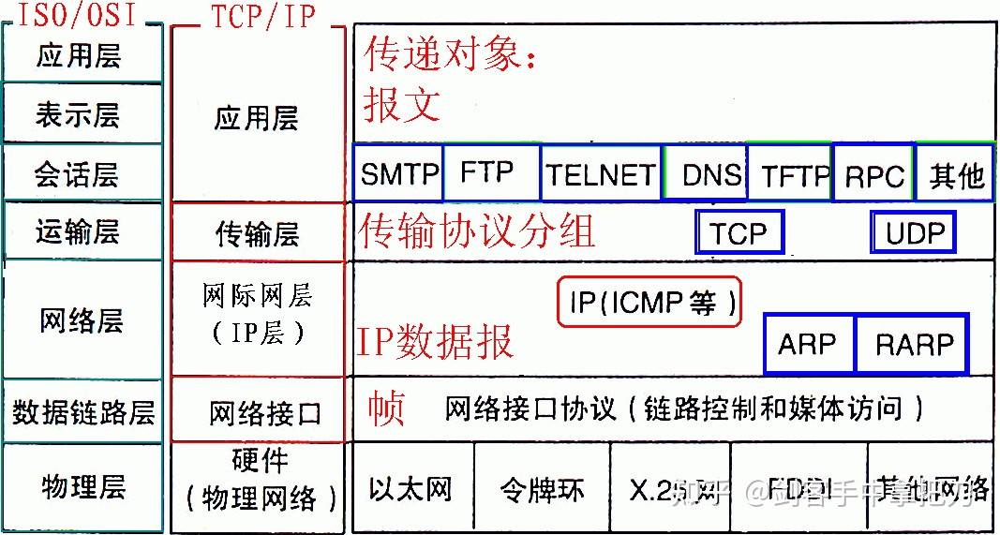

 <h1 style="font-size:60px;text-align:center;">网络基础</h1>
# 1. 基础概念


```term
triangle@LEARN_FUCK:~$ cat /etc/network/interfaces
auto eth0     
iface eth0 inet static     
address 192.168.3.250                 # ip
netmask 255.255.255.0                  #子网掩码     
gateway 192.168.3.1                      #网关     
dns-nameservers 8.8.8.8 8.8.4.4    #设置dns服务器
```

## 1.1. IP 地址

> [!tip]
> - **概念：用于唯一标识网络中的每台计算机**
> - **指令：** `ifconfig`
> - **IP表示：**
>   - `IPV4:`: 4 个字节，32 位，十进制表示，`xx,xx,xx,xx`，`xx`表示一个字节`0 - 255`
>   - `IPV6`: 16 个字节，128位，十六进制表示，IPV4的最大问题资源有限，IPV6就是用来扩展资源的
> - **IP的组成：** 「网络地址」 + 「主机地址」，例如 192.168.16.96 = 192.168.16.0 + 96

**`IPV4`分类：**

<p style="text-align:center;"></p>

| 类别 | 范围                      |
| ---- | ------------------------- |
| A    | 0.0.0.0~127.255.255.255   |
| B    | 128.0.0.0~191.255.255.255 |
| C    | 192.0.0.0~223.255.255.255 |
| D    | 224.0.0.0~239.255.255.255 |
| E    | 240.0.0.0~255.255.255.255 |


## 1.2. 子网掩码

> [!tip]
> **作用：就是将某个IP地址划分成「网络地址」和「主机地址」两部分。**

```
address 192.168.1.8    
netmask 255.255.255.0  
```

IP地址通过与掩码进行「与」运算可以把IP拆分为：`192.168.1.0` 与 `8`
- `192.168.1.0`: 网络地址（网段地址），就是互联网中的一个「局域网」
- `8`: 主机地址，代表了一个「局域网」下的主机。
- **`255.255.255.0`: 最后一字节为`0`，「主机地址」取值范围就是`0 - 255`，其中`192.168.1.0`是「网段地址」和`192.168.1.255`是「广播地址」这两个IP不能用于表示计算机，因此，在该掩码下只能存在`253`台主机。**


## 1.3. 端口

> [!tip]
> **作用： 用来标记一个进程的，让外部连接能识别到。**`PID`号是变动的，每次启动都不一样，只能在用另外一个固定的编号，来标记进程，这样外部进来的连接才能准备找到这个进程。
> **数量：** 最多 `65535`个。

<p style="text-align:center;"></p>

**端口分配：**

- **服务器：** 端口号手动设定，多个用户连接服务器的一个服务进程，只消耗服务器的一个端口。
- **客户端：** 随机生成一个，客户端上的一个客户进程就要消耗一个端口，有两个客户进程就消耗两个端口。


## 1.4. 域名

> [!tip]
> - **域名（Domain Name）: 是由一串字符组成的，域名指向某一个IP地址。**
> - **`DNS`: 域名服务器，可以到域名服务器(例如，谷歌 8.8.8.8)上去查询对应域名的真实`IP`。**


## 1.5. 网关

<p style="text-align:center;"></p>

>[!tip]
> - **作用：网关(Gateway)就是一个网络连接到另一个网络的「关口」。**
> - 两个「红圆主机」想要通讯，就需要从互联网这个「图」中找到一条相互连接的「路径」。对于这个路径，在主机中存下整个互联网的「图」，然后用算法找出一个路径，这个是不可能的。所以换了一个思路：**当前主机只记录，下一个跳转的网络连接点在哪儿。**
> - **`IP`路由表：** 存储了本地计算机可以到达的网络目的地址范围和如何到达的路由信息。

```term
triangle@LEARN_FUCK:~$ route -n # 查看路由表
Kernel IP routing table
Destination     Gateway         Genmask         Flags Metric Ref    Use Iface
192.168.56.0    0.0.0.0         255.255.255.0   U     256    0        0 eth2
0.0.0.0         192.168.1.1     0.0.0.0         U     0      0        0 wifi0
triangle@LEARN_FUCK:~$ ping www.baidu.com
PING www.a.shifen.com (39.156.66.14) 56(84) bytes of data.
64 bytes from 39.156.66.14 (39.156.66.14): icmp_seq=1 ttl=52 time=49.1 ms
....
```

**上面`ping`，查找网关步骤：**
1. `39.156.66.14`和`route -n`第一行的 `Genmask：255.255.255.0`进行 「与」运算
2. 计算结果为`39.156.66.0`与第一行的`Destination: 192.168.56.0`进行比较，不一样
3. 换`route -n`第二行，重复步骤1和步骤2
4. 发现第二行满足要求，这样下一次的跳转点就是`gateway: 192.168.1.1`

## 1.6. socket

> [!tip]
> **定义：服务端 `ip:port` 与 客户端`ip:port`建立的连接；这个连接是独立隔离的。**


## 1.7. MAC


**作用：用来确认网络设备位置的位址，`MAC`地址用于在网络中唯一标示一个网卡，一台设备若有一或多个网卡，则每个网卡都需要并会有一个唯一的`MAC`地址**

<span style="font-size:24px;font-weight:bold" class="section2">1. 局域网</span>

**特点：**
- 所有计算机均连接在一个「交换机」上
- 同一局域网下的所有「网络地址」一样，「子网掩码」一样
- **满足前面两个条件，局域网才能通讯**
- 「交换机」会记录同「网络地址」下，所有主机的「MAC地址」

<p style="text-align:center;"></p>

<span style="font-size:24px;font-weight:bold" class="section2">2. ARP</span>

**定义：地址解析协议，即ARP（Address Resolution Protocol），是根据IP地址获取物理地址的一个`TCP/IP`协议。处于「网络层」**

```term
triangle@LEARN_FUCK:~$ arp -a
```

**案例：`pc2`想连接上`pc3`，但是不知道对方的`mac`，需要完成`mac`查找**

1. `pc2`创建一个「数据包」：双方的IP地址和自己的MAC，对方的MAC瞎写一个
    <p style="text-align:center;"></p>
2. 「交换机」对数据包进行「广播」，`pc3`满足要求，接收数据包，其他主机无视
    <p style="text-align:center;"></p>
3. `pc3`接收到`pc2`的查找后，就把自己的`mac`打包发回去。此时，由于之前「交换机」已经将`pc2`的`mac`地址记录了，所以直接发回，不用广播了。
    <p style="text-align:center;"></p>
4. `pc2`接收到了`pc3`的回信，就能确定`pc3`的`mac`地址了。


# 2. 两个局域网

**描述：两个局域网可以通过路由器进行连接，「路由器」也可以看作是一个主机，包含了两个「网卡」，每张网卡连接一个「交换机」。**

<p style="text-align:center;"></p>


**案例：`pc2`给`pc4`发消息**

1. `pc2`应用层：`pc2`按照协议规定：把数据写成标准协议格式。
2. `pc2`传输层：建立「连接」，把数据按照规定：打包
3. `pc2`网络层：查询`gateway`，找到下一跳转点的`IP`为路由器：`192.168.1.3`
4. `pc2`链路层：根据跳转点的`IP`查找到路由器对应的`mac`地址：`3.3.3`
    <p style="text-align:center;"></p>
5. 通过第一个交换机，数据就发给了「路由器」 
6. 「路由器」接收到数据后，又重复上面步骤，找下一跳转点，修改`mac`，通过第二个交换机发送给`pc 4`
    <p style="text-align:center;"></p>


> [!note|style:flat]
> **通讯过程：**
> - `IP`：在数据传输中，不会改变，代表着通讯的两个「端点」
> - `mac`: 在地址往下一个点跳转的时候，会被修改；代表着通讯中的「节点」
>
> **路由器与交换机：**
> - **交换机：** 涉及「链路层」与「物理层」；存储「arp表」
> - **路由器：** 涉及「网络层」，「链路层」与「物理层」；存储「IP路由表」
> - **如今实物「路由器」，其实是「交换机功能」和「路由器功能」的结合体。**
> - **主机：** 全部；「arp表」与「IP路由表」都会储存。
>
> **互联网：**
> - 多准备几个交换机局域网，多连接几个路由器，然后把网络连接起来。


# 3. 单臂路由

<p style="text-align:center;"></p>

- **问题：两个不同「网络地址」的主机（网线），插到了同一个「交换机」上，直接实现`pc2`与`pc1`的通讯。这个是行不通的，两个主机的「网络地址」不一样，无法利用「交换机」构成「局域网」。**
- **解决方案：在交换机上，再插入一个「路由器」（可以通过另一台`pc`实现）。在路由器pc上分别为两个网络地址设置一个网卡（一个物理网卡，可以配置多个字网段），这样就能间接实现`pc1`与`pc2`的通讯了。**


# 4. TCP/IP

## 4.1. TCP/IP 协议模型

**定义：双方通讯的约定，两边都能看得懂。**

<p style="text-align:center;"></p>

<p style="text-align:center;"></p>

**各层作用：**
1. 应用层：准备协议的具体内容，例如，准备`HTTP`协议的请求头`GET / HTTP/1.0 \n`
2. 传输层：使用`TCP UDP`准备要发送的「数据包」，例如，`syn,ack`这些数据包
3. 网络互连层：根据路由表，寻找网关`gateway`，得到下一个跳转点的IP
4. 链路层：通过`arp`查询下一个跳转点的`mac`，添加到「数据包」上
5. 物理层：在「数据包」前面添加「前导码」，用于「交换机」识别「数据包」

## 4.2. 网络连接案例

```term
triangle@LEARN_FUCK:~$ exec 8<> /dev/tcp/www.baidu.com/80 # kernel 连接
triangle@LEARN_FUCK:~$ echo -e 'GET / HTTP/1.0\n' 1>& 8 # 用户层，准备协议
triangle@LEARN_FUCK:~$ cat 0<& 8
HTTP/1.0 200 OK
Accept-Ranges: bytes
Cache-Control: no-cache
Content-Length: 14615
Content-Type: text/html
....
```

`exec 8<> /dev/tcp/www.baidu.com/80`:
- `8`:文件描述符
- `/dev/tcp/www.baidu.com/80`:网页地址

`'GET / HTTP/1.0\n'`: 请求头
- `GET`:请求
- `HTTP/1.0`:协议版本


> [!note]
> 1. `client` 与 `server`首先建立连接
>   - 「连接」是不会断开的
>   - 「超时」是先「连接」成功后，用户不发送请求，服务器自己把连接给断掉。
> 1. 连接成功后，需要传输某种协议

# 5. `TCP`协议

> [!note]
> 1. 传输层进行
> 1. 面向「连接」
> 1. 「可靠」的传输连接

<span style="font-size:24px;font-weight:bold" class="section2">1. 连接与三次握手</span>

<p style="text-align:center;"></p>

> [!note]
> **三次握手：只是传输层测试用，和用户层没关系**
> 1. C 发送一个 `syn` 给 S
> 1. S 收到后，发送`syn`和`ack`给 C
> 1. C 收到后，发送一个`ack`给 S
> - 1 和 2 ： C 确认的收发通道的正常
> - 2 和 3 ： S 确认了收发通道的正常
>
> **开辟资源**
> - **在完成连接后，`S C`会分别开辟资源，等待正式通讯。**
> 
> **完成「三次握手」和「资源开辟」后，一个「`TCP`连接」才算正式成立。当前的「连接」是虚拟的，没有实质性的保障，指不定啥时候对方就挂了，所以还需要额外手段保证「连接」的有效性。**

<span style="font-size:24px;font-weight:bold" class="section2">2. 可靠</span>

**「三次握手」中，就存在`syn`与`ack`收发确认，这个保证了，通讯的「可靠」。**


<span style="font-size:24px;font-weight:bold" class="section2">3. 四次分手</span>

<p style="text-align:center;"></p>

> 1. C 发一个 `fin` 给 S：通知要断开
> 1. S 发 `ack` 给 C：回应一下，不代表同意断开
> 1. 然后 S 开始收尾工作， 可能还有数据没有传输完，C 还是可以接收数据。
> 1. 收尾完毕，S 正式回应一个`fin`：表示可以断开了
> 1. C 回复一个`ack`
> 1. 最后双方开始`close`回收资源。
> - `fin`: 表示后面没有数据需要发送，通常意昧着所建立的连接需要关闭了。

<span style="font-size:24px;font-weight:bold" class="section2">4. 案例测试</span>

```term
triangle@LEARN_FUCK:~$ sudo tcpdump -i ens192 port 80
tcpdump: verbose output suppressed, use -v or -vv for full protocol decode
listening on ens192, link-type EN10MB (Ethernet), capture size 262144 bytes

# 三次握手
18:06:03.191110 IP nginx-hj.41414 > 14.215.177.39.http: Flags [S], seq 2295567055, win 29200, options [mss 1460,sackOK,TS val 1364799231 ecr 0,nop,wscale 7], length 0
18:06:03.224702 IP 14.215.177.39.http > nginx-hj.41414: Flags [S.], seq 4189444164, ack 2295567056, win 8192, options [mss 1400,sackOK,nop,nop,nop,nop,nop,nop,nop,nop,nop,nop,nop,wscale 5], length 0
18:06:03.224755 IP nginx-hj.41414 > 14.215.177.39.http: Flags [.], ack 1, win 229, length 0

# 发送 http 请求头
18:06:03.231241 IP nginx-hj.41414 > 14.215.177.39.http: Flags [P.], seq 1:78, ack 1, win 229, length 77: HTTP: GET / HTTP/1.1
18:06:03.265447 IP 14.215.177.39.http > nginx-hj.41414: Flags [.], ack 78, win 908, length 0

# 百度发网页回来：分了两次发送
18:06:03.267423 IP 14.215.177.39.http > nginx-hj.41414: Flags [.], seq 1:1401, ack 78, win 908, length 1400: HTTP: HTTP/1.1 200 OK
18:06:03.267439 IP nginx-hj.41414 > 14.215.177.39.http: Flags [.], ack 1401, win 251, length 0
18:06:03.267468 IP 14.215.177.39.http > nginx-hj.41414: Flags [P.], seq 1401:2782, ack 78, win 908, length 1381: HTTP
18:06:03.267481 IP nginx-hj.41414 > 14.215.177.39.http: Flags [.], ack 2782, win 274, length 0

# 四次挥手
18:06:03.269671 IP nginx-hj.41414 > 14.215.177.39.http: Flags [F.], seq 78, ack 2782, win 274, length 0

# 还有数据没发完，接着发
18:06:03.276309 IP 14.215.177.39.http > nginx-hj.41414: Flags [P.], seq 1401:2782, ack 78, win 908, length 1381: HTTP
18:06:03.276334 IP nginx-hj.41414 > 14.215.177.39.http: Flags [.], ack 2782, win 274, options [nop,nop,sack 1 {1401:2782}], length 0

18:06:03.303586 IP 14.215.177.39.http > nginx-hj.41414: Flags [.], ack 79, win 908, length 0

# 这次活干完了，服务器开始断开
18:06:03.303614 IP 14.215.177.39.http > nginx-hj.41414: Flags [F.], seq 2782, ack 79, win 908, length 0
18:06:03.303638 IP nginx-hj.41414 > 14.215.177.39.http: Flags [.], ack 2783, win 274, length 0

```

