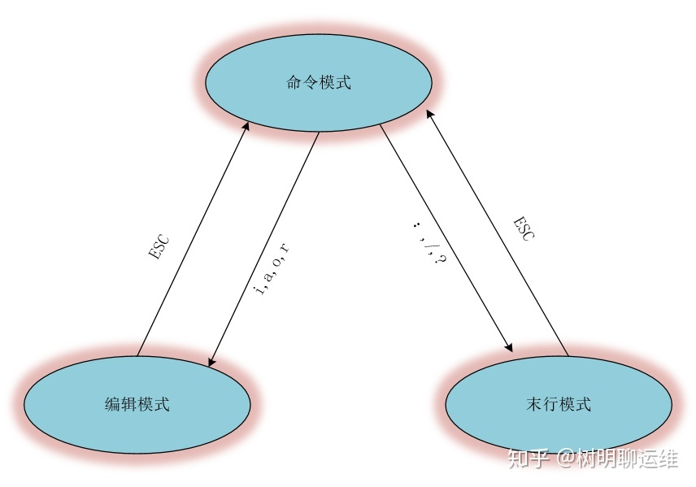
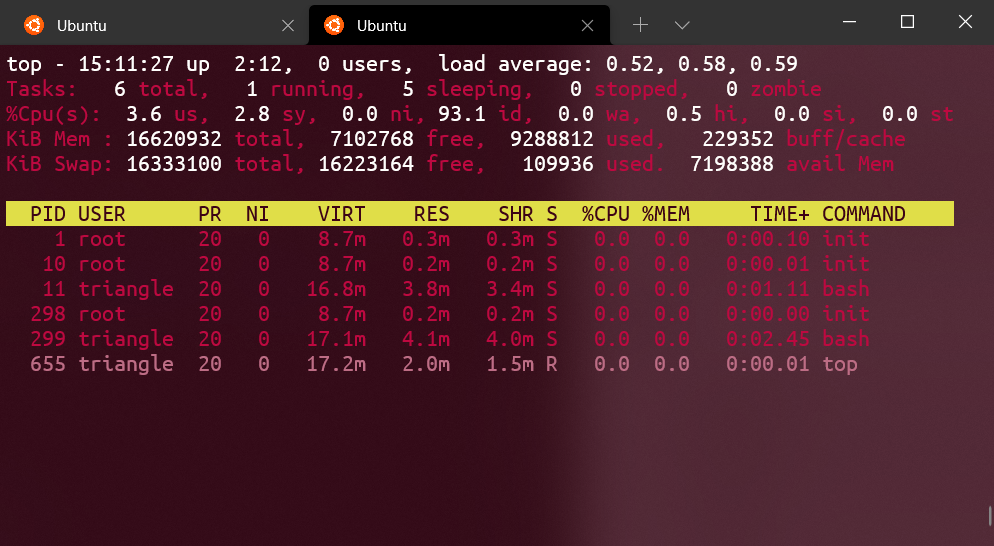

 <h1 style="font-size:60px;text-align:center;">指令</h1>

# 1. 文件目录

## 1.1. `find`

> [!tip]
> - `-size`: 根据大小查找
>   - `-size +6k`: 大于6k
>   - `-size -10k`: 小于10k
> - `-name`: 根据名字查找
> - `-type`
>   - `d`: 文件夹
>   - `f`: 文件
>   - `l`: 软链接
> - `-empty`：查询空文件

 
<span style="font-size:24px;font-weight:bold" class="section2">忽略大小写</span>

```term
triangle@LEARN_FUCK:~$ find ./ -iname "ReadMe.md"
```

<span style="font-size:24px;font-weight:bold" class="section2">查询到文件然后执行指令</span>

- `{}`：代表`find`所查询到的内容
- `\;`：附加指令的结束标记

```term
triangle@LEARN_FUCK:~$ find ./ -type f -exec python AutoNum.py {} \; 
```


<span style="font-size:24px;font-weight:bold" class="section2">时间查询</span>

- **`/var` 目录下找出 `90` 天之内未被访问过的文件**

```term
triangle@LEARN_FUCK:~$ find /var -type f -atime -90
```

- **`/home` 目录下找出 `120` 天之前被修改过的文件**

```term
triangle@LEARN_FUCK:~$ find /home -type f -mtime +120
```


## 1.2. `whereis`

> [!tip]
> 用来定位指令的「二进制程序」、「源代码文件」和「`man`」手册页等相关文件的「路径」。

```term
triangle@LEARN_FUCK:~$ whereis cp
cp: /bin/cp /usr/share/man/man1/cp.1.gz /usr/share/man/man1/cp.1posix.gz
```

## 1.3. `locate`

> [!tip]
> - **介绍：`linux`自带的类似`everything`的「文件搜索」软件。**
> - **原理: 先建立一个包括系统内所有档案名称及路径的「数据库」，之后当寻找时就只需查询这个数据库，而不必实际深入档案系统之中了。**
> - **注意：最近的文件可能查找不到。<br> 数据库由`updatedb`程序来更新，`updatedb`是由`cron daemon`周期性建立的，`locate`命令在搜寻数据库时比由整个由硬盘资料来搜寻资料来得快，但较差劲的是`locate`所找到的档案若是最近才建立或 刚更名的，可能会找不到，在内定值中，`updatedb`每天会跑一次，可以由修改crontab来更新设定值。`(etc/crontab)`**
> - `updatedb`：可以用来强制更新数据库

```term
triangle@LEARN_FUCK:~$ locate /bin/cp
/bin/cp
/bin/cpio
/usr/bin/cpan
/usr/bin/cpan5.26-x86_64-linux-gnu
/usr/lib/klibc/bin/cpio
```


## 1.4. `ls`

<span style="font-size:24px;font-weight:bold" class="section2">显示文件名</span>

```term
triangle@LEARN_FUCK:~$ ls
chapter  linux.md
```

<span style="font-size:24px;font-weight:bold" class="section2">显示文件名与类型</span>

```term
triangle@LEARN_FUCK:~$ ls -F
chapter/  linux.md*
```

<span style="font-size:24px;font-weight:bold" class="section2">显示完整路径</span>

```term
triangle@LEARN_FUCK:~$ ls -l
total 0
drwxrwxrwx 1 triangle triangle 4096 Sep  7 21:34 chapter
-rwxrwxrwx 1 triangle triangle    0 Sep  7 21:32 linux.md
```

## 1.5. `mkdir`

```term
triangle@LEARN_FUCK:~$ mkdir -p 路径 # -p：可以创建路径中没有的文件夹
```

## 1.6. `du`

> [!tip]
> **`du` (disk usage): 查看文件夹和文件的磁盘占用**
> - `h`
> - `a` : 默认只显示文件夹，`a`会显示到具体文件
>   - <font color="#f44336">文件夹的大小 = 目录文件大小 + 文件夹内文件的大小; 数据块的大小</font> 
> - `s （summarize）` : 查看路径对于数据块的总大小
> - `--max-depth=` : 文件夹路径的层级

```term
triangle@LEARN_FUCK:~$ du -h
8.0K    ./chapter
8.0K    .
triangle@LEARN_FUCK:~$ du -ha
4.0K    ./chapter/command.md
4.0K    ./chapter/foundation.md
8.0K    ./chapter
0       ./linux.md
8.0K    
```

## 1.7. `rm`

> [!tip]
> -`-i`：删除前询问
> -`-f`：强制删除
> -`-r`：递归

```term
triangle@LEARN_FUCK:~$  rm -i linux.md
rm: remove regular file 'linux.md'? n
```

## 1.8. 查看

|  命令  | 作用                                                   |
| :----: | ------------------------------------------------------ |
| `cat`  | 直接展开全部内容                                       |
| `tail` | 默认显示文件最后的 `10` 行文本                         |
| `more` | 不能向上一行一行翻页，`Ctrl b`能回滚一页               |
| `less` | 在不加载整个文件的前提下显示文件内容，`more`的功能加强 |

<span style="font-size:24px;font-weight:bold" class="section2">添加行号</span>

```term
triangle@LEARN_FUCK:~$ cat -n linux.md
     1  fuck you
     2  linux
     3  love linux
triangle@LEARN_FUCK:~$ cat -n linux.md | less
triangle@LEARN_FUCK:~$ cat -n linux.md | more
```
> [!note|style:flat]
> - `less more`的行号可以通过`cat`添加
> - `more`重定向后，不能回滚

<span style="font-size:24px;font-weight:bold" class="section2">`tail`添加指定行</span>

```term
triangle@LEARN_FUCK:~$ tail -n 3 command.md
> **作用：用于挂载Linux系统外的储存硬件，硬盘，u盘等，挂载到`linux`系统的一个文
件夹上，方便用户查看。**
> - `mount 设备名(就是一文件路径) 挂载点(目标文件夹路径)`：挂载
> - `umount 设备名/挂载点`：卸载已经加载的文件系统
```

# 2. 硬件相关

## 2.1. `df`

> [!tip]
> **`df （disk free)` : 查看硬盘整体使用情况**
> - `-h` （human）: 会进行单位换算，方便人看
> - `-i` （inode）: 查看i节点

```term
triangle@LEARN_FUCK:~$ df -h
Filesystem      Size  Used Avail Use% Mounted on
rootfs          125G   96G   30G  77% /
none            125G   96G   30G  77% /dev
none            125G   96G   30G  77% /run
none            125G   96G   30G  77% /run/lock
none            125G   96G   30G  77% /run/shm
none            125G   96G   30G  77% /run/user
tmpfs           125G   96G   30G  77% /sys/fs/cgroup
C:\             125G   96G   30G  77% /mnt/c
D:\             109G  6.5G  103G   6% /mnt/d
E:\             121G  106G   15G  88% /mnt/e
F:\             121G   97G   24G  81% /mnt/f
G:\             226G  109G  118G  49% /mnt/g
```

## 2.2. `mount`

> [!tip]
> **作用：用于挂载Linux系统外的储存硬件，硬盘，u盘等，挂载到`linux`系统的一个文件夹上，方便用户查看。**
> - `mount 设备名(就是一文件路径) 挂载点(目标文件夹路径)`：挂载
> - `umount 设备名/挂载点`：卸载已经加载的文件系统

# 3. 数据流处理

## 3.1. `grep`

> [!tip]
> **查找「文件」里符合条件的字符串。「管道」传递的`stdin`也算一个文件。**
> - `-i`: 忽略大小写
> - `-n`: 显示行号
> - `-F` fixed-regexp: 规则视作普通字符串
> - `-E` extended-regexp : 扩展正则
> - `-c` : 匹配计数
> - `-o` only-matching: 只显示匹配内容，不显示完整行
> - `-v` invert-match : 反向查找

**输出成功匹配的行，以及该行之后的两行**

```term
triangle@LEARN_FUCK:~$ grep -A 2 "linux" test.txt
linux ubuntu
linux centos
linux redhat
system reboot
system shutdown
```
**在一个文件夹中递归查询包含指定字符串的文件**

```term
triangle@LEARN_FUCK:~$ grep -r "linux" *
./test/linux.txt:love linux
./test/linux.txt:fuck linux
./test.txt:linux ubuntu
./test.txt:linux centos
```
## 3.2. 管道 `|`

> [!tip]
> <font color="#f44336"> 将前一个指令的`stdout`转为后一个指令的`stdin`，被视为一个「文件」传递给后面的指令。</font>

## 3.3. `xargs`

> [!tip]
> `|` 实现的是将前面的输出`stdout`作为后面的输入`stdin`，但是有些命令不接受管道的传递方式。**这就需要`xargs`将管道产生的`stdin`进行处理，将`stdin`文件转为指令的参数**。

```term
triangle@LEARN_FUCK:~$ find . -type f
./test/linux.txt
./test.txt
./test2.txt
triangle@LEARN_FUCK:~$ find . -type f | cat # 只是输出了find找到的文件的 stdout
./test/linux.txt
./test.txt
./test2.txt
triangle@LEARN_FUCK:~$ find . -type f | xargs cat # 将路径文本，拆分成一条一条路径，当成参数传递给 cat
love linux
cpp
fuck linux
linux ubuntu
linux centos
linux redhat
system reboot
system shutdown
hello world
hello ubuntu
```

## 3.4. `xargs`与`find -exec`

<!--sec data-title="案例程序" data-id="test_program" data-show=true data-collapse=true ces-->

**`main`函数解释，见「c/c++ 基础知识」章节。**

```cpp
#include <stdio.h>
int main(int argn,char * args[]){
    if(argn == 2){
        printf("传输一个参数：%d,%s\n",argn,args[1]);
    }else{
        printf("传输多个参数：%d\n",argn);
    }
}

```
<!--endsec-->


```term
triangle@LEARN_FUCK:~$ ./a.out hellow 
传输一个参数：2,hellow
triangle@LEARN_FUCK:~$ ./a.out arg1 arg2
传输多个参数：3
triangle@LEARN_FUCK:~$ find . -name "*.txt" # 输出所有的 .txt 文件
./salary.txt
./test/linux.txt
./test.txt
./test2.txt
triangle@LEARN_FUCK:~$ find . -name "*.txt" | xargs ./a.out # xargs 特点
传输多个参数：5
triangle@LEARN_FUCK:~$ find . -name  "*.txt" -exec ./a
.out {} \;
传输一个参数：2,./salary.txt
传输一个参数：2,./test/linux.txt
传输一个参数：2,./test.txt
传输一个参数：2,./test2.txt
```

> [!note|style:flat]
> - **`find -exec 执行语句` 指令：可以理解为`find`查询到一个目标，然后执行一次，「执行语句」；「执行语句」执行类似`for`循环。**
> - **`| xargs  执行语句`指令：将管道符传入的`stdout`进行「参数化」处理，再塞给后面的「执行语句」；「执行语句」对「参数」批量执行一次。**

## 3.5. `uniq`

> [!tip]
> 用于检查及删除文本文件中重复出现的行列。<font color="#4c9df8">不会修改源文件，控制台输出或生成新文件。</font>
> - `-c`: 计数
> - `-u unique`: 显示出现一次的行

```term
triangle@LEARN_FUCK:~$ uniq test.txt
linux ubuntu
hellow world
system shutdown
linux ubuntu
hellow world
triangle@LEARN_FUCK:~$ cat test.txt
linux ubuntu
linux ubuntu
hellow world
hellow world
system shutdown
triangle@LEARN_FUCK:~$ uniq test.txt # 只有紧挨着的两行一样，才能去重复
linux ubuntu
hellow world
system shutdown
```
## 3.6. `sed`
> [!tip]
> 文件流处理工具，**操作的单位为文本中的一行**。

```cpp
    sed [选项] '表达式 指令' 源文件
```

**选项**：
- `-e`: 指定一行表达式指令
- `-f`: 指定一个表达式指令文本
- `-n`: 会屏蔽未被选中的行
- `-i`: 输出覆盖源文件
- `-r`: 扩展正则

**表达式**：按照行进行选择
- `/ /`：正则表达式，选中对应目标的所在行
- `数字`: 指定行号
- `A,B`：范围符号，表示 `[A,B]`
  - `/ /,/ /`: **选中两个表达式之间的所有行**
  - `数字1,数字2`：表示`[数字1,数字2]`

**指令**: 针对一行进行操作
- `s/ / /g`: 替换
- `i\内容`: 前插入一行
- `a\内容`: 后插入一行
- `c\内容`: 用指定内容替换选中行
- `p`: 打印
- `d`: 删除
- `;`: 用于指定多个指令
- `{}`: 当表达式是 `/ /` 时，需要用 `{}` 框住多个指令

```term
triangle@LEARN_FUCK:~$ cat test.txt # 测试文件
linux ubuntu linux
hellow world
system shutdown
hellow linux
fuck you
triangle@LEARN_FUCK:~$ sed -n -e '/linux/p' test.txt # 显示含有 linux 的行
linux ubuntu linux
hellow linux
triangle@LEARN_FUCK:~$ sed  -e '/linux/i\ok' test.txt # 有linux的行前面插入一行 ok 
ok
linux ubuntu linux
hellow world
system shutdown
ok
hellow linux
fuck you
triangle@LEARN_FUCK:~$ sed -n -e  's/linux/unix/p' test.txt  # 只替换一行，第一次出现的内容
unix ubuntu linux
hellow unix
triangle@LEARN_FUCK:~$ sed -n -e  's/linux/unix/gp' test.txt
unix ubuntu unix
hellow unix
triangle@LEARN_FUCK:~$ sed -n -e  '2,4p' test.txt # 输出为 [2,4]行的内容
hellow world
system shutdown
hellow linux
triangle@LEARN_FUCK:~$ sed -n -e  '2p;5p' test.txt # 选定行输出
hellow world
fuck you
```

> [!tip|style:flat]
> - `-n 'p' `：显示所有被修改的行
> - `'s/ / /'`：只替换一行，第一次出现的内容
> - `'s/ / /g'`：替换全部

## 3.7. `awk`

# 4. 通用

## 4.1. `{}`
> [!tip]
> 可选符号，能将多个参数合并为一个，`{，，，}`中为可变部分。


## 4.2. `sort`

> [!tip]
> 默认使用 **空格，制表符** 作为文本的分割符号；**默认对第一列进行排序**。每一行作为一个单位，相互比较，比较原则是从首字符向后，依次按`ASCII`码值进行比较，最后将他们按**升序**输出。
> - `t`: 自定义分隔符
> - `k`: 按照第几列排序
> - `r`: 逆序排序
> - `n`: 按照数值，从大到小排序
> - `h`: 按照单位进行排序
> - `u`: 去重

```term
triangle@LEARN_FUCK:~$ cat test.txt
linux ubuntu linux
hellow world
system shutdown
hellow linux
fuck you
triangle@LEARN_FUCK:~$ sort test.txt
fuck you
hellow linux
hellow world
linux ubuntu linux
system shutdown
triangle@LEARN_FUCK:~$ sort -k 2 test.txt # 以第二列进行排序
hellow linux
system shutdown
linux ubuntu linux
hellow world
fuck you
```

<span style="font-size:24px;font-weight:bold" class="section2">`-k`的使用</span>

```cpp
FStart.CStart Modifie,FEnd.CEnd Modifier
-------Start--------,-------End--------
 FStart.CStart 选项  ,  FEnd.CEnd 选项
```

> [!tip]
> `-rk FStart.CStart,FEnd.CEnd`
> - `FStart.CStart,FEnd.CEnd`：指定那个部分参与排序。从第`Fstart`列的第`Cstart`个字母到第`FEnd`列的第`CEnd`个字母参与排序。
> - `modifie`：就是`r,n`

```term
triangle@LEARN_FUCK:~$ cat salary.txt
aa 40 2000
aa 40 1000
bc 50 3000
ca 30 5000
db 10 2000
triangle@LEARN_FUCK:~$ sort -k1.2 salary.txt # 从「第1列的第2个字母」到「最后一列」进行排序
ca 30 5000
aa 40 1000
aa 40 2000
db 10 2000
bc 50 3000
triangle@LEARN_FUCK:~$ sort -k1.2,1.2  salary.txt # 只对「第1列的第2个字母」进行排序
aa 40 1000
aa 40 2000
ca 30 5000
db 10 2000
bc 50 3000
triangle@LEARN_FUCK:~$ sort -k 1.2,1.2 -k 3,3nr salary # 首先对「第1列的第2个字母」进行排序，「相同项」然后对「第3列」的「数字（`n`）」进行「降序（`r`）」排序
.txt
ca 30 5000
aa 40 2000
aa 40 1000
db 10 2000
bc 50 3000
```

## 4.3. `man`

>[!tip]
> 查看Linux中的指令帮助
>
> **分页数字的含义：**
> `1`：用户在shell环境可操作的命令或执行文件；
> `2`：系统内核可调用的函数与工具等
> `3`：一些常用的函数(function)与函数库(library)，大部分为C的函数库(libc)
> `4`：设备文件说明，通常在/dev下的文件
> `5`：配置文件或某些文件格式
> `6`：游戏(games)
> `7`：惯例与协议等，如Linux文件系统，网络协议，ASCII code等说明
> `8`：系统管理员可用的管理命令
> `9`：跟kernel有关的文件

```term
triangle@LEARN_FUCK:~$ man sleep # 默认查询的是 sleep 指令
triangle@LEARN_FUCK:~$ man 3 sleep # 查询的是 sleep 函数
```

## 4.4. `info`

> [!tip]
> 指令使用手册，就内容来说，`info`页面比`man page`编写得要更好、更容易理解，也更友好，但`man page`使用起来确实要更容易得多。


## 4.5. `vim`

<p style="text-align:center;"></p>

- `ctrl v`：块编辑模式
  - `I`:插入
  - `x`:删除
  - `c`:改变
- `vim -R 文件`：只读打开文件


# 5. 压缩

## 5.1. `zip`压缩包

> [!tip]
> **压缩指令：`zip`**
> - `-r`: 递归文件夹
> - `-q quite`: 不显示指令信息
> - `-d`: **删除压缩包中的文件**
>
> **解压缩指令：`unzip`**
> - `-d`: 解压缩的路径
> - `-v`: 查看压缩包

<!--sec data-title="指令测试" data-id="zip" data-show=true data-collapse=true ces-->


```term
triangle@LEARN_FUCK:~$ tree .
.
├── salary.txt
├── test
│   └── linux.txt
├── test.txt
└── test2.txt
triangle@LEARN_FUCK:~$ zip -r test.zip ./
adding: salary.txt (deflated 27%)
adding: test/ (stored 0%)
adding: test/linux.txt (deflated 15%)
adding: test.txt (deflated 19%)
adding: test2.txt (deflated 8%)
triangle@LEARN_FUCK:~$
triangle@LEARN_FUCK:~$ zip -rq test.zip ./ # 啥也不显示
triangle@LEARN_FUCK:~$
triangle@LEARN_FUCK:~$ unzip -v test.zip # 查看压缩包
Archive:  test.zip
 Length   Method    Size  Cmpr    Date    Time   CRC-32   Name
--------  ------  ------- ---- ---------- ----- --------  ----
      55  Defl:N       40  27% 2021-09-10 12:59 a73d2f4a  salary.txt
       0  Stored        0   0% 2021-09-09 22:26 00000000  test/
      26  Defl:N       22  15% 2021-09-09 22:26 55f37f44  test/linux.txt
      75  Defl:N       61  19% 2021-09-10 12:19 ba64a614  test.txt
      25  Defl:N       23   8% 2021-09-09 22:37 83778b60  test2.txt
--------          -------  ---                            -------
     181              146  19%                            5 files
triangle@LEARN_FUCK:~$
triangle@LEARN_FUCK:~$ unzip test.zip -d test/ # 指定路径解压
Archive:  test.zip
inflating: test/salary.txt
creating: test/test/
inflating: test/test/linux.txt
inflating: test/test.txt
inflating: test/test2.txt
```
<!--endsec-->


## 5.2. `tar`

- 通用
  - `-f`: 指定压缩包，**切记，这个参数是最后一个参数，后面只能接压缩包名**
  - `-v`: 显示详细信息
  - `-c create`: 创建包
  - `-C`: 指定解压目录
  - `-t list`: 列出备份文件的内容；
  - `-x extract`: 解压缩
  - `-r`: 追加

- `.tar`：**没有进行压缩**
  - `-c[v]f`: 创建一个tar包
  - `-t[v]f`: 查看压缩包
  - `-x[v]f`: 解压

- `.tar.压缩方法`:

    
| 格式 | 指令 | 后缀   |
| ---- | ---- | ------ |
| gzip | `-z` | `.gz`  |
| bz2  | `-j` | `.bz2` |
| xz   | `-J` | `.xz`  |

<!--sec data-title="指令测试" data-id="tar" data-show=true data-collapse=true ces-->

```term
triangle@LEARN_FUCK:~$ tree
.
├── salary.txt
├── test
│   └── linux.txt
├── test.txt
└── test2.txt
triangle@LEARN_FUCK:~$
triangle@LEARN_FUCK:~$ tar -cvf testTar.tar ./
./
./salary.txt
./test/
./test/linux.txt
./test.txt
./test2.txt
tar: ./testTar.tar: file is the archive; not dumped
triangle@LEARN_FUCK:~$
triangle@LEARN_FUCK:~$ tar -cvzf testTar.tar.gz ./
./
./salary.txt
./test/
./test/linux.txt
./test.txt
./test2.txt
./testTar.tar.gz
triangle@LEARN_FUCK:~$
triangle@LEARN_FUCK:~$tar -tvf testTar.tar.gz
drwxrwxrwx triangle/triangle 0 2021-09-10 14:16 ./
-rwxrwxrwx triangle/triangle 55 2021-09-10 12:59 ./salary.txt
drwxrwxrwx triangle/triangle  0 2021-09-09 22:26 ./test/
-rwxrwxrwx triangle/triangle 26 2021-09-09 22:26 ./test/linux.txt
-rwxrwxrwx triangle/triangle 75 2021-09-10 12:19 ./test.txt
-rwxrwxrwx triangle/triangle 25 2021-09-09 22:37 ./test2.txt
-rwxrwxrwx triangle/triangle  0 2021-09-10 14:16 ./testTar.tar.gz
triangle@LEARN_FUCK:~$
triangle@LEARN_FUCK:~$ mkdir ./testTar
triangle@LEARN_FUCK:~$ tar -xvzf testTar.tar.gz -C ./testTar
./
./salary.txt
./test/
./test/linux.txt
./test.txt
./test2.txt
./testTar.tar.gz
```
<!--endsec-->

# 6. 权限管理

## 6.1. `umask`
> [!tip]
> 决定文件创建的默认权限: `777 & 掩码`
> - `-S`: 具体权限分配

## 6.2. `chmod`

- `[a，u，g，o] + [r，w，x]`: 添加权限
- `[a，u，g，o] - [r，w，x]`: 移出权限
- `编号`: 批量修改

```term
triangle@LEARN_FUCK:~$ ll set.txt
-rwxr-xr-x 1 triangle triangle 21 Sep 10 14:33 set.txt*
triangle@LEARN_FUCK:~$ 
triangle@LEARN_FUCK:~$ chmod a-x set.txt
triangle@LEARN_FUCK:~$ ll set.txt
-rw-r--r-- 1 triangle triangle 21 Sep 10 14:33 set.txt
```
 
## 6.3. `chown`

**修改文件的拥有者**

```term
triangle@LEARN_FUCK:~$ chowm -R 用户名 路径 # 批量递归修改
```

## 6.4. `chgrp` 

**修改文件所述的组**

```term
triangle@LEARN_FUCK:~$ chgrp -R 用户名 路径 # 批量递归修改
```

## 6.5. 用户组管理

| 指令                | 描述                                         |
| ------------------- | -------------------------------------------- |
| `adduser 用户名`    | 创建用户                                     |
| `addgroup` 组名     | 创建组                                       |
| `passwd 用户`       | 创建、改变用户密码                           |
| `userdel -r 用户名` | 底层用于删除用户的工具，会将用户彻底删除干净 |
| `deluser 用户名`    | 普通删除用户                                 |
| `delgroup 删除组`   | 删除组                                       |


# 7. 进程

## 7.1. top

<p style="text-align:center;"></p>

> [!tip]
> 类似于Windows的任务管理器
>* top 行：当前时间，运行时间，用户数量，`cpu`使用情况:`5min内 10min内 15min内`
>* `tasks`行：进程信息
>* `CPU`行：`cpu`的详细占用情况， **默认只显示了一个`CPU`** 
>* `mem`行：内存
>* `swap`行：交换区
>* 进程列表

**常用指令：**

> * `e`：进程列表单位
> * `E`：men行、swap行的单位
> * `z`：颜色区分
> * `Z`：自定义颜色
> * `m`：如何显示内存 
> * `f`：进程表排序
> * `W`：保存配置


## 7.2. `ps`

> [!tip]
> `process status`，用于显示当前进程的状态，功能没有`top`全面

```term
triangle@LEARN_FUCK:~$  ps -au
USER       PID %CPU %MEM    VSZ   RSS TTY      STAT START   TIME COMMAND
root        10  0.0  0.0   8944   228 tty1     Ss   12:58   0:00 /init
triangle    11  0.0  0.0  17156  3852 tty1     S    12:58   0:01 -bash
root       298  0.0  0.0   8944   228 tty2     Ss   13:50   0:00 /init
triangle   299  0.0  0.0  17468  4232 tty2     S    13:50   0:02 -bash
triangle   668  0.0  0.0  17392  1904 tty2     R    15:17   0:00 ps -au
```


## 7.3. 后台进程

> [!tip]
> - `jobs -l`：用于显示`Linux`中的任务列表及任务状态，包括后台运行的任务
> - `fg %编号`：于将后台作业（在后台运行的或者在后台挂起的作业）放到前台终端运行。
> - `bg %编号`：用于将作业放到后台运行，使前台可以执行其他任务。
> - `指令 &`：效果与`bg`一样，将程序放到后台。

```term
triangle@LEARN_FUCK:~$ find / -name "fuck" & # 将程序放到后台运行
triangle@LEARN_FUCK:~$ jobs
[1]+  Stopped                 vim set.txt
[2]   Running                 find / -name "fuck" &
triangle@LEARN_FUCK: fg %1 # 将程序调到前台
triangle@LEARN_FUCK: kill %2 # 杀死后台程序
```

# 8. 系统
## 8.1. `free`

> [!tip]
> 查看内存使用情况
> - `-k`: 单位kb
> - `-m`: 单位mb
> - `-g`: 单位gb

## 8.2. `uname`

> [!tip]
> 查看系统信息
> - `-a`: 全部信息
> -  `-r（release）`: 显示操作系统的发行编号

```term
triangle@LEARN_FUCK:~$ uname -a
Linux DESKTOP-RDTVBUO 4.4.0-19041-Microsoft #1151-Microsoft Thu Jul 22 21:05:00 PST 2021 x86_64 x86_64 x86_64 GNU/Linux
```

# 9. 网络
## 9.1. `netstat`

> [!tip]
>利用 netstat 指令可让你得知整个 Linux 系统的网络情况。
>- `-n numeric`: 直接使用`IP`地址
>- `-p programs`: 显示正在使用`Socke`t的程序识别码和程序名称。
>- `-t tcp`: 显示`TC`P传输协议的连线状况。
>- `-u udp`: 显示`UDP`传输协议的连线状况。
>- `-l listening`：显示「监听状态」的服务器的`Socket`
>- `-a all`：显示所有连线中的`Socket`

```term
triangle@LEARN_FUCK:~$  netstat -npl # 系统都开启了哪些监听端口
Active Internet connections (only servers)
Proto Recv-Q Send-Q Local Address               Foreign Address             State       PID/Program name
tcp        0      0 0.0.0.0:22                  0.0.0.0:*                   LISTEN      1035/sshd
tcp        0      0 :::22                       :::*                        LISTEN      1035/sshd
udp        0      0 0.0.0.0:68                  0.0.0.0:*                               931/dhclient
Active UNIX domain sockets (only servers)
Proto RefCnt Flags       Type       State         I-Node PID/Program name    Path
unix  2      [ ACC ]     STREAM     LISTENING     6825   1/init              @/com/ubuntu/upstart
unix  2      [ ACC ]     STREAM     LISTENING     8429   1003/dbus-daemon    /var/run/dbus/system_bus_socket
triangle@LEARN_FUCK:~$ netstat -an | grep -c ESTABLISHED # 统计系统当前进程连接数
triangle@LEARN_FUCK:~$
triangle@LEARN_FUCK:~$
triangle@LEARN_FUCK:~$
triangle@LEARN_FUCK:~$
```

> proto: 协议类型
> Local Address: 本机的IP与端口
> Foreign Address: 远程的IP与端口
> State: 连接状态


## 9.2. ifconfig

> [!tip]
> 查看或者配置主机的网络设备
> - `ethX`: 真正的物理网卡
> - `lo`: 本地虚拟网卡

<!--sec data-title="指令测试" data-id="ifconfig" data-show=true data-collapse=true ces-->

```term
triangle@LEARN_FUCK:~$ ifconfig
eth2: flags=4163<UP,BROADCAST,RUNNING,MULTICAST>  mtu 1500
        inet 191.167.26.1  netmask 255.255.0.0  broadcast 191.167.26.255
        inet6 fe80::590b:354c:9433:480d  prefixlen 64  scopeid 0xfd<compat,link,site,host>
        ether 0a:00:27:00:00:0a  (Ethernet)
        RX packets 0  bytes 0 (0.0 B)
        RX errors 0  dropped 0  overruns 0  frame 0
        TX packets 0  bytes 0 (0.0 B)
        TX errors 0  dropped 0 overruns 0  carrier 0  collisions 0

lo: flags=73<UP,LOOPBACK,RUNNING>  mtu 1500
        inet 127.0.0.1  netmask 255.0.0.0
        inet6 ::1  prefixlen 128  scopeid 0xfe<compat,link,site,host>
        loop  (Local Loopback)
        RX packets 0  bytes 0 (0.0 B)
        RX errors 0  dropped 0  overruns 0  frame 0
        TX packets 0  bytes 0 (0.0 B)
        TX errors 0  dropped 0 overruns 0  carrier 0  collisions 0

wifi0: flags=4163<UP,BROADCAST,RUNNING,MULTICAST>  mtu 1500
        inet 192.168.0.107  netmask 255.255.255.0  broadcast 192.168.0.255
        inet6 fe80::14c3:a7ab:45e2:63b5  prefixlen 64  scopeid 0xfd<compat,link,site,host>
        ether 00:bb:60:62:28:07  (Ethernet)
        RX packets 0  bytes 0 (0.0 B)
        RX errors 0  dropped 0  overruns 0  frame 0
        TX packets 0  bytes 0 (0.0 B)
        TX errors 0  dropped 0 overruns 0  carrier 0  collisions 0
```
<!--endsec-->

## 9.3. `ping`

> [!tip]
> **介绍：用来测试主机之间网络的连通性。执行`ping`指令会使用`ICMP(Internet Control Message Protocol)`传输协议，发出要求回应的信息，若远端主机的网络功能没有问题，就会回应该信息，因而得知该主机运作正常。**

```term
triangle@LEARN_FUCK:~$ ping www.baidu.com
PING www.a.shifen.com (14.215.177.39) 56(84) bytes of data.
64 bytes from www.baidu.com (14.215.177.39): icmp_seq=1 ttl=54 time=60.2 ms
64 bytes from www.baidu.com (14.215.177.39): icmp_seq=2 ttl=54 time=44.3 ms
64 bytes from www.baidu.com (14.215.177.39): icmp_seq=3 ttl=54 time=42.0 ms
64 bytes from www.baidu.com (14.215.177.39): icmp_seq=4 ttl=54 time=42.0 ms
64 bytes from www.baidu.com (14.215.177.39): icmp_seq=5 ttl=54 time=54.1 ms
```

# 10. 脚本运行

## 10.1. `source`

> [!tip]
> - **作用：在当前Shell环境中从指定文件读取和执行命令，命令返回退出状态。**
> - <span style="color:red;font-weight:bold"> 使用：当脚本使用，可以用来批量执行命令行 </span>

```term
triangle@LEARN_FUCK:~$ tree
.
└── readme.txt

0 directories, 1 file
triangle@LEARN_FUCK:~$ cat test.txt
echo 'ok'
mkdir ./nice
cd ./nice
touch readme.txt
echo 'hello ubuntu' > readme.txt
triangle@LEARN_FUCK:~$ source test.txt
ok
triangle@LEARN_FUCK:~/nice$
triangle@LEARN_FUCK:~/nice$ cd ..
triangle@LEARN_FUCK:~$
triangle@LEARN_FUCK:~$ tree
.
├── nice
│   └── readme.txt
└── test.txt

1 directory, 2 files
triangle@LEARN_FUCK:~$
triangle@LEARN_FUCK:~$ cat ./nice/readme.txt
hello ubuntu
```