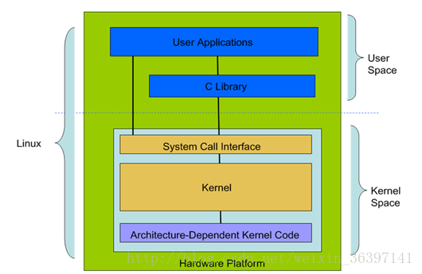
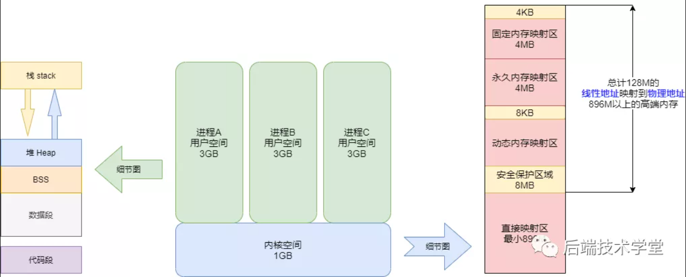
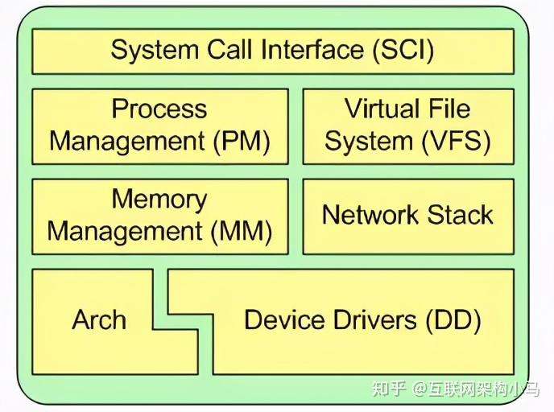
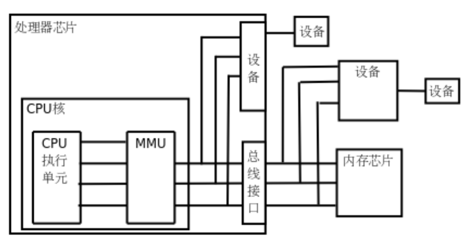
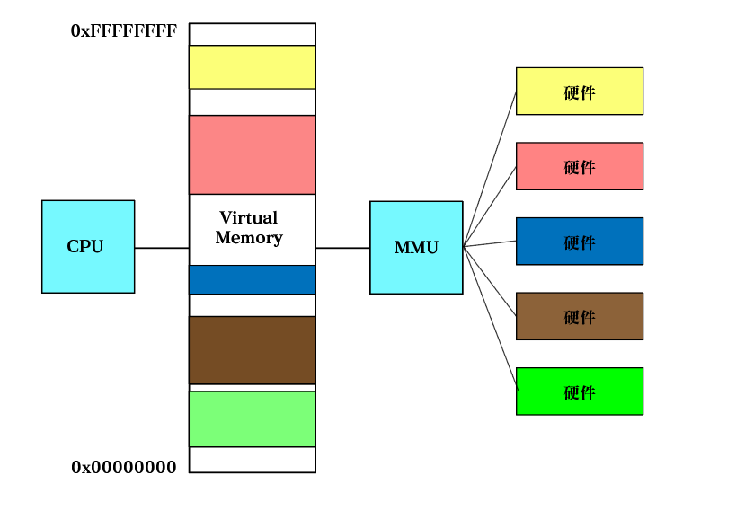
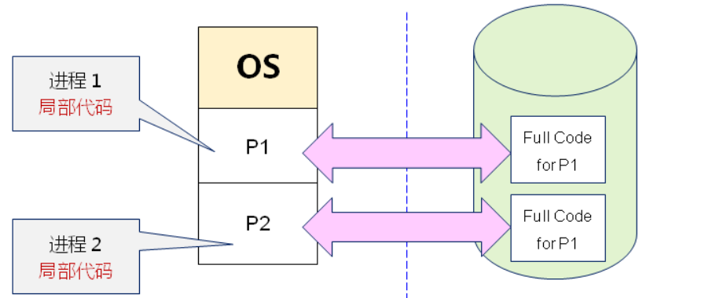
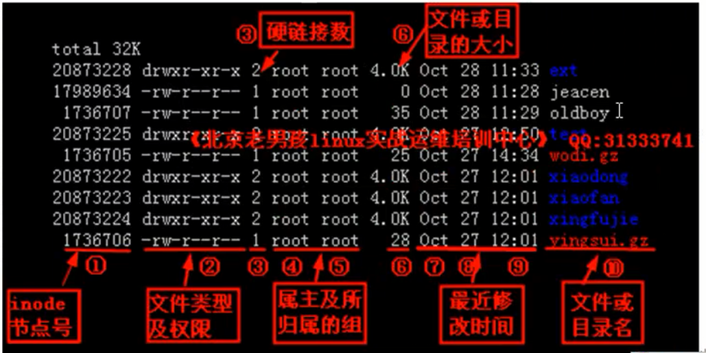
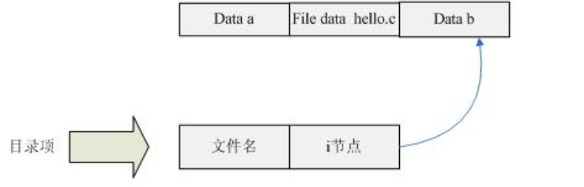
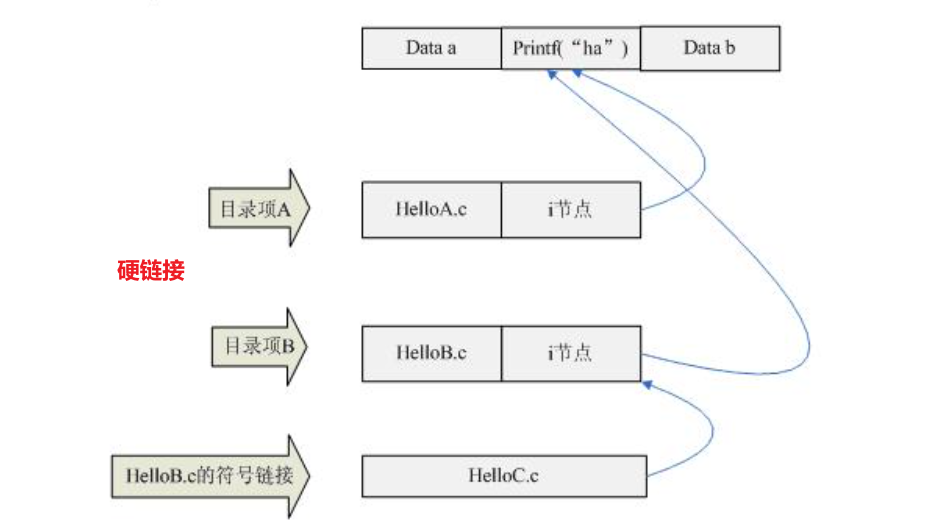
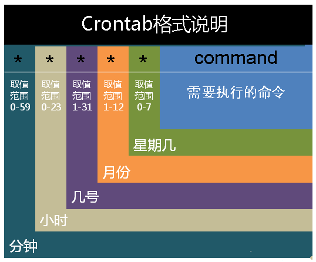

# 1. `Linux` 简介

## 1.1. `Linux` 系统结构

参考博客：
- [用户空间和内核空间的区别](https://zhuanlan.zhihu.com/p/343597285)

<p style="text-align:center;"></p>

<span style="font-size:24px;font-weight:bold" class="section2">`Linux`系结结构:</span>

- **用户空间(User Space)** ：用户空间又包括用户的应用程序`(User Applications)`、C 库`(C Library)` 
- **内核空间(Kernel Space)** ：内核空间又包括系统调用接口`(System Call Interface)`、内核`(Kernel)`、平台架构相关的代码`(Architecture-Dependent Kernel Code) `。

**原因：**

- 现代 `CPU` 实现了不同的工作模式，不同模式下 `CPU` 可以执行的指令和访问的寄存器不同。
- `Linux` 从 `CPU` 的角度出发，为了保护内核的安全，把系统分成了两部分，防止用户程序不稳定把系统给搞崩溃。


<span style="font-size:24px;font-weight:bold" class="section2">1. 进程、内存：</span>


- **内存分配**：根据结构上的区分，内存被分为了两大块，两个空间有着各自的内存区域。
- **内核态: 当进程/线程运行在「内核空间」时就处于「内核态」。**
  -  `CPU `可以执行任何指令
  -  代码不受任何的限制，可以自由地访问任何有效地址
  -  代码也可以直接进行端口的访问
- **用户态: 当进程/线程运行在「用户空间」时则处于「用户态」。**
  - 代码执行要受到 `CPU `的很多检查
  - 访问内存地址受限制，比如：进程只能访问映射其地址空间的页表项中规定的在用户态下可访问页面的虚拟地址。
- <span style="color:red;font-weight:bold"> 所有系统资源的管理都是在「内核态」执行。 </span>

<p style="text-align:center;"></p>

<span style="font-size:24px;font-weight:bold" class="section2">2. 用户态切换到内核态</span>


**原因：**

所有系统资源的管理通过内核态完成，那我们应用程序需要访问磁盘，读取网卡的数据，新建一个线程都需要从「用户态」切换到「内存态」。

**方式：**
- **系统调用:** 通过对系统提供的`API`接口函数进行调用，完成从「用户态」切换到「内存态」。
- **中断：** 利用软中断`init 6`，用户可以进行系统重启。
  - **硬中断：** 外部硬件状态发生改变所引起的中断；例如，插入一个u盘，网卡收到数据包的时候
  - **软中断：** 由当前进程所触发的中断；例如，`init 6`


| 类型   | 触发     | CPU            | 时间             | 案例             |
| ------ | -------- | -------------- | ---------------- | ---------------- |
| 硬中断 | 硬件触发 | 马上中断处理   | 较短时间内完成   | 插入一个u盘      |
| 软中断 | 进程触发 | 不一定马上运行 | 处理时间相对较长 | `init 6`重启系统 |

> [!tip|style:flat]
> **扩展：根据`CPU`运行情况，可以把「中断」分为「外中断」与「内中断」，执行逻辑顺序一样。**
> - **中断（外中断）**：「外中断」就是通常所述的「中断」，由`CPU`外部事件所触发的。
> - **异常（内中断）**：`CPU`内部程序运行，**指令执行出错**，把程序玩崩溃了。
> 
> 参考博客：[中断与异常的区别](https://blog.csdn.net/qq_29996285/article/details/88078939)


## 1.2. 内核

<p style="text-align:center;"></p>

> [!note|style:flat]
> **作用：Linux系统的核心是内核（`kernel space`，这里的「内核」是指的是「内核空间」里面的东西）。内核控制着计算机系统上的所有硬件和软件,在必要时分配硬件,并根据需要执行软件。**
> - **系统内存管理``**
> - **应用程序管理**
> - **硬件设备管理**
> - **文件系统管理**

## 1.3. 内存管理

<span style="font-size:24px;font-weight:bold" class="section2">1. MMU 内存管理单元</span>

**介绍**： 一个硬件芯片，用来将`virtual memory`映射到真正的物理设备地址上。**也就是说`CPU`是通过`MMU`来找到真正的内存条，硬盘，显卡等硬件的位置。**

<p style="text-align:center;"></p>


<span style="font-size:24px;font-weight:bold" class="section2">2. virtual memory</span>

对`32`位的`CPU`而言，就会构造一个地址范围为`0x00000000 ~ 0xFFFFFFFF`的「虚拟内存」，然后通过`Memory Management`将物理内存`Memory`（内存条）和`Swap Space`（硬盘上的模拟内存）映射到虚拟内存上，同样还有其他硬件的可操作内存都映射到这上面（例如显存）。**这样做的好处就是：将零碎的可访问地址统一集中起来，`CPU`中的指令就只需要根据地址编号`0x00000000 ~ 0xFFFFFFFF`读写对应的内存就行了，具体的找地址工作就交给「内存管理单元`MMU`」完成。**


<p style="text-align:center;"></p>

> [!tip]
> - **我们编写的程序都是以`virtual memory`进行内存寻址的，运行时，也可以看成是在「虚拟地址空间」中运行的。真实的物理寻址则靠`MMU`完成。**
> - **每个进程都有自己独立的虚拟地址空间，运行时，就将虚拟地址空间里的代码数据映射到内存中，从而被CPU执行与处理。**
> 
> <span style="color:red;font-weight:bold"> 上图的内存映射是乱画的，真实情况不知道（懒得查了） </span>

<p style="text-align:center;"></p>

**虚拟内存的全局图：**
<p style="text-align:center;"></p>


**下面进行程序测试，同样的程序同时运行，其内存地址是一样。通过`MMU`单元翻译过后的物理地址也应该是一样的。「这就产生问题了，同时运行的程序，其所在的内存地址应该要不一样才行阿。」**

 **在`CPU`中执行的代码只是完整程序的一部分**，对于上面所遇到的两进程同时运行造成的问题，只要系统将进程运行时间错开，再运行就行了，**表面上的同时运行，其实对于`CPU`而言是错开了的。**

**进程1：**

```term
triangle@LEARN_FUCK:~$ .\a.exe
int address: 000000000061FE1C
double address: 000000000061FE10
一直运行
```

**进程2：**

```term
triangle@LEARN_FUCK:~$ .\a.exe
int address: 000000000061FE1C
double address: 000000000061FE10
一直运行
```

<!--sec data-title="测试代码" data-id="virtualMemory" data-show=true data-collapse=true ces-->

```cpp
#include <stdio.h>
int main(int argn,char* args[]){
    
    int a = 1;
    double b = 1.0;

    // 输出地址
    printf("int address: %p \n",&a);
    printf("double address: %p \n",&b);

    // 将程序停住，在后台一直运行
    getchar();
}
```
<!--endsec-->

<span style="font-size:24px;font-weight:bold" class="section2">3. swap space</span>

**`swap space`：就是一块磁盘空间（硬盘空间）。虚拟内存与物理内存映射的时候，当物理内存不够用时，会将代码放到「交换区」中，以后在`CPU`想要执行相关的指令或者数据时，如果内存中没有，先去交换区将需要的指令与数据搬到物理内存，然后`CPU`再执行。**

<p style="text-align:center;"></p>

**在`CPU`中执行的代码只是完整程序的一部分**，`CPU`是会以时间片的形式轮换执行多个程序；在这里`swap space`就充当了一个「休息室」，当「物理内存」中客流量大时（内存被占用的太厉害），就将「物理内存」中还有一段时间才能切换到的空闲程序给撤下来，放到「交换区」里等着，别占用「物理内存」，等到要运行的时候，又将程序与数据加载回「物理内存」。**通过`swap space`这就能实现多个需要大内存运行的程序，能在储存量小的物理内存上同时运。**


<span style="font-size:24px;font-weight:bold" class="section2">4. cache/buffer</span>

- **cache**：缓存，用来加速「读」操作；先把从磁盘读取的数据保存到内存中，然后`CPU`使用时，直接从内存中读取，效率更块。
- **buffer**：缓冲区，用来加速「写」操作；先把要写出的数据保存到内存中，达到一定数量后，然后`CPU`集中将数据写入磁盘。


## 1.4. 应用程序管理

**`Linux`操作系统将运行中的程序称为「进程」。每个进程分配一个「virtual memory」，真正在物理内存上运行的就只是其中一小部分。** 进程可以在前台运行，将输出显示在屏幕上，也可以在后台运行，隐藏到幕后。内核控制着`Linux`系统如何管理运行在系统上的所有进程。


<span style="font-size:24px;font-weight:bold" class="section2">1. `init`进程</span>


**`linux`系统启动后，第一个被创建的「用户态」进程就是`init`进程。** 
1. 执行系统初始化脚本，创建一系列的进程（它们都是`init`进程的子孙）；
2. 在一个死循环中等待其子进程的退出事件，并调用`waitid`用来完成「收尸」工作；
3. `init`进程不会被暂停
4. `PID`永远为`1`


```term
triangle@LEARN_FUCK:~$ pstree
init─┬─init───bash───pstree
     └─{init}
```

<span style="font-size:24px;font-weight:bold" class="section2">2. 7大运行级别</span>


> [!tip]
> - `0`：系统停机 
> - `1`：单用户工作状态，root权限，用于系统维护，禁止远程登陆 
> - `2`：多用户状态(没有`NFS`，网络文件系统) 
> - `3`：完全的多用户状态(有`NFS`，网络文件系统)，登陆后进入控制台命令行模式 
> - `4`：系统未使用，保留 
> - `5`：X11控制台，桌面模式 
> - `6`：系统正常关闭并重启

```term
triangle@LEARN_FUCK:~$ init 运行级别号
triangle@LEARN_FUCK:~$ runlevel # 当前运行级别
5
```

## 1.5. 硬件设备管理

任何`Linux`系统需要与之通信的设备，都需要在内核代码中加入对应的「驱动程序代码」。驱动程序代码相当于应用程序和硬件设备的中间人，允许内核与设备之间交换数据。

在`Linux`内核中有两种方法用于插入设备驱动代码:

- **编译进内核的设备驱动代码**：加入代码，重新编译内核
- **可插入内核的设备驱动模块**：允许将驱动代码插入到运行中的内核而无需重新编译内核。当设备不再使用时也可将内核模块从内核中移走。


## 1.6. 文件系统管理

- 内核必须在编译时就加入对所有可能用到的文件系统的支持
- `Linux`内核采用虚拟文件系统`(Virtual File System,VFS)`作为和每个文件系统交互的接口

```cpp
ext      | Linux扩展文件系统,最早的Linux文件系统
ext2     | 第二扩展文件系统,在ext的基础上提供了更多的功能
ext3     | 第三扩展文件系统,支持日志功能
ext4     | 第四扩展文件系统,支持高级日志功能
hpfs     | OS/2高性能文件系统
jfs      | IBM日志文件系统
iso9660  | ISO 9660文件系统(CD-ROM)
minix    | MINIX文件系统
msdos    | 微软的FAT16
ncp      | Netware文件系统
nfs      | 网络文件系统
ntfs     | 支持Microsoft NT文件系统
proc     | 访问系统信息
ReiserFS | 高级Linux文件系统,能提供更好的性能和硬盘恢复功能
smb      | 支持网络访问的Samba SMB文件系统
sysv     | 较早期的Unix文件系统
ufs      | BSD文件系统
umsdos   | 建立在msdos上的类Unix文件系统
vfat     | Windows 95文件系统(FAT32)
XFS      | 高性能64位日志文件系统

```

# 2. `linux`的启动过程


1. 主机加电自检，加载 `BIOS`硬件信息。
2. 读取 `MBR` 的引导文件(GRUB、LILO)。
3. 引导 `Linux` 内核。
4. 运行第一个进程 `init` (进程号永远为 1 )。
5. 进入相应的「运行级别」。
6. 运行终端，输入用户名和密码。


# 3. 文件
参考博客：
- [Linux下七种文件类型、文件属性及其查看方法](https://blog.csdn.net/rong09_13/article/details/79233956)
- [深入理解linux i节点(inode)](https://blog.csdn.net/feiyinzilgd/article/details/5609157)
- [目录文件](https://zhidao.baidu.com/question/488568249980342132.html#:~:text=%E5%9C%A8Linux%E4%B8%8B%E4%B8%80%E5%88%87%E7%9A%86%E6%96%87%E4%BB%B6%EF%BC%8C%E5%9B%A0%E6%AD%A4%E7%9B%AE%E5%BD%95%E4%B9%9F%E6%98%AF%E6%96%87%E4%BB%B6%E3%80%82%20%E6%89%80%E4%BB%A5%EF%BC%8C%E9%80%9A%E8%BF%87%20ls%20-al%20%E5%91%BD%E4%BB%A4%E6%98%BE%E7%A4%BA%E7%9A%84%E7%9B%AE%E5%BD%95%E5%A4%A7%E5%B0%8F%E5%B9%B6%E9%9D%9E%E5%B8%B8%E8%A7%84%E6%84%8F%E4%B9%89%E4%B8%8A%E5%8C%85%E5%90%AB%E5%85%B6%E5%AD%90%E6%96%87%E4%BB%B6%E7%9A%84%E6%80%BB%E5%A4%A7%E5%B0%8F%EF%BC%8C%E8%80%8C%E6%98%AF%E5%8D%95%E7%BA%AF%E6%8C%87%E7%9A%84%E6%98%AF%E7%9B%AE%E5%BD%95%E7%9A%84%E5%A4%A7%E5%B0%8F%E3%80%82,%E8%BF%99%E4%B8%80%E7%82%B9%E5%92%8CWindows%E5%B9%B6%E4%B8%8D%E4%B8%80%E6%A0%B7%E3%80%82%20%E8%AF%B7%E6%B3%A8%E6%84%8F%E4%B8%80%E7%82%B9%EF%BC%8C%E5%85%B6%E5%AE%9ELinux%E4%B8%8B%E7%9B%AE%E5%BD%95%E7%9A%84%E5%A4%A7%E5%B0%8F%E5%B9%B6%E4%B8%8D%E9%83%BD%E6%98%AF4096%E7%9A%84%E3%80%82%20%E9%82%A3%E4%B9%88%E4%B8%BA%E4%BB%80%E4%B9%88%E5%A4%A7%E9%83%A8%E5%88%86%E7%9A%84%E7%9B%AE%E5%BD%95%E5%A4%A7%E5%B0%8F%E9%83%BD%E6%98%AF4096%E5%91%A2%EF%BC%9F%20%E8%BF%99%E9%9C%80%E8%A6%81%E4%BB%8ELinux%E6%96%87%E4%BB%B6%E7%9A%84%E5%AD%98%E5%82%A8%E6%9C%BA%E5%88%B6%E8%AF%B4%E6%98%8E%E3%80%82%20%E6%96%87%E4%BB%B6%E5%82%A8%E5%AD%98%E5%9C%A8%E7%A1%AC%E7%9B%98%E4%B8%8A%EF%BC%8C%E7%A1%AC%E7%9B%98%E7%9A%84%E6%9C%80%E5%B0%8F%E5%AD%98%E5%82%A8%E5%8D%95%E4%BD%8D%E5%8F%AB%E5%81%9A%E2%80%9C%E6%89%87%E5%8C%BA%E2%80%9D%EF%BC%88Sector%EF%BC%89%E3%80%82%20%E6%AF%8F%E4%B8%AA%E6%89%87%E5%8C%BA%E5%82%A8%E5%AD%98512%E5%AD%97%E8%8A%82%EF%BC%88%E7%9B%B8%E5%BD%93%E4%BA%8E0.5KB%EF%BC%89%E3%80%82)

## 3.1. 概念

> [!warning|style:flat]
> **在`Linux`系统中，一切皆是文件。**

## 3.2. 文件属性

<p style="text-align:center;"></p>

```term
triangle@LEARN_FUCK:~$  ls -ila
total 0
3377699720545409 drwxrwxrwx 1 triangle triangle 4096 Sep 10 19:54 .
1970324836981980 drwxrwxrwx 1 triangle triangle 4096 Sep  1 19:34 ..
 281474976816981 lrwxrwxrwx 1 triangle triangle   10 Sep 10 19:52 link1 -> salary.txt
1407374883659532 -rwxrwxrwx 3 triangle triangle   55 Sep 10 12:59 linkd1
1407374883659532 -rwxrwxrwx 3 triangle triangle   55 Sep 10 12:59 linkd2
1407374883659532 -rwxrwxrwx 3 triangle triangle   55 Sep 10 12:59 salary.txt
 844424930238223 drwxrwxrwx 1 triangle triangle 4096 Sep  9 22:26 test
```

## 3.3. 七种文件类型

- **普通文件类型:`-`** 
    
   - `Linux`中最多的一种文件类型, 包括 纯文本文件`(ASCII)`；二进制文件`(binary)`；数据格式的文件`(data)`;各种压缩文件

- **目录文件:`d`**

   - 就是文件夹

- **块设备文件:`b`**

    - 就是存储数据以供系统存取的接口设备，简单而言就是「硬盘」。例如一号硬盘的代码是 `/dev/hda1` 等文件。

- **字符设备:`c`**

    - 串行端口的接口设备，例如键盘、鼠标等等。

- **套接字文件:`s`**

    - 这类文件通常用在网络数据连接。可以启动一个程序来监听客户端的要求，客户端就可以通过套接字来进行数据通信。最常在` /var/run`目录中看到这种文件类型

- **管道文件:`p`**

    - `FIFO`也是一种特殊的文件类型，它主要的目的是进程间通讯。

- **链接文件:`l`**

    - 类似`Windows`下面的快捷方式。

## 3.4. 文件权限
- 文件的访问对象分为: **u用户，g组，o其他** ;
- 文件的访问权限分为: **r，w，x 对应二进制 111** 

```term
triangle@LEARN_FUCK:~$ ls -laF
drwxrwxrwx 1 triangle triangle 4096 Sep 10 14:18 ./
drwxrwxrwx 1 triangle triangle 4096 Sep  1 19:34 ../
-rwxrwxrwx 1 triangle triangle   55 Sep 10 12:59 salary.txt*
drwxrwxrwx 1 triangle triangle 4096 Sep  9 22:26 test/
-rwxrwxrwx 1 triangle triangle   75 Sep 10 12:19 test.txt*
```

## 3.5. 文件时间戳

> [!note]
> - 访问时间 `(acces)` （`-atime` 天，`-amin` 分钟）：文件被查看的时间，用户最近一次访问时间。
> - 修改时间 `(modify)`（`-mtime` 天，`-mmin` 分钟）：「内容数据」被修改的最后一次修改时间。
> - 变化时间 `(change)`（`-ctime` 天，`-cmin` 分钟）：状态时间，当文件的状态即文件的属性被改变是就会更改这个时间，例如文件系统中的`links`(链接数)，`size`(文件的大小)、文件的权限、`blocks`(文件的`block`数)；

```term
triangle@LEARN_FUCK:~$ stat command.md

File: command.md
Size: 1258            Blocks: 8          IO Block: 4096   regular file
Device: 11h/17d Inode: 562949953511263  Links: 1
Access: (0777/-rwxrwxrwx)  Uid: ( 1000/triangle)   Gid: ( 1000/triangle)
Access: 2021-09-08 10:21:03.394365400 +0800
Modify: 2021-09-08 10:11:44.128382200 +0800
Change: 2021-09-08 10:11:44.128382200 +0800
 Birth: -
```

## 3.6. 目录的结构

**硬盘内存的划分：**
1. **导引块**: 加载硬盘数据用的程序
1. **专用块**: 磁盘相关信息，例如，磁盘大小。
1. **`i`节点表块**: 存储所有的`i`节点
1. **数据存储块**: 文件数据

**目录**
- **目录: 包含「一组目录项」的「文件」**
- **目录项: 由「文件名」与「i节点索引」**
- **i节点**: 指向该文件在硬盘上的「数据存储块」，还包含了很多信息，文件的创建者、文件的创建日期、文件的大小等等，**唯独不记录文件名**。
- **文件：每一个文件都对应着一个「i节点」** 

<p style="text-align:center;"></p>

> [!note|style:flat]
> <span style="color:red;font-weight:bold"> 对于`linux`而言默认的一个`block`为`4096`个字节，对应硬盘`8`个扇区。由于「文件夹」其实就是「目录」，即也是存储在硬盘上的一个「文件」，默认分配大小就是一个`block`，所以一个「文件夹」会显示大小为`4096` </span>

```term
triangle@LEARN_FUCK:~$ ll | grep '^d'
drwxrwxrwx 1 triangle triangle 4096 Sep 10 18:43 ./
drwxrwxrwx 1 triangle triangle 4096 Sep  1 19:34 ../
drwxrwxrwx 1 triangle triangle 4096 Sep  9 22:26 test/
drwxrwxrwx 1 triangle triangle 4096 Sep 10 14:16 testTar/
```


<span style="font-size:24px;font-weight:bold" class="section2">链接</span>

<p style="text-align:center;"></p>

> [!tip]
> - **硬链接**: 多个「目录项」绑定到了同一片「数据储存块」（也就是同一文件）；「硬链接」会使得「链接计数器」增加，计数器表示了当前文件被多少个文件绑定，当计数器为`0`时，该文件才能真正被删除。
>   - **只有超级用户才可以为目录创建硬链接**
>   - **不可以在不同文件系统的文件间建立链接**
> - **符号链接**: 是一个包含「i结点」路径的一个索引。
>   - **软链接克服了硬链接的不足**
>   - **当原始文件位置变动或者被删除，软连接失效。** 

```term
triangle@LEARN_FUCK:~$ ln -s salary.txt  link1
triangle@LEARN_FUCK:~$ ll | grep '^l' # 后面跟着符号链接指向文件的路径
lrwxrwxrwx 1 triangle triangle   10 Sep 10 19:52 link1 -> salary.txt*
triangle@LEARN_FUCK:~$
triangle@LEARN_FUCK:~$ ln -d salary.txt linkd1
triangle@LEARN_FUCK:~$ ln -d salary.txt linkd2
triangle@LEARN_FUCK:~$ stat salary.txt # links 链接数为 3 
  File: salary.txt
  Size: 55              Blocks: 0          IO Block: 4096   regular file
Device: 11h/17d Inode: 1407374883659532  Links: 3
Access: (0777/-rwxrwxrwx)  Uid: ( 1000/triangle)   Gid: ( 1000/triangle)
Access: 2021-09-10 14:25:20.283459400 +0800
Modify: 2021-09-10 12:59:27.000000000 +0800
Change: 2021-09-10 19:54:34.610528800 +0800
 Birth: -
triangle@LEARN_FUCK:~$ ll | grep -E  'linkd|salary'
lrwxrwxrwx 1 triangle triangle   10 Sep 10 19:52 link1 -> salary.txt*
-rwxrwxrwx 3 triangle triangle   55 Sep 10 12:59 linkd1*
-rwxrwxrwx 3 triangle triangle   55 Sep 10 12:59 linkd2*
-rwxrwxrwx 3 triangle triangle   55 Sep 10 12:59 salary.txt*
```

# 4. 环境变量

参考博客：
- [超详干货！Linux 环境变量配置全攻略](https://zhuanlan.zhihu.com/p/317282094)

## 4.1. 定义

> [!tip]
> **在 `Linux` 系统中，「环境变量」是用来定义系统运行环境的一些参数，比如每个用户不同的家目录`（HOME）`、邮件存放位置`（MAIL）`等。**

| 变量         | 描述                                   |
| ------------ | -------------------------------------- |
| HOME         | 用户的主目录（也称家目录）             |
| SHELL        | 用户使用的 Shell 解释器名称            |
| PATH         | 定义命令行解释器搜索用户执行命令的路径 |
| EDITOR       | 用户默认的文本解释器                   |
| RANDOM       | 生成一个随机数字                       |
| LANG         | 系统语言、语系名称                     |
| HISTSIZE     | 输出的历史命令记录条数                 |
| HISTFILESIZE | 保存的历史命令记录条数                 |
| PS1          | Bash解释器的提示符                     |
| MAIL         | 邮件保存路径                           |

## 4.2. 查看


> [!warning|style:flat]
> <span style="color:red;font-weight:bold"> `¥` 是 `dollor`英文符号 </span>

```term
triangle@LEARN_FUCK:~$ env # 查看全部
...
HOSTTYPE=x86_64
LESSCLOSE=/usr/bin/lesspipe %s %s
WT_SESSION=d4b9b3a0-7112-4e08-a3ac-5062b7740ec5
LANG=C.UTF-8
WSL_DISTRO_NAME=Ubuntu-18.04
USER=triangle
PWD=/mnt/f/workPlace/linux
HOME=/home/triangle
NAME=DESKTOP-RDTVBUO
XDG_DATA_DIRS=/usr/local/share:/usr/share:/var/lib/snapd/desktop
SHELL=/bin/bash
TERM=xterm-256color
SHLVL=1
LOGNAME=triangle
...
triangle@LEARN_FUCK:~$ export # 查看全部
....
declare -x PWD="/mnt/f/workPlace/linux"
declare -x SHELL="/bin/bash"
declare -x SHLVL="1"
declare -x TERM="xterm-256color"
declare -x USER="triangle"
declare -x WSLENV="WT_SESSION::WT_PROFILE_ID"
declare -x WSL_DISTRO_NAME="Ubuntu-18.04"
declare -x WT_PROFILE_ID="{c6eaf9f4-32a7-5fdc-b5cf-066e8a4b1e40}"
declare -x WT_SESSION="d4b9b3a0-7112-4e08-a3ac-5062b7740ec5"
....
triangle@LEARN_FUCK:~$ echo ¥USER # 查看指定
triangle
```

## 4.3. 创建

<span style="font-size:24px;font-weight:bold" class="section2">终端直接定义变量</span>

> [!warning|style:flat]
> <span style="color:red;font-weight:bold"> `¥` 是 `dollor`英语符号 </span>


```term
triangle@LEARN_FUCK:~$ FUCK='hellow world'
triangle@LEARN_FUCK:~$ echo ¥FUCK
hellow world
```

> [!tip]
> - **生效时间**: 立即生效
> - **生效期限**: 当前终端用户，**切换用户后失效**
> - **生效范围**：仅对当前用户有效

<span style="font-size:24px;font-weight:bold" class="section2">终端`export`定义变量</span>

> [!warning|style:flat]
> <span style="color:red;font-weight:bold"> `¥` 是 `dollor`英文符号 </span>


```term
triangle@LEARN_FUCK:~$ export FUCK='hellow world'
triangle@LEARN_FUCK:~$ echo ¥FUCK
hellow world
triangle@LEARN_FUCK:~$ su
root@LEARN_FUCK:~$ echo ¥FUCK
hellow world
```

> [!tip]
> - **生效时间**: 立即生效
> - **生效期限**: 当前终端，**重启终端失效**
> - **生效范围**：**所有用户**


<span style="font-size:24px;font-weight:bold" class="section2"> 在`~/.bashrc` 添加 </span>


> [!tip]
> - **生效时间**: 重启终端，或者`source ~/.bashrc`
> - **生效期限**: 永久有效
> - **生效范围：仅对当前用户有效**

<span style="font-size:24px;font-weight:bold" class="section2"> 在`/etc/environment` 添加 </span>

```term
triangle@LEARN_FUCK:~$ cat /etc/environment
PATH="/usr/local/sbin:/usr/local/bin:/usr/sbin:/usr/bin:/sbin:/bin:/usr/games:/usr/local/games"
```

> [!tip]
> - **生效时间**: 重启终端，或者`source ~/.bashrc`
> - **生效期限**: 永久有效
> - **生效范围：对所有用户有效**


# 5. `crontab`定时

## 5.1. 简介


**作用：可以用来让系统定时调用某个指令。**
**原理：Linux下的任务调度分为两类：系统任务调度和用户任务调度。`Linux`系统任务是由 `cron (crond)` 这个系统服务来控制的，这个系统服务是默认启动的。**
**注意：`crondtab`配置会每分钟刷新一次。**

<p style="text-align:center;"></p>

## 5.2. 配置

<span style="font-size:24px;font-weight:bold" class="section2">配置文件</span>

```term
triangle@LEARN_FUCK:~$  cat /etc/crontab

# /etc/crontab: system-wide crontab
# Unlike any other crontab you don't have to run the `crontab'
# command to install the new version when you edit this file
# and files in /etc/cron.d. These files also have username fields,
# that none of the other crontabs do.

# crond任务运行的环境变量
SHELL=/bin/sh # 系统要使用哪个shell
PATH=/usr/local/sbin:/usr/local/bin:/sbin:/bin:/usr/sbin:/usr/bin # 系统执行命令的路径

# 定时命令配置
# m h dom mon dow user  command
17 *    * * *   root    cd / && run-parts --report /etc/cron.hourly
25 6    * * *   root    test -x /usr/sbin/anacron || ( cd / && run-parts --report /etc/cron.daily )
47 6    * * 7   root    test -x /usr/sbin/anacron || ( cd / && run-parts --report /etc/cron.weekly )
52 6    1 * *   root    test -x /usr/sbin/anacron || ( cd / && run-parts --report /etc/cron.monthly )
#
```

<span style="font-size:24px;font-weight:bold" class="section2">配置设置</span>

<p style="text-align:center;"></p>

> [!tip|style:flat]
> - `*`：取值范围内的所有值
> - `/`：一定时间间隔，如分钟字段为`*/10`，表示每`10`分钟执行`1`次
> - `-`：某个区间范围，如`a - b`表示`[a,b]`
> - `,`：分散的时间安排，如`1,3,4`

> [!tip|style:flat]
> **指令配置时，最好写成绝对路径。**

**参考博客：[crontab用法与实例](https://www.linuxprobe.com/how-to-crontab.html)**

<span style="font-size:24px;font-weight:bold" class="section2">配置文件编辑</span>

```term
triangle@LEARN_FUCK:~$ vim /etc/crontab
triangle@LEARN_FUCK:~$ crontab -e
```

# 6. 挂载

> [!tip]
> **`fs`表示`file system`**

```term
triangle@LEARN_FUCK:~$  cat /etc/fstab

# This file is edited by fstab-sync - see 'man fstab-sync' for details

# Device                Mount point        filesystem   parameters  dump fsck

LABEL=/                 /                       ext3    defaults        1 1

LABEL=/boot             /boot                   ext3    defaults        1 2

none                    /dev/pts                devpts  gid=5,mode=620  0 0

none                    /dev/shm                tmpfs   defaults        0 0

none                    /proc                   proc    defaults        0 0

none                    /sys                    sysfs   defaults        0 0

LABEL=SWAP-sda3         swap                    swap    defaults        0 0

/dev/sdb1               /u01                    ext3    defaults        1 2

UUID=18823fc1-2958-49a0-9f1e-e1316bd5c2c5       /u02    ext3    defaults        1 2

/dev/hdc                /media/cdrom1           auto    pamconsole,exec,noauto,managed 0 0

/dev/fd0                /media/floppy           auto    pamconsole,exec,noauto,managed 0 0
```


**当系统启动的时候，会自动将此文件中指定的文件系统挂载到指定的目录。**
- `Device` 要挂载的分区或存储设备
- `Mount point` 挂载点
- `filesystem` 要挂载设备或是分区的文件系统类型;`auto`类型自动搜索，用于cd，DVD
- `parameters` 挂载参数
- `dump dump` （0表示不进行dump备份，1代表每天进行dump备份，2代表不定日期的进行dump备份）
- `pass fsck`检测顺序 （其实是一个检查顺序，0代表不检查，1代表第一个检查，2后续.一般根目录是1，数字相同则同时检查）